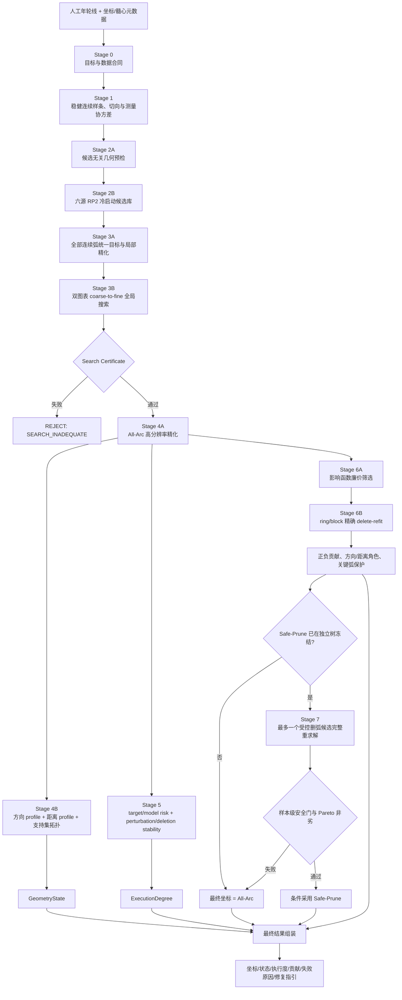

# ArcPith-GT v4：局部截断、非理想同心年轮弧的分阶段髓心反演与反事实贡献最终方案

**文档定位**：最终算法与实验规格，不包含实现代码。  
**当前输入边界**：Phase A 使用人工标注的连续年轮线和真实髓心建立几何上限；自动年轮提取不进入本版主线。  
**唯一目标**：从局部、截断、数量有限且非理想同心的年轮弧，反演可能位于图内、图外或极远处的**生物学髓心**；对能够定位的样本追求尽可能低的物理误差，对距离不可辨识或模型不适用的样本输出范围、方向、多模态或拒识，而不是由初值、搜索边界、先验或删弧操作制造伪精确坐标。

---

# 0. 最终修订决定

## 0.1 保留的算法地基

1. 使用 \(\mathbb{RP}^2\) 统一有限髓心与无穷远方向；禁止用“最大搜索半径点”代替远场。
2. 离散标注点仅用于恢复连续曲线；最终估计、评分和贡献分析均以连续弧、连续弧块及 parent ring 为证据单位。
3. 冷启动不是单一初值，而是“多源候选覆盖 + 全连续弧统一重评分 + 搜索充分性证书”。
4. 主坐标由 All-Arc 绝对几何估计产生；可辨识性、模型风险和认证不反向偷换候选。
5. 弧段正负贡献由“删除后完整重求解”定义；高残差或低稳健权重不能直接等同于负贡献。
6. All-Arc、Safe-Prune、GT-Oracle 三层分开：分别回答稳健基线、无 GT 可部署精化、理论上限。

## 0.2 调整后吸收的评审意见

| 评审问题 | 本版处理 |
|---|---|
| \(d_{\mathbb{RP}^2}\) 未定义 | 定义为单位齐次向量间的 antipodal 角距离；有限点 basin 合并另加物理距离条件 |
| \(W_\phi,W_\kappa\) 单位不清 | 不再用含义不稳定的裸 \(W_\kappa\)；改为方向角宽度 \(W_\phi\)、射影逆距离角宽度 \(W_\vartheta\) 和物理/对数距离区间 |
| 多尺度切向差无公式 | 定义 axial tangent distance、真实重复标注 bootstrap 和多尺度分位数 \(D_t\) |
| CS2 无法复现 | 改为可解析的“连续法线约束带二次型交汇”，给出 \(H,b\) 及条件数门 |
| seam 一致性不明确 | 定义重叠区、目标差、射影距离及 topology 三重容差；不一致先扩域重算，仍失败则 `SEARCH_INADEQUATE` |
| Safe-Prune 小样本功效不足 | 冻结树数采用 \(n_{\rm freeze}=\max(30,n_{\rm power})\)；不足时 Safe-Prune 强制 `OFF` |
| 偏心生长下目标不清 | 明确区分生物学髓心 \(p^*\) 与全截面径向汇聚中心 \(p_{\rm rc}\)，建立 `TARGET_ALIGNED/ECCENTRIC_GT/TARGET_UNKNOWN` |
| \(\sigma\) 来源循环 | 以真实重复标注为主、样条 bootstrap 为辅、合成扰动仅作外推；通过 Jacobian 传播到残差尺度 |
| 小 \(R\) 时 P90 失真 | crop 内尾部量改为自适应 worst-\(k\) upper-tail mean；P90 仅在 \(R\) 足够时作为补充 |
| 删除分析计算量过高 | 引入“廉价影响筛选—parent-ring 精确删除—少量 block 精确删除”的分层触发；只有精确重求解结果可获正式贡献标签 |
| 理想坏弧生态效度不足 | 复合低频生物变形 + 标注系统偏移作为主扰动，单一旋转/位移只作机制对照 |

## 0.3 不直接采用的意见

1. **不设统一 `REJECT ≤ 15%`。** 不同 FOV、弧长和远近条件的可辨识性差异很大，固定拒识上限会迫使系统输出伪 POINT。改为报告风险—覆盖曲线，并在预注册 False-POINT 风险下约束可用覆盖率，防止“拒绝全部”或“强行全出点”两种极端。
2. **不以固定 \(r/D<0.5\) 或 \(r/D>4\) 直接规定 POINT/AXIS。** 状态还取决于弧转角、方向覆盖、空间基线、噪声和非圆变形。\(r/D\) 仅用于分层和退化曲线横轴，状态阈值在独立 calibration trees 上冻结。
3. **不把 `ECCENTRIC_GT` 简单移出全部统计。** 该类必须单列，同时保留在 full-domain 分母中；否则会把模型最困难且最影响“真实髓心”目标的样本人为删除。
4. **不把近似 influence 当成正式正负贡献。** 近似只用于筛选需要做完整 delete-refit 的弧段，最终贡献仍来自完整冷启动、全局搜索和 profile 重建。

## 0.4 当前可冻结的核心

```text
G0：All-Arc Continuous Projective Geometry
    连续弧测量
  + parent-ring 证据守恒
  + 多源 RP2 冷启动
  + 全弧稳健公共中心目标
  + 全局 basin 搜索证书
  + 高分辨率有限点精化
  + 方向/距离支持集与五态输出
  + 弧段贡献报告
```

基于现有少量 biological trees，`Safe-Prune` 只能作为探索性分支；在满足独立树数量与统计功效前，最终坐标选择固定为 **All-Arc**。这不是算法降级，而是避免把训练阶段 GT 选择规则伪装成运行时能力。

---

# 1. 科学目标、操作定义与适用域

## 1.1 主目标是生物学髓心，而不是任意“几何中心”

记人工或完整截面可靠标注的生物学髓心为：

\[
p^*\in\mathbb R^2.
\]

本方法从局部年轮弧估计 \(p^*\)。但是非理想同心、偏心生长、应压木或系统变形可能使“所有局部切向法线的最佳汇聚点”偏离生物学髓心。因此定义全截面或最大可用 FOV 上的径向汇聚中心：

\[
p_{\rm rc}^{\rm full}
=
\arg\min_p J_{\rm abs}^{\rm full}(p),
\]

并定义目标—模型差异：

\[
B_{\rm target}
=
\frac{\|p_{\rm rc}^{\rm full}-p^*\|_2}{D_{\rm section}},
\]

其中 \(D_{\rm section}\) 是截面参考尺度。

数据域标签：

```text
TARGET_ALIGNED:
  B_target 不超过预注册应用容差，且低频结构残差不显著；

ECCENTRIC_GT:
  生物学髓心标注可靠，但共同径向中心与 pith 存在系统偏离；

TARGET_UNKNOWN:
  无完整截面或不足以判断两者关系。
```

**处理原则**：

- `TARGET_ALIGNED` 是 G0 的主适用域；
- `ECCENTRIC_GT` 不允许把 \(p_{\rm rc}\) 当作“真髓心”宣称高精度，必须单列误差并进入 model-risk；
- `TARGET_UNKNOWN` 的最高执行等级受限；
- 论文同时报告 aligned-domain 与 full-domain 结果。

## 1.2 输入

一个局部 crop/FOV 的人工标注证据：

\[
\mathcal E=\{\Gamma_r\}_{r=1}^{R},
\qquad
\Gamma_r=\{\gamma_{rf}\}_{f=1}^{F_r},
\]

其中 \(r\) 是 parent ring，\(f\) 是可见连续 fragment。

最低字段：

```text
tree_id / section_id / crop_id
parent_ring_id / ring_order / fragment_id
ordered annotation points
source↔crop transform
pixel size or physical scale
crop polygon and truncation flags
pith GT and its uncertainty, when available
annotation author/version/replicate id
```

## 1.3 输出必须分成四层

```text
A. GeometryState
   POINT / RANGE_UNCERTAIN / AXIS / MULTIMODAL / REJECT

B. Estimate
   finite pith coordinate, direction, finite range interval,
   projective components and supported set

C. ExecutionDegree
   X0_INVALID / X1_GEOMETRY_WEAK / X2_DIRECTION_USABLE /
   X3_FINITE_RESEARCH / X4_FINITE_STABLE / X5_CERTIFIED

D. ArcContribution
   direction, range, mode-exclusion, leverage, conflict,
   GT-positive/GT-negative when GT exists,
   runtime harmful-suspect/beneficial-candidate otherwise
```

几何状态回答“当前局部弧支持什么”；执行等级回答“该结果可用于什么”；二者不能合并成一个未经校准的置信总分。


建议冻结的结果结构：

```text
ArcPithResult
├── target
│   ├── target_domain
│   ├── pith_gt_uncertainty_if_available
│   └── target_model_discrepancy_if_available
├── geometry
│   ├── state
│   ├── h_RP2
│   ├── pith_xy_mm
│   ├── direction_phi
│   ├── finite_range_interval
│   └── competing_components
├── support
│   ├── direction_profile / W_phi
│   ├── range_profile / W_vartheta
│   ├── I_r / W_logr
│   └── support_calibration_level
├── search
│   ├── seed_sources
│   ├── basin_map
│   └── certificate
├── execution
│   ├── E_data / E_search / E_direction / E_range
│   ├── E_model / E_robust / E_cal
│   └── degree_X0_to_X5
├── contributions[]
│   ├── group_id / level / arc_interval
│   ├── C_GT_proj / C_GT_mm_if_available
│   ├── C_phi / C_r / C_mode
│   ├── C_shift / C_conflict
│   └── multi_label_role
├── refinement
│   ├── all_arc_solution
│   ├── safe_prune_candidate_if_any
│   ├── selected_solution
│   └── rollback_reason
└── reason_codes / repair_guidance / provenance
```

---

# 2. 总体算法流程



## 2.1 各阶段只使用最有价值的量

| 阶段 | 具体方法 | 主要参数或二次量 | 唯一职责 |
|---|---|---|---|
| 连续测量 | 稳健三次 B 样条 + 真实标注 bootstrap | \(\lambda_s,\Sigma_x,\sigma_\psi,D_t\) | 从离散点恢复可信切向与不确定度 |
| 预检 | axial tangent scatter、空间基线、总转角、齐次 Gram 谱 | \(R,L,\Theta,B,g_{\rm svd}\) | 决定搜索强度，不输出坐标 |
| 冷启动 | SVD、连续法线带交汇、arc-group、整弧圆、far-axis、RP2 mesh | 条件数、转角稳定性、inverse-range ladder | 覆盖可能 basin |
| 核心估计 | parent-balanced 连续弧 pseudo-Huber 目标 | \(\sigma_e,\delta_\rho,r_{\rm hard}\) | 估计共享公共中心 |
| 候选守卫 | ring median + adaptive upper-tail mean | \(M_{50},U_{20}\) | 防止低平均损失掩盖系统冲突 |
| 全局认证 | 双图表预算递增与 seam replay | \(\tau_J,\tau_h,\tau_{\rm seam}\) | 判断是否漏 basin |
| 精度阶段 | dense quadrature + manifold trust-region | \(\tau_{\rm quad},\tau_{\rm opt}\) | 只消除数值离散误差 |
| 可辨识性 | \((\phi,\vartheta)\) profile 和嵌套支持集 | \(\delta_\alpha,W_\phi,W_\vartheta,I_r\) | 分开判断方向与距离 |
| 模型风险 | target discrepancy、结构残差、删除散布、扰动 replay | \(B_{\rm target},R^2_{\rm struct},S_{\rm del}\) | 阻止共同偏差伪 POINT |
| 弧段贡献 | influence 筛选 + exact delete-refit | \(C^{GT},C^\phi,C^r,C^{mode},C^{conflict}\) | 解释正负作用与功能 |
| 条件精化 | 单次、受保护、预算受限 Safe-Prune | 删除预算、剩余覆盖、False-POINT 门 | 仅在已验证时减少有害偏差 |

---

# 3. Stage 0：坐标、目标与数据硬合同

## 3.1 固定 FOV 归一化

以 FOV 几何中心 \(c_{\rm FOV}\) 和固定尺度 \(s_{\rm FOV}\) 归一化：

\[
\tilde x=\frac{x-c_{\rm FOV}}{s_{\rm FOV}}.
\]

推荐 \(s_{\rm FOV}\) 统一取长边或对角线；选定后全数据一致。下文记 \(D_{\rm FOV}=s_{\rm FOV}\) 的物理长度。图外髓心使用同一变换，绝不 clip 到边界。

## 3.2 射影表示

齐次中心：

\[
h=[a_x,a_y,h_0]^T\in\mathbb{RP}^2,
\qquad h\sim\lambda h.
\]

远场图表使用非负 inverse range：

\[
\hat h(\phi,\kappa)
=
\frac{[\cos\phi,\sin\phi,\kappa]^T}{\sqrt{1+\kappa^2}},
\qquad
\phi\in[0,2\pi),\;\kappa\ge0.
\]

有限点：

\[
\tilde p=\frac{1}{\kappa}[\cos\phi,\sin\phi]^T,
\qquad \kappa>0.
\]

远场：

\[
\kappa=0,
\]

此时 \(\phi\) 按 modulo-\(\pi\) 的轴解释。FOV 中心附近由 Cartesian finite chart 处理，避免 \(\kappa\to\infty\) 的参数退化。

定义射影角距离：

\[
\boxed{
 d_{\mathbb{RP}^2}(h_1,h_2)
 =
 \arccos\!\left(
 \left|\frac{h_1^Th_2}{\|h_1\|\,\|h_2\|}\right|
 \right)
 \in[0,\pi/2]
}
\]

它用于 antipodal 等价、远场 mode 距离和解影响。两个有限 basin 合并时还必须满足：

\[
\frac{\|p_1-p_2\|}{D_{\rm FOV}}\le\tau_p,
\]

防止 projective 距离在极远区域压缩后误合并物理上不同的有限解。

无向切向或轴向角距离：

\[
d_\pi(t_1,t_2)=\arccos(|t_1^Tt_2|)\in[0,\pi/2].
\]

## 3.3 lineage 与证据层级

```text
tree
└── section
    └── crop/FOV
        └── parent ring
            └── visible fragment
                └── continuous block
                    └── quadrature node
```

parent-ring order 必须由完整标注或可靠拓扑确定，不允许根据当前候选髓心重新排序。

## 3.4 硬不变量

必须自动测试：

1. source↔crop 坐标往返；
2. 平移、旋转、统一缩放后映回结果一致；
3. \(t\to-t\) 不改变目标；
4. \(h\to-h\) 不改变射影结论；
5. finite/far chart 重叠区映射一致；
6. 图外 GT 不被裁剪；
7. 顶点复制、插值加密不增加证据；
8. fragment 人工拆分不增加 parent-ring 总预算；
9. exact AXIS fixture 不变成最大半径有限点；
10. candidate 进入 observation 邻域时不产生人工零残差；
11. test tree 运行前 data manifest 与 transform 冻结。

任一失败：

```text
STOP -> INVALID_DATA / COORDINATE_ERROR
```

---

# 4. Stage 1：由少量离散标注恢复可信连续弧

## 4.1 稳健三次样条

对 fragment \((r,f)\) 的有序点 \(x_j\)，以弦长参数初始化 \(s_j\)，拟合：

\[
\hat\gamma_{rf}
=
\arg\min_\gamma
\sum_j
\rho_{\rm ann}
\!\left(
\frac{\|x_j-\gamma(s_j)\|_{\Sigma_j^{-1}}}{\tau_{\rm ann}}
\right)
+
\lambda_s\int\|\gamma''(s)\|^2ds.
\]

约束：

- 三次 B 样条；
- 弧长单调参数化；
- 不允许自交或局部反向回折；
- 端点保护区不用于高精度切向积分；
- \(\lambda_s\) 按数据分层全局冻结，不按单图残差或 GT 自适应。

切向：

\[
t(s)=\frac{\hat\gamma'(s)}{\|\hat\gamma'(s)\|},
\qquad t\sim-t.
\]

## 4.2 平滑尺度的双重冻结

重复标注或 bootstrap 第 \(b\) 次、尺度 \(\lambda\) 下的切向记为 \(t_{\lambda}^{(b)}(s)\)。定义：

\[
D_t(\lambda)
=
Q_{0.90}^{s,b,b'}
\left[
 d_\pi\big(t_{\lambda}^{(b)}(s),t_{\lambda}^{(b')}(s)\big)
\right].
\]

定义总转角保持误差：

\[
B_\Theta(\lambda)
=
\frac{|\Theta_\lambda-\Theta_{\rm ref}|}
{\Theta_{\rm ref}+\epsilon},
\qquad
\Theta_\lambda=\int\left|\frac{d\psi_\lambda}{ds}\right|ds.
\]

其中 \(\Theta_{\rm ref}\) 来自重复标注共识或高分辨率、低偏差参考，不只来自解析合成曲线。

冻结规则：

\[
\lambda_s^*
=
\min\left\{
\lambda:
D_t(\lambda)\le\tau_t
\;\land\;
B_\Theta(\lambda)\le\tau_\Theta
\right\}.
\]

即选择**达到切向稳定所需的最小平滑**，避免为了稳定而抹掉真实转角。

## 4.3 测量不确定度：真实重复标注优先

重复标注子集应分层覆盖短弧、长弧、低/高转角、边界弧和异常弧，建议不少于全部 fragments 的 20%。由其估计：

```text
Sigma_x(s): 位置协方差，重点是法向位移
sigma_psi(s): axial tangent angle 标准差
sigma_GT: 髓心 GT 标注不确定度
```

合成扰动只用于扩展未覆盖的噪声强度，不作为 \(\sigma\) 的唯一来源。

对候选 \(h\)，测量协方差通过残差 Jacobian 传播：

\[
\sigma_e^2(s;h)
=
J_x(s;h)\Sigma_x(s)J_x^T(s;h)
+
J_\psi^2(s;h)\sigma_\psi^2(s)
+
\sigma_0^2.
\]

这里候选只进入确定性的误差传播 Jacobian；\(\Sigma_x,\sigma_\psi\) 不由当前 residual 反向重估。\(\sigma_e\) 在预注册上下限内截断，防止近点或极远点造成数值爆炸。

## 4.4 连续弧有效性

| 条件 | 计算 | 失败处理 |
|---|---|---|
| 唯一标注点足够 | \(N_{rf}\ge N_{\min}\) | `INVALID_FRAGMENT` |
| 物理弧长足够 | \(L_{rf}\ge L_{\min}\) | 不进主估计，仅可视化 |
| 无大缺口 | \(g_{\max,rf}\le g_{\rm split}\) | 按真实缺口拆 fragment |
| 切向非奇异 | \(\|\gamma'(s)\|>\epsilon_t\) | 局部屏蔽或重标 |
| 多尺度稳定 | \(D_t\le D_{t,\max}\) | 增大测量不确定度；严重时无效 |
| 端点稳定 | endpoint bootstrap dispersion | 扩大端点保护区 |
| 拓扑正确 | 无自交、错误回折、错误 parent id | 修复标注或拒绝 |

低转角弧不能因“圆心不可拟合”而删除；它仍可能是重要的方向证据。

## 4.5 证据守恒和连续积分

每个 eligible parent ring 总预算固定为 1。fragment 按有效物理弧长分配：

\[
\omega_{rf}=\frac{L_{rf}}{\sum_uL_{ru}},
\qquad
\sum_f\omega_{rf}=1.
\]

自适应 Gauss–Legendre 或弧长 quadrature 从 \(K\) 加密到 \(2K\)，直至：

\[
\frac{|A^{(2K)}_{rf}-A^{(K)}_{rf}|}
{1+|A^{(2K)}_{rf}|}
<\tau_{\rm quad}.
\]

quadrature 只控制数值误差，不改变 ring 权重、独立证据数或统计样本量。

---

# 5. Stage 2：候选无关预检与多源冷启动

## 5.1 候选无关几何预检

对全部有效弧计算：

```text
R_eff                     有效 parent-ring 数
total physical arc length 总弧长
Theta_total               总绝对转角
B_spatial                 弧段质心空间基线 / D_FOV
T_span                    无向切向角覆盖
truncation ratio          截断比例
annotation stability      D_t 与 Sigma_x
```

无向切向散布矩阵：

\[
M_t
=
\frac1R\sum_r\frac1{L_r}
\sum_f\int t(s)t^T(s)ds.
\]

\(\lambda_{\min}(M_t)\) 很小表示切向近似单一方向，只用于增加 far-chart 预算和提示弱距离。

齐次设计行：

\[
A(s)=[t_x(s),t_y(s),-t^T(s)\tilde\gamma(s)].
\]

parent-balanced Gram：

\[
G_A
=
\frac1R\sum_r\frac1{L_r}
\sum_f\int A^T(s)A(s)ds.
\]

设特征值 \(\lambda_1\le\lambda_2\le\lambda_3\)，定义：

\[
g_{\rm svd}
=
\frac{\lambda_2-\lambda_1}{\max(\lambda_3,\epsilon)}.
\]

\(g_{\rm svd}\) 小只意味着 SVD null direction 不稳定，触发搜索升级；它不能单独签发 AXIS、RANGE 或 REJECT。

## 5.2 六类互补冷启动

### CS1：parent-balanced homogeneous SVD

取 \(G_A\) 最小特征向量 \(h_{\rm svd}\) 作为统一有限/远场 seed。谱间隙进入 search budget registry，不进入最终置信度。

### CS2：连续法线约束带二次型交汇

对连续证据组 \(g\) 定义：

\[
J_g^{\rm band}(p)
=
\frac1{L_g}\int
[t^T(s)(p-\gamma(s))]^2ds
=
p^TH_gp-2b_g^Tp+c_g,
\]

其中：

\[
H_g=\frac1{L_g}\int t(s)t^T(s)ds,
\qquad
b_g=\frac1{L_g}\int t(s)t^T(s)\gamma(s)ds.
\]

对来自不同 parent rings 的 pair/triple \(G\)：

\[
H_G=\sum_{g\in G}\omega_gH_g,
\qquad
b_G=\sum_{g\in G}\omega_gb_g,
\]

若：

\[
\lambda_{\min}(H_G)>\tau_H,
\qquad
\operatorname{cond}(H_G)<\kappa_H,
\]

则有限交汇 seed：

\[
p_G=H_G^{-1}b_G.
\]

若矩阵近奇异，不强行求超远有限点；其弱特征向量转入 CS5 作为远场方向候选。

### CS3：parent-arc group consensus

- \(R\) 小时确定性枚举 2–3 条 parent rings；
- \(R\) 大时按切向互补性和空间基线做 ring-level progressive sampling；
- 每个组合使用 CS2 二次型或受限 \(J_{\rm abs}\) 求一个共享中心，不抽点三元组；
- 用全部 parent rings 计算粗 consensus：

\[
Q_G
=
\frac1R\sum_{r=1}^{R}
\mathbf 1\!\left[A_r(p_G)\le\tau_{\rm cons}\right],
\]

其中每条 parent ring 最多一票；\(Q_G\) 只用于控制 seed 数，不进入最终坐标或置信度；
- 组合解仅作 seed，所有保留候选最终由全部有效 rings 的同一 \(J_{\rm abs}\) 评分。

该步骤的价值是应对少数异常 ring，不是让一个小组合替代全证据。

### CS4：整弧稳健圆/曲率 seed

对转角足够的 fragment：

1. Pratt/Taubin 仅作 algebraic 初值；
2. 几何 LM 最小化整弧正交径向误差；
3. 在真实标注 bootstrap、平滑尺度和重采样相位下计算圆心离散；
4. 只有 \(\Theta\ge\Theta_{\rm seed}\) 且离散小于门限时进入 seed 库。

它不进入最终目标，也不增加该 ring 的权重。

### CS5：far-axis + inverse-range ladder

对近似平行弧，使用 ring-balanced 法线散布：

\[
M_n
=
\frac1R\sum_r\frac1{L_r}
\sum_f\int n(s)n^T(s)ds.
\]

主特征向量给出 modulo-\(\pi\) 远场轴 \(u_\infty\)。由于内外方向通常未知，对 \(\pm u_\infty\) 均生成有限梯级：

\[
\frac{r}{D_{\rm FOV}}
\in\{1,2,4,8,16,32,64,128,\infty\}.
\]

梯级只用于搜索覆盖，不是距离先验。

### CS6：确定性双图表 \(\mathbb{RP}^2\) 网格

- Cartesian finite chart 覆盖图内和中等图外；
- \((\phi,\kappa)\) far chart 显式包含 \(\kappa=0\)；
- 在低损 cell、ridge、seam、\(\kappa\approx0\) 和 Gram 弱方向处加密；
- 至少进行两种 mesh phase 或 chart rotation replay。

这是启发式 seed 全部失效时的确定性兜底，不能删除。

## 5.3 候选去重与 basin 合并

1. 所有 seed 转为单位齐次向量；
2. 先按 \(d_{\mathbb{RP}^2}\le\tau_h\) 聚类；
3. 若两者均为有限点，再要求归一化物理距离 \(\le\tau_p\)；
4. 每个 seed 使用同一粗目标局部精化；
5. 保存各 seed family 的来源，便于判断是否只有单一家族发现某 basin。

---

# 6. Stage 3：All-Arc 连续弧公共中心全局反演

## 6.1 射影径向—切向残差

对连续位置 \(x=\tilde\gamma_{rf}(s)\)：

\[
v(s;h)=a-h_0x,
\]

\[
e(s;h)
=
\frac{t^T(s)v(s;h)}
{\sqrt{\|v(s;h)\|^2+\epsilon_v^2}}.
\]

它是候选径向方向与年轮切向不正交的有符号角度近似，满足 \(t\sim-t\) 和 \(h\sim-h\)。标准化：

\[
z(s;h)=\frac{e(s;h)}{\sigma_e(s;h)}.
\]

## 6.2 单一稳健核

本版核心采用 pseudo-Huber：

\[
\rho_\delta(z)
=
\delta^2\left(\sqrt{1+(z/\delta)^2}-1\right).
\]

原因：小残差近似二次，大残差影响有界但不完全归零，避免 redescending kernel 将高残差但关键的 range/mode-exclusion 弧静默删除。

## 6.3 层次连续目标

fragment：

\[
A_{rf}(h)
=
\frac1{L_{rf}}
\int_{\Gamma_{rf}}
\rho_\delta(z(s;h))ds.
\]

parent ring：

\[
A_r(h)=\sum_f\omega_{rf}A_{rf}(h).
\]

crop 主目标：

\[
\boxed{
J_{\rm abs}(h)
=
\frac1R\sum_{r=1}^{R}A_r(h)
}
\]

所有 local optimization 均最小化这一固定、平滑、parent-balanced 目标。质量只进入测量不确定度；不得再由当前 residual 生成新的 ring reliability 权重。

## 6.4 小 ring 数下稳定的整体与尾部守卫

将 \(A_r\) 排序为 \(A_{(1)}\le\cdots\le A_{(R)}\)。定义典型 ring 误差：

\[
M_{50}(h)=\operatorname{median}_{r}A_r(h).
\]

定义自适应 upper-tail mean：

\[
k_R=\max\left(1,\left\lceil0.2R\right\rceil\right),
\]

\[
U_{20}(h)
=
\frac1{k_R}
\sum_{j=R-k_R+1}^{R}A_{(j)}(h).
\]

解释：

- \(R\le5\) 时自动退化为最大 ring 误差；
- \(R\) 增大后成为最差约 20% rings 的均值；
- 若 \(R\ge10\)，另报 P90，但 P90 不再是小 \(R\) 下的主守卫。

使用规则：

1. 坐标优化只使用 \(J_{\rm abs}\)；
2. \(M_{50}\) 描述大多数 rings 的典型一致性；
3. \(U_{20}\) 检查少数系统冲突；
4. 若最低 \(J\) basin 的 \(U_{20}\) 显著恶化，不能改用另一个候选“修饰结果”，而应标记 `MODEL_CONFLICT`、降低执行等级或保留多模态；
5. 数据集物理误差仍报告 median、IQR、P90、P95、max 和灾难误差率。

## 6.5 非法近点域

有限候选过于靠近弧点时径向方向无定义。定义：

```text
r_hard: 硬非法半径
r_soft: 数值 barrier 起始半径
```

- \(\min_s\|p-x(s)\|<r_{\rm hard}\) 的候选直接非法；
- \([r_{\rm hard},r_{\rm soft}]\) 只加平滑 barrier；
- barrier 不计入图像证据、不参与支持集 coverage 校准。

## 6.6 全局优化

```text
1. 每个冷启动 seed 在粗 quadrature 下局部优化；
2. 合并 antipodal 和同 basin 解；
3. 双图表网格 coarse-to-fine 搜索低损 cell 和 ridge；
4. 对所有相关 basin 做高预算局部流形优化；
5. 以 J_abs 确定最优 basin，以 M50/U20 做冲突守卫；
6. 保留 loss-equivalent 且空间分离的所有科学相关 basin；
7. 预算递增直到 Search Certificate 通过。
```

## 6.7 loss-equivalent basin 与多模态

数值等价容差（各项均换算为 objective-gap 单位）：

\[
\tau_{\rm eq}
=
\max(5\tau_{\rm quad,J},\tau_{\rm opt,J},\tau_{\rm mesh,J}),
\]

若 basin \(b\) 满足：

\[
J_b\le J_{\min}+\tau_{\rm eq}+\delta_{\rm mode},
\]

且与最优 basin 的 \(d_{\mathbb{RP}^2}\) 或有限物理距离超过合并门，则保留为竞争 mode。\(\delta_{\rm mode}\) 只能由 development/calibration trees 冻结。

## 6.8 Search Certificate 的闭合定义

在预算 \(B\) 与 \(2B\) 下匹配 basin。必须同时满足：

\[
\frac{|J_{\min}^{2B}-J_{\min}^{B}|}
{1+|J_{\min}^{2B}|}
\le\tau_J,
\]

\[
\max_{b\in\mathcal B_B}
\min_{b'\in\mathcal B_{2B}}
 d_{\mathbb{RP}^2}(h_b,h_{b'})
\le\tau_h,
\]

以及：

```text
basin/component count stable
all retained modes locally stationary
no new relevant low-loss cell
no boundary-pinned finite solution
near-point exclusion respected
far-field ridge not replaced by max-radius point
grid phase / chart rotation replay stable
```

### 双图表 seam 条件

在预注册重叠域：

\[
\kappa\in[\kappa_{\rm ov,min},\kappa_{\rm ov,max}],
\]

finite chart 与 far chart 的匹配解必须满足：

\[
d_{\mathbb{RP}^2}(h_F,h_P)\le\tau_h,
\]

\[
\frac{|J_F-J_P|}{1+\min(J_F,J_P)}\le\tau_{\rm seam,J},
\]

并具有相同 component/topology 结论。

不一致时的顺序固定为：

```text
扩大重叠域/网格 -> 增加 quadrature/optimizer 精度 -> replay；
仍不一致 -> SEARCH_INADEQUATE -> REJECT。
```

seam 不一致不能直接解释为 MULTIMODAL，因为它首先是数值/搜索不闭合。

---

# 7. Stage 4：有限点高精度精化与方向—距离可辨识性

## 7.1 All-Arc 高分辨率精化

只对 Search Certificate 通过的每个相关 basin：

1. 从冻结样条重新生成更密 quadrature；
2. 保持 \(\sigma_e\)、parent budget、pseudo-Huber 和非法域不变；
3. 在单位球切空间或 \((\phi,\kappa)\) 局部 trust-region 中精化；
4. 检查梯度范数、KKT/边界、重复运行和 chart 映射；
5. 若加密前后物理位移超过数值容差，继续加密或标记 `NUMERICAL_UNSTABLE`。

该阶段只能减少离散积分和局部优化误差，不增加任何新证据。

## 7.2 使用射影逆距离角而非裸 \(W_\kappa\)

定义：

\[
\vartheta=\arctan\kappa\in[0,\pi/2).
\]

- \(\vartheta=0\)：无穷远；
- \(\vartheta\) 越大：中心越近；
- 它是单位射影球上的角坐标，单位为弧度，数值在远场附近稳定。

方向 profile：

\[
L_\phi(\phi)=\min_{\vartheta}J_{\rm abs}(\phi,\vartheta).
\]

距离 profile：

\[
L_\vartheta(\vartheta)=\min_\phi J_{\rm abs}(\phi,\vartheta).
\]

## 7.3 嵌套支持集

\[
\mathcal S_\delta
=
\left\{h:
J_{\rm abs}(h)\le J_{\min}+\delta
\right\}.
\]

对每个 persistent component \(C\)：

### 方向宽度

\[
W_\phi(C)
=
\text{projection of }C\text{ onto }\phi\text{ 的最小圆周覆盖弧长}.
\]

- finite component：\(\phi\) 按 \(2\pi\) 周期，单位 rad；
- infinity-touching component：按 modulo-\(\pi\) 轴宽度，单位 rad。

### 射影距离宽度

\[
W_\vartheta(C)
=
\max_{h\in C}\vartheta(h)-\min_{h\in C}\vartheta(h),
\]

单位 rad。

### 可解释的有限距离区间

若 \(\kappa_{\min}>0\)：

\[
I_r(C)
=
\left[
\frac{D_{\rm FOV}}{\kappa_{\max}},
\frac{D_{\rm FOV}}{\kappa_{\min}}
\right],
\]

并报告：

\[
W_{\log r}(C)
=
\log\frac{r_{\max}}{r_{\min}}.
\]

若 \(\kappa_{\min}=0\)，则 \(r_{\max}=\infty\)，不得输出有限上界。

## 7.4 支持阈值的独立校准，消除循环依赖

在 calibration trees 上，以 tree 为独立单位。对预注册 crop family，计算：

\[
s_{tc}=J_{tc}(h^*_{tc})-J_{tc,\min}.
\]

每棵树聚合为一个预注册分位数或最大值 \(s_t\)，再用 split-conformal/经验分位数得到 \(\delta_\alpha\)。随后：

- calibration trees 只冻结 \(\delta_\alpha\)；
- radial paired state 实验在独立 validation trees 上检验；
- sealed test 不重新选择 \(\delta\)。

当独立树数不足：

```text
只报告 delta-family 下的 nested profile；
POINT 只能是 POINT_CANDIDATE / X3_FINITE_RESEARCH；
不得宣称 calibrated coverage。
```

## 7.5 几何五态

按优先级：

```text
1. 数据、坐标或数值非法
   -> REJECT

2. Search Certificate 不通过
   -> REJECT

3. component/topology 对 delta 邻域或 replay 不稳定
   -> REJECT: TOPOLOGY_FRAGILE

4. 两个及以上 persistent 且分离的 component
   -> MULTIMODAL

5. 单一稳定方向 component，支持集触及 vartheta=0，
   finite distance 上界不存在或不稳定
   -> AXIS

6. 单一 finite component，方向紧，但 W_logr / I_r 过宽
   -> RANGE_UNCERTAIN

7. 单一 finite compact component，方向和距离均紧
   -> POINT_CANDIDATE

8. 通过 Stage 5 model-risk 与稳定性门
   -> POINT
```

禁止使用固定 \(r/D\) 直接替代上述支持集判定。


---

# 8. Stage 5：模型适用性、稳健性与执行度

## 8.1 为什么“内部拟合很好”仍可能不是髓心

以下情况可以产生紧致、低损失、重复运行稳定的伪中心：

- 整组 rings 共同椭圆化或各向异性变形；
- ring center 随年份系统漂移；
- 所有标注具有共同切向旋转或法向偏移；
- 局部弧只覆盖同一侧，错误中心仍能解释全部切向；
- parent-ring association 系统错误；
- \(p_{\rm rc}\) 本身与生物学髓心 \(p^*\) 偏离。

因此 `POINT_CANDIDATE` 还要通过模型风险和扰动稳定性检查。这些检查默认**不改变坐标**，只决定是否允许输出 POINT 及其执行等级。


非理想同心按三种层级处理：

```text
局部、稀疏偏差：由 point-level pseudo-Huber 限制影响；
单个 ring 或单个连续块偏差：由 equal-parent + delete-refit 识别；
跨 rings 的共同低频偏差：进入 target/model-risk，不用高自由度形变项强行“修正”。
```

在局部短弧上，髓心平移与低频形变参数高度混淆。未经独立树证明的 Fourier/nonrigid refiner 容易吸收真实髓心信息，因此本版不把它放入坐标主线。未来若研究低容量形变 refiner，必须限制在 G0 支持集内，且不得把 AXIS/RANGE 升级成 POINT。

## 8.2 最小模型风险诊断集

### A. target-alignment registry

在有完整截面或最大 FOV 的 development data 上计算 \(B_{\rm target}\)，建立：

```text
species / section / growth-condition strata
TARGET_ALIGNED rate
ECCENTRIC_GT rate
B_target distribution
```

局部样本继承可知的 section-level 标签；未知时为 `TARGET_UNKNOWN`。

### B. 结构化残差

对有限候选定义极角 \(\theta(s)=\operatorname{atan2}(x_y-p_y,x_x-p_x)\)，对 signed standardized residual 拟合低容量基：

\[
z(s)
=
\beta_0
+
\beta_1\sin\theta+\beta_2\cos\theta
+
\beta_3\sin2\theta+\beta_4\cos2\theta
+\varepsilon.
\]

采用 leave-one-parent-ring-out 或 buffered block cross-fit，报告：

\[
R^2_{\rm struct}
=1-\frac{\operatorname{SSE}_{\rm OOF,model}}
{\operatorname{SSE}_{\rm OOF,null}}.
\]

- 高且稳定的 \(R^2_{\rm struct}\)：存在跨 ring 的低频系统偏差；
- 只在训练内高、OOF 不高：不视为可靠结构；
- AXIS/极远场样本改用归一化弧长和切向角基，不强求极角模型。

该低容量模型只是诊断器，不输出替代中心。

### C. parent-ring 删除散布

对精确 leave-one-ring-out 结果：

\[
S_{\rm del}^{\rm proj}
=
Q_{0.90,r}
\left[d_{\mathbb{RP}^2}(\hat h,\hat h_{-r})\right],
\]

有限点另报：

\[
S_{\rm del}^{\rm mm}
=
Q_{0.90,r}
\left[\|\hat p-\hat p_{-r}\|_{\rm mm}\right].
\]

同时记录 state flip 和新 basin 出现率。

### D. 测量与搜索 replay

至少覆盖：

```text
真实标注 bootstrap
spline 邻近冻结尺度
quadrature phase / density
cold-start family ablation
grid phase / chart rotation
```

输出中心散布、\(W_\phi\)、\(W_\vartheta\)、状态一致率。

### E. common-bias fixtures

主扰动采用：

```text
low-frequency biological deformation
+ systematic annotation normal shift
+ tangent bias
+ partial wrong association
```

并以单独 tangent rotation、normal displacement、jitter 作为机制对照。目标不是训练一个万能修正器，而是确认哪些偏差会产生未标记伪 POINT。

## 8.3 模型风险状态

```text
LOW_RISK:
  target aligned 或有充分外推证据；结构残差低；删除与扰动稳定；

POINT_BLOCKING:
  存在系统偏差或 target mismatch 风险，几何候选可保留，
  但禁止升级为高等级 POINT；

HARD_REJECT:
  模型明显不适用、association 错误、数值/拓扑不稳定；

UNKNOWN:
  数据不足以证明 LOW_RISK；UNKNOWN 不能当作 LOW_RISK。
```

`POINT_BLOCKING` 不得被改写成 RANGE 来绕过门；geometry state 与 risk status 分开保存。

## 8.4 ExecutionProfile

```text
E_data       数据/坐标/lineage 是否可靠
E_search     搜索是否闭合、离边界与 seam 有多少余量
E_direction  方向支持宽度、mode 数、扰动一致性
E_range      距离支持、infinity touch、有限区间稳定性
E_model      target alignment、结构残差、common-bias 风险
E_robust     annotation/spline/deletion/grid replay 稳定性
E_cal        未校准/功效不足/验证通过/sealed validated
```

不得将这些分量随意线性加权成一个“高分即正确”的数字。

## 8.5 ExecutionDegree

| 等级 | 必要条件 | 允许使用 |
|---|---|---|
| `X0_INVALID` | 数据、坐标、搜索或数值失败 | 不可使用；按 reason code 修复 |
| `X1_GEOMETRY_WEAK` | 连稳定方向都不能识别 | 不输出坐标；建议扩大 FOV/补弧 |
| `X2_DIRECTION_USABLE` | AXIS，或 RANGE 的方向部分稳定 | 可使用方向/轴，不可使用有限距离 |
| `X3_FINITE_RESEARCH` | finite compact candidate，但阈值、model-risk 或样本功效未闭合 | 研究分析和误差统计，不作生产承诺 |
| `X4_FINITE_STABLE` | 独立树上搜索、profile、扰动与目标适用域均稳定 | 可作工程/科研稳定结果，仍需标注校准级别 |
| `X5_CERTIFIED` | 足量独立 calibration + sealed test；风险—覆盖和 False-POINT 门通过 | 允许按预注册应用规格使用 |

只有校准数据足够时，才可另外给出：

\[
\Pr(\|\hat p-p^*\|\le\epsilon_{\rm app}\mid E_{\rm profile}),
\]

并必须由 held-out calibration 学得；当前少量树阶段不得伪造这一概率。

## 8.6 风险—覆盖而非固定拒识率

False-POINT 的应用定义必须预注册。例如：

\[
\operatorname{FalsePoint}
=
\mathbf 1\left[
\text{state=POINT}
\land
\|\hat p-p^*\|>\epsilon_{\rm app}
\right].
\]

其中 \(\epsilon_{\rm app}\) 是任务允许的物理误差；若 GT uncertainty 不可忽略，应将其并入容差或单独报告。支持集漏覆盖另记 \(\mathbf 1[h^*\notin\mathcal S_{\delta_\alpha}]\)，不与 False-POINT 混为一个事件。

核心报告：

```text
POINT coverage at fixed False-POINT risk
usable coverage = POINT + RANGE + AXIS
risk-coverage curve and AURC
REJECT reason distribution
coverage by distance/FOV, arc span, R_eff and target domain
```

应用可预注册：

```text
False-POINT <= alpha_FP
POINT coverage >= C_min within a declared target stratum
```

但不设置脱离任务难度的统一 REJECT 上限。

---

# 9. Stage 6：弧段正负贡献与功能角色

## 9.1 贡献分析的两个目标

1. 解释当前中心为何能或不能被识别；
2. 判断哪些连续弧段帮助精度、损害精度、提供方向、提供距离或排除错误 mode。

贡献不是当前 robust 权重、静态 residual 或局部梯度的同义词。

## 9.2 贡献层级

```text
Level 1: parent ring          必须优先，语义最稳定
Level 2: visible fragment     识别截断/断裂影响
Level 3: contiguous block     输出空间贡献图
Level 4: adjacency edge       仅在 association/relation 实验中
```

block 采用冻结物理长度的两种尺度和两个切分 phase；重叠 block 只用于定位，不视为独立样本。

## 9.3 廉价 influence 只作筛选

在 All-Arc optimum 的二维局部切空间 \(\xi\) 中，设：

\[
H=\nabla_\xi^2J_{\rm abs}(\hat\xi).
\]

证据组 \(G\) 的近似删除影响：

\[
\Delta\xi_G^{\rm IF}
\approx
H^\dagger\nabla_\xi J_G(\hat\xi),
\]

并计算局部 range/direction leverage。其用途仅为：

- 选择需要精确 delete-refit 的高影响、高冲突或低稳定 block；
- 选择少量高价值 block 作为保护对照；
- 控制计算预算。

以下情况 influence 自动失效并转 exact：

```text
Hessian 近奇异
支持集触及 infinity
存在多个 basin
预测 state change
删除预算较大
```

## 9.4 正式贡献必须完整重求解

对证据组 \(G\)：

\[
\hat h=M(\mathcal E),
\qquad
\hat h_{-G}=M(\mathcal E\setminus G).
\]

精确删除必须：

1. 删除整个连续组，不逐点删除；
2. 其余 parent rings 保持冻结预算语义；
3. 删除 incident association/relation edge；
4. full solution 仅作为额外 warm start；固定 global starts 仍必须运行；
5. 重建全部 relevant basin、Search Certificate、profiles 和 state；
6. 不重新选择 \(\lambda_s,\sigma,\rho,\delta\) 或搜索域；
7. 删除求解搜索失败时，该组贡献标记 `UNRESOLVED_SEARCH`。

## 9.5 正式贡献量

### A. GT 正负贡献

所有状态均可报告射影贡献：

\[
\boxed{
C_{G,\rm proj}^{GT}
=
d_{\mathbb{RP}^2}(\hat h_{-G},h^*)
-
d_{\mathbb{RP}^2}(\hat h,h^*)
}
\]

当 full 与 delete-refit 均为有效有限解时，另报主要物理贡献：

\[
\boxed{
C_{G,\rm mm}^{GT}
=
\|\hat p_{-G}-p^*\|_{\rm mm}
-
\|\hat p-p^*\|_{\rm mm}
}
\]

- \(C^{GT}>\epsilon_{GT}\)：保留 \(G\) 使误差更小，**正贡献**；
- \(C^{GT}< -\epsilon_{GT}\)：保留 \(G\) 使误差更大，**负贡献**；
- 其余为 practically equivalent / redundant；
- 若删除引起 POINT→RANGE/AXIS/MULTIMODAL，先报告状态贡献，不用单一毫米数掩盖可辨识性变化。

\(\epsilon_{GT}\) 至少覆盖髓心 GT 标注误差和求解数值误差。

### B. 方向贡献

\[
C_G^{\phi}
=
\log\frac{W_{\phi,-G}+\epsilon}
{W_\phi+\epsilon}.
\]

\(C_G^\phi>0\) 表示删除后方向支持变宽，\(G\) 对方向有正信息。

### C. 距离贡献

对 finite component：

\[
C_G^{r}
=
\log\frac{W_{\log r,-G}+\epsilon}
{W_{\log r}+\epsilon}.
\]

同时报告 \(W_\vartheta\) 变化。对 infinity-touching 情形不用有限比值，改报：

```text
finite -> infinity touch
POINT -> RANGE
POINT/RANGE -> AXIS
finite lower-bound change
```

### D. mode-exclusion 贡献

```text
C_G^mode = number/components added after deletion
```

删除后出现第二稳定 basin 或 single→multi，\(G\) 为 mode-exclusion arc。

### E. 解影响

\[
C_G^{\rm shift}
=d_{\mathbb{RP}^2}(\hat h,\hat h_{-G}).
\]

有限点另报：

\[
C_G^{\rm mm}=\|\hat p-\hat p_{-G}\|_{\rm mm}.
\]

高 shift 只表示高杠杆，不能单独判断正负。

### F. 对其余证据的冲突

在删除组 \(G\) 后的剩余证据上：

\[
C_G^{\rm conflict}
=
J_{-G}(\hat h)-J_{-G}(\hat h_{-G})\ge0.
\]

同时定义：

\[
C_G^{50}
=M_{50,-G}(\hat h)-M_{50,-G}(\hat h_{-G}),
\]

\[
C_G^{tail}
=U_{20,-G}(\hat h)-U_{20,-G}(\hat h_{-G}).
\]

大值表示 \(G\) 迫使其他证据牺牲拟合，但仍需结合方向、距离和 GT-help，不能直接称为错误弧。

## 9.6 弧段角色判定

| 角色 | 判据核心 | 解释 |
|---|---|---|
| `DIRECTION_CRITICAL` | 删除后 \(W_\phi\) 变宽或方向 state 恶化 | 提供不可替代方向信息 |
| `RANGE_CRITICAL` | 删除后 \(W_{\log r}\) 变宽或 POINT→RANGE/AXIS | 提供稀缺距离信息 |
| `MODE_EXCLUSION` | 删除后新增稳定 basin | 排除错误物理解 |
| `BENEFICIAL_GT` | \(C^{GT}>\epsilon_{GT}\) | GT 证实正贡献 |
| `HARMFUL_GT` | \(C^{GT}< -\epsilon_{GT}\) | GT 证实负贡献 |
| `HARMFUL_SUSPECT` | 无 GT 下剩余证据、测量异常和 replay 一致指向有害 | 仅嫌疑，不能称真负贡献 |
| `HIGH_LEVERAGE` | projective/mm shift 大 | 影响大，正负未定 |
| `REDUNDANT` | state、support、shift、GT-help 均近零 | 与其他弧信息重复 |
| `UNRESOLVED` | 删除搜索失败或多指标冲突 | 不强行分类 |

优先级：

```text
state role > direction/range role > GT sign > leverage/conflict > redundancy
```

一个弧可以同时是 `RANGE_CRITICAL + HIGH_LEVERAGE + HARMFUL_GT`；这意味着它提供距离但带来系统偏差，不能用单标签掩盖矛盾。

## 9.7 分层精确计算策略

### Research/Audit 模式

- \(R\le R_{\rm exact}\)：所有 parent rings 做 exact leave-one-ring-out；
- \(R>R_{\rm exact}\)：所有 rings 先 influence，精确计算 top-\(K\) 高影响、top-\(K\) 高冲突、所有候选关键弧及预注册随机控制；
- block exact 仅对稳定 POINT/RANGE、候选异常 ring 和高价值保护 ring 运行；
- 每个 fragment 最多两个尺度、两个 phase；
- 不做全 Shapley，不搜索任意多弧组合。

### Core/Deployment 模式

- 输出所有 ring 的 screening 指标；
- 精确计算预算内的 parent-ring 和 top block；
- 未精确计算者标记 `SCREEN_ONLY`，不得给正式正负标签；
- AXIS/MULTIMODAL/REJECT 不运行 Safe-Prune，只做必要的 ring-level 角色解释。

## 9.8 贡献图生成

对有 exact block 结果的弧，按物理弧长位置输出：

```text
C_GT or harmful-suspect score
C_phi
C_r
C_shift
C_conflict
role labels
resolution/block scale
```

重叠 block 可通过长度加权平均生成热图，但热图只是可视化，不改变估计权重或证据数。

---

# 10. Stage 7：Safe-Prune 条件精化

## 10.1 为什么只能是条件模块

删去真实负贡献弧可能降低偏差，但也可能：

- 减少方向互补；
- 丢失唯一距离信息；
- 删除 mode-exclusion 证据；
- 使支持集虚假变窄；
- 在 development GT 上过拟合。

因此 All-Arc 永久保存，Safe-Prune 只能在独立验证已经证明安全后改变坐标。

## 10.2 无 GT 的 `HARMFUL_SUSPECT` 条件

一个连续组必须同时满足：

1. \(C_G^{50}>\tau_{50}\) 且 \(C_G^{tail}>\tau_{tail}\)；
2. 改善在 annotation/spline/grid replay 中方向一致；
3. 存在候选无关异常证据，如高 \(D_t\)、法向标注不稳定、gap、association 风险；
4. 不是 `DIRECTION_CRITICAL/RANGE_CRITICAL/MODE_EXCLUSION`；
5. 删除后 Search Certificate 通过；
6. 剩余 \(R_{\rm eff}\)、切向跨度、空间基线和总弧长超过冻结下限；
7. 删除后没有 RANGE/AXIS→虚假紧致 POINT；
8. 删除预算不超过预注册上限；
9. 不依赖测试 GT 或当前样本的人工选择。

## 10.3 v1 只允许单次删除

```text
最多删除一个 contiguous block 或一个明确错误 parent ring；
不做“删一个 -> 重算 -> 再找下一个”的递归清洗；
不枚举组合删除；
总删除 parent-budget <= b_max；
```

这避免多重比较、证据耗尽和自适应过拟合。


若同时出现多个 `HARMFUL_SUSPECT`，v1 使用冻结的词典序选出唯一候选：

```text
1. min(C50 / tau50, Ctail / tautail) 最大；
2. 候选无关测量异常等级更高；
3. 删除预算更小；
4. 仍并列则不删，回退 All-Arc。
```

不允许在单个样本上试遍多个删除结果后按最低 loss 选择。

## 10.4 样本级安全门

对 Safe-Prune 候选 \(\hat h_{\rm pr}\)：

```text
A. search certificate pass
B. remaining geometry coverage pass
C. no protected critical arc removed
D. no new unexplained basin
E. no spurious state upgrade
F. 在相同剩余证据上，J_{-G}, M50_{-G}, U20_{-G} Pareto 非劣
G. annotation/grid replay stability non-inferior
H. model-risk does not worsen
I. physical support does not become implausibly narrow
```

任一失败立即回退 \(\hat h_{\rm all}\)。

## 10.5 数据集级部署门

独立树数：

\[
n_{\rm freeze}
=
\max(30,n_{\rm power}),
\]

其中 \(n_{\rm power}\) 由 tree-level paired effect、目标非劣界、False-POINT 事件率和目标功效预先模拟得到。30 只是最低地板，不等于自动充分。

Safe-Prune 必须在 validation trees 上同时满足：

1. tree-balanced median physical error 非劣，且至少一个主精度终点明确改善；
2. P90/P95、max 或 catastrophic rate 不恶化；
3. False-POINT 的单侧置信上界不恶化；
4. POINT/RANGE/AXIS usable coverage 不通过大量 REJECT 人为换取；
5. critical-arc false-removal rate 在预注册上限内；
6. aligned-domain 与 full-domain 均报告；
7. 阈值、删除预算、候选数和求解预算在 sealed test 前冻结。

若不满足：

```text
SAFE_PRUNE = OFF
final coordinate = All-Arc
contribution module remains enabled for explanation
```

## 10.6 三层对照

| 版本 | 定义 | 用途 | 可改变最终坐标 |
|---|---|---|---:|
| `F-All` | 全连续弧 G0 | 永久稳健基线 | 是，默认 |
| `F-Safe` | 无 GT 单次受控删弧 | 检验可部署精化 | 仅通过独立部署门后 |
| `F-Oracle` | GT 选择最佳单删组 | 估计理论上限 | 否 |

结果解释：

| 结果 | 结论 |
|---|---|
| Oracle 明显提高，Safe 接近 Oracle | 负贡献可被无 GT 特征识别，具部署潜力 |
| Oracle 提高，Safe 不稳定 | 负贡献存在，但识别器不成熟；保持 All-Arc |
| Safe median 提高但 P90/False-POINT 变坏 | 误删关键弧或制造伪可辨识；禁止部署 |
| Safe 与 All 相同 | 全弧 robust 已足够；贡献保留为解释 |
| Safe 只在 development 有效 | 过拟合；禁止部署 |

---

# 11. 参数与二次量注册表

## 11.1 参数必须一职一用

| 参数/量 | 单位 | 唯一职责 | 冻结来源 | 禁止用途 |
|---|---:|---|---|---|
| \(c_{\rm FOV},s_{\rm FOV}\) | pixel/mm | 坐标规范 | 图像几何 | 不按结果修改 |
| \(\lambda_s\) | spline unit | 切向平滑 | 重复标注 + turn bias | 不按单图 GT 调 |
| \(\Sigma_x\) | mm²/pixel² | 位置测量误差 | 双人/重复标注 | 不改变证据数 |
| \(\sigma_\psi\) | rad | 切向误差 | tangent bootstrap | 不作 arc 概率 |
| \(N_{\min},L_{\min},g_{\rm split}\) | count/mm | fragment 有效性 | 测量稳定实验 | 不签发 POINT |
| endpoint guard | 弧长比例/mm | 避免端点导数偏差 | bootstrap | 不动态删主体弧 |
| \(\omega_{rf}\) | 无量纲 | ring 内弧长预算 | 物理弧长 | 不表达质量 |
| pseudo-Huber \(\delta\) | 标准化残差 | 有限影响 | controlled corruption | 不输出可靠概率 |
| \(r_{\rm hard},r_{\rm soft}\) | FOV-normalized | 合法几何域 | near-point fixtures | 不作置信门 |
| \(g_{\rm svd}\) | 无量纲 | 搜索升级 | development/synthetic | 不判 state |
| \(\tau_H,\kappa_H\) | 无量纲 | CS2 条件数门 | analytic/synthetic | 不淘汰低转角弧 |
| \(\Theta_{\rm seed}\) | rad | 圆 seed 可用性 | bootstrap stability | 不作 range state |
| inverse-range ladder | \(r/D\) | far seed 覆盖 | search convergence | 不作距离先验 |
| \(\tau_{\rm quad}\) | 相对误差 | 积分精度 | replay | 不改变权重 |
| \(\tau_h,\tau_p\) | rad / FOV | basin 合并 | search fixtures | 不定义应用精度 |
| \(\tau_{\rm seam,J}\) | 相对目标差 | chart seam | numerical replay | 不判 multimodal |
| \(\delta_\alpha\) | objective increment | 支持集 coverage | independent calibration | 不在 test 重选 |
| \(W_\phi\) | rad | 方向可辨识性 | supported set | 不替代 search cert |
| \(W_\vartheta\) | rad | 射影距离可辨识性 | supported set | 不单独给物理距离 |
| \(W_{\log r}\) | log-ratio | finite range 紧致度 | supported set | infinity 时禁用 |
| block length/phase | mm/比例 | 贡献空间分辨率 | scale stability | 不进主拟合 |
| \(b_{\max}\) | parent budget | 删弧上限 | held-out Safe-Prune | 不为低 loss 放宽 |

## 11.2 工程起始值，只用于首轮实现

以下值用于建立可运行版本和敏感性扫描，不是论文冻结值：

| 项目 | 起始设置 |
|---|---|
| 唯一点数 | \(N_{\min}=8\) |
| 端点保护 | 每端 3%–5% 有效弧长 |
| 初始 quadrature | 每 fragment 32 节点，逐次翻倍 |
| \(\tau_{\rm quad}\) | 相对积分变化 \(10^{-4}\) |
| robust kernel | pseudo-Huber，\(\delta=1.5\) 个标准化残差 |
| circle seed 转角扫描 | 5° / 8° / 12° |
| far ladder | \(r/D=1,2,4,8,16,32,64,128,\infty\) |
| block 尺度 | fragment 有效弧长的 15% 与 30%，两个 phase |
| v1 删除上限 | 最多一个组，总 parent budget 不超过 20% |
| exact ring 默认上限 | \(R_{\rm exact}=8\)，超出后分层筛选 |
| block exact 默认上限 | 每 crop 最多 6–8 个候选 block |
| search replay | 至少两次预算级、两种 mesh phase |

最终值必须由 tree-level development/calibration split 冻结。

---

# 12. 计算复杂度与运行模式

设：

```text
N_q   全部 coarse quadrature nodes
R     parent-ring 数
S     冷启动 seed 数
I     单次局部优化迭代数
M     RP2 mesh 评价点数
P     profile 评价/精化点数
K_ex  精确删除求解次数
```

## 12.1 核心复杂度

| 模块 | 复杂度近似 | 备注 |
|---|---:|---|
| spline/measurement | \(O(N_{ann})\) 至稀疏 spline solve | 每 crop 一次 |
| Gram/SVD | \(O(N_q)+O(3^3)\) | 很低 |
| CS2 group intersection | \(O(R^2)\) 或受限 triples | 2×2 解析求解 |
| whole-arc bootstrap seeds | \(O(B_{boot}N_q)\) | 只对高转角弧 |
| mesh scoring | \(O(MN_q)\) | 主要粗搜索开销 |
| local refinement | \(O(SIN_q)\) | 可批量向量化 |
| profiles | \(O(PN_q)\) | 只对通过搜索的 modes |
| exact contribution | \(K_{ex}\times C_{core}\) | 主要审计开销 |

## 12.2 分层触发预算

```text
所有样本：
  Core estimation + Search Certificate + profiles

稳定 finite POINT/RANGE：
  exact ring deletion + selected block deletion

AXIS：
  只做方向关键 ring 删除；不做 Safe-Prune

MULTIMODAL：
  只做 mode-exclusion / ring-level 删除；不做 block prune

REJECT：
  只定位首个失败阶段；不做昂贵细粒度贡献
```

## 12.3 两种运行模式

### `CORE`

用于常规批量运行：

```text
All-Arc 坐标
Search Certificate
profiles/state
ExecutionProfile
ring-level screening
预算内 exact contributions
```

### `AUDIT`

用于论文实验和疑难样本：

```text
更高预算 reference search
所有可行 ring exact deletion
selected block exact deletion
common-bias fixtures/replay
Oracle/Safe 对照
```

正式报告必须分别给出 Core 与 Audit 的 P50/P90 runtime、峰值内存、solver failure 和 contribution 开销占比。

---

# 13. 数据划分、样本量与统计原则

## 13.1 只能按 biological tree 划分

```text
Development trees:
  测量、目标、搜索结构和算法开发

Calibration trees:
  support delta、state thresholds、risk operating point

Validation trees:
  G0/G1 或 Safe-Prune 的 KEEP/OFF 决策

Sealed test trees:
  一次性运行冻结系统
```

同一树的 section、相邻 crop、不同 FOV、旋转、扰动和派生样本不得跨集合。

## 13.2 当前小样本条款

当独立树少于：

\[
n_{\rm freeze}=\max(30,n_{\rm power}),
\]

必须：

```text
Safe-Prune = OFF
hard calibrated POINT threshold = UNFROZEN
X5_CERTIFIED 不可签发
所有阈值收益标记 exploratory
```

大量同树 crop 只能提高几何曲线分辨率，不能替代独立 biological trees。

## 13.3 统计终点

### POINT

```text
physical error mm
normalized error / D_FOV
median / IQR / P90 / P95 / max
catastrophic error rate
False-POINT rate
support containment
```

### RANGE

```text
GT range containment
finite interval width / log-range width
direction interval
false POINT conversion
```

### AXIS

```text
mod-pi direction error
direction interval width
finite lower-bound violation
false finite conversion
```

### MULTIMODAL

```text
GT-consistent component present
second-mode recall
component count/separation
topology stability
```

### Contribution

```text
positive/negative GT contribution recall
critical arc protection recall
harmful-suspect precision@k
scale/phase stability
Oracle-Safe gap
```

## 13.4 汇总方式

1. 每棵树内部先聚合 crop 指标；
2. 再以 tree 为独立单位报告 median/IQR 和区间；
3. paired 方法比较先得到每棵树的 paired endpoint，再做 bootstrap/permutation/Wilcoxon；
4. False-POINT 使用 tree-aware 或事件级单侧置信上界，并报告分母；
5. 同时报告效果量和 risk-coverage，不只报告 \(p\) 值。

---

# 14. 核心实验、输入输出与判定

## Experiment E0：目标定义与公共中心适用域

| 项目 | 内容 |
|---|---|
| 输入 | 完整截面/最大 FOV 年轮线、可靠生物学髓心 GT |
| 方法 | 计算 \(p_{\rm rc}^{full}\)、\(B_{\rm target}\)、结构残差和 ring-center drift |
| 输出 | `TARGET_ALIGNED/ECCENTRIC_GT/TARGET_UNKNOWN`，按树/截面分布 |
| 正确判断 | 若 ECCENTRIC_GT 占比高，不能把 G0 的径向中心误写为生物学髓心精度；需单列风险或扩展模型 |
| 冻结门 | 明确主适用域与 full-domain 分母，目标容差由应用误差和 GT uncertainty 决定 |

## Experiment E1：连续弧测量、平滑与 \(\sigma\)

比较：

```text
raw polyline tangent
point subset / three-point circle
single synthetic-tuned spline
本方案：真实重复标注 + conservative spline + covariance propagation
```

输入扰动：不同点密度、采样 phase、重复标注、端点截断、fragment split。

输出：

```text
tangent axial error / D_t
normal position repeatability
total-turn bias
pith shift
quadrature convergence
interpolation/split invariance
```

KEEP：本方案必须在不显著损失真实总转角的前提下降低切向方差，并使点复制/插值/切分不改变科学结果。

## Experiment E2：冷启动与 Search Certificate

比较：

```text
FOV-center single start
SVD only
SVD + finite seeds
SVD + finite + far-axis
完整六源 seed bank
完整六源 + deterministic RP2 reference mesh
高预算 offline reference
```

fixture：

```text
pith inside / near outside / far outside / exact infinity
same direction different range
seam basin
narrow second basin
near-point trap
boundary-pinned finite trap
one corrupted ring
```

输出：basin recall、global-best recall、objective gap、chart/seam consistency、boundary false finite、runtime。

判定：预算增加仍出现新 basin 或 seam 不闭合，则算法不可输出 POINT；不能用 GT 正确但搜索未闭合来绕过证书。

## Experiment E3：All-Arc 核心估计与尾部守卫

比较：

```text
per-ring circle centers + mean/median
pooled point fit
parent-balanced all-arc L2
parent-balanced all-arc pseudo-Huber
本方案 + M50/U20 conflict guard
```

主扰动：单 ring 低频变形 + 系统标注偏移；理想旋转/位移为对照。

输出：physical median/P90/max、catastrophic rate、M50/U20、false compact finite、candidate conflict。

判定：

- 只改善平均而恶化 P90/max：不 KEEP；
- 最低 J 但 U20 灾难性增大：应 risk-block，而不是偷偷换候选；
- pseudo-Huber 必须控制坏弧，同时不明显损害 clean cases。

## Experiment E4：方向—距离退化与五态正确性

输入：同一 section/FOV orientation 沿径向构造 paired crops，并交叉：

```text
short/long arcs
one-sided/distributed arcs
low/high noise
TARGET_ALIGNED/ECCENTRIC_GT
```

横轴报告 \(r/D_{\rm FOV}\)，但不预设统一状态阈值。

输出：

```text
direction error
physical range error
W_phi / W_vartheta / W_logr
infinity touch
state transition
GT support containment
false POINT / false finite
```

正确趋势：随距离增大或有效转角减少，距离证据应逐步变弱，整体呈 `POINT -> RANGE -> AXIS`，但具体转折由固定 calibration thresholds 和几何分层决定。

## Experiment E5：高分辨率精化是否真正提高髓心精度

比较：

```text
coarse quadrature solution
adaptive dense quadrature + manifold trust-region
```

保持 objective、sigma、robust kernel、parent budget 不变。

输出：physical error、重复运行差异、梯度/KKT、chart consistency、profile width、runtime。

KEEP：实际误差或数值漂移得到稳定改善；若只增时不增精度，降低在线预算。

## Experiment E6：弧段正负贡献与 Safe-Prune

比较：

```text
All-Arc
All-Arc + contribution only
Safe single-block prune
Safe single-ring prune
GT Oracle single-prune
```

主扰动：

```text
低频生物形变 + 法向标注偏移
局部错误 parent association
系统 tangent bias
```

对照扰动：单独 tangent rotation、normal shift、jitter、local deletion。

输出：

```text
C_GT sign accuracy
C_phi/C_r role accuracy
mode-exclusion recall
critical-arc false removal
paired physical error change
P90/P95/max/catastrophic change
False-POINT and coverage change
Oracle-Safe gap
rollback rate
```

判定矩阵：

| 结果 | 决策 |
|---|---|
| Oracle 提高且 Safe 接近 | 可继续进入独立部署门 |
| Oracle 提高、Safe 不稳 | 贡献可解释，删弧不部署 |
| Safe median 好、tail/False-POINT 坏 | 禁止部署 |
| 删除后误差小但 range support 明显变宽 | 不能保持 POINT；回退或降级 |
| 高残差弧删除后新增 mode | 该弧是 mode-exclusion，受保护 |

## Experiment E7：共同模型偏差与生态效度

构造或选择：

```text
ellipse/anisotropy
center drift
low-frequency radial deformation
mixed centers
common tangent/normal bias
wrong association
真实 ECCENTRIC_GT sections
```

目标：识别以下危险样本：

```text
finite compact
+ internally stable
+ cross-fit good
+ pith GT badly wrong
```

输出：catastrophic capture、false veto、POINT_BLOCKING recall、uncovered catastrophe、full-domain coverage。

正确结果不是强行修正所有偏差，而是高风险样本不获得未标记高等级 POINT。

## Experiment E8：计算预算与分层触发

输入：按 \(R,N_q,state,distance/FOV\) 分层的真实 crops。

比较：

```text
full exact deletion
influence-screened exact deletion
CORE mode
AUDIT mode
```

输出：P50/P90 runtime、峰值内存、目标评价次数、exact deletion 次数、贡献开销占比、筛选漏掉的重要弧比例。

KEEP：分层策略显著降耗，同时不漏掉预注册的 critical/harmful groups；否则提高 exact budget。

## Experiment E9：冻结 sealed-tree 终测

一次性运行：

```text
frozen data/target manifest
frozen spline/sigma/evidence budget
frozen cold starts/search certificate
frozen objective/tail guard
frozen support calibration/state thresholds
frozen model-risk route
frozen contribution/Safe-Prune status
```

报告所有样本，包括 REJECT、搜索失败、数值失败和 ECCENTRIC_GT。测试 GT 只用于事后评价，不参与删弧或候选选择。

---

# 15. 结果分析与故障修复表

| 观察 | 科学解释 | 最终处理/修复指引 |
|---|---|---|
| 单初值与六源搜索不同 | 存在局部极小或边界依赖 | 保留多源冷启动；提高 reference budget |
| 两图表 seam 不一致 | 数值或搜索未闭合，不是生物多模态 | 扩 overlap/网格/精度；仍失败则 REJECT |
| far crop 落在最大半径 | infinity 处理错误 | 检查 far chart、\(\kappa=0\) 和 boundary rule |
| J 很低但 U20 很高 | 多数弧一致，少数 ring 系统冲突 | `MODEL_CONFLICT`，做贡献/风险分析，不强出高等级 POINT |
| 删除高残差弧后出现第二 mode | 该弧在排除错误解 | 标记 MODE_EXCLUSION，禁止删除 |
| 删除后误差下降但范围变宽 | 偏差下降、方差/不可辨识性上升 | 回退 All-Arc 或输出 RANGE，不伪装 POINT |
| Safe 只在同树 crops 有效 | 伪重复/过拟合 | 增加独立树；Safe-Prune OFF |
| TARGET_ALIGNED 好、ECCENTRIC_GT 差 | G0 估计的是径向汇聚中心而非全部生物髓心 | 单列 domain；完善模型风险或扩大观测 |
| REJECT 很低但 False-POINT 高 | 状态机过于激进 | 收紧 POINT 门，报告风险—覆盖变化 |
| REJECT 很高且风险很低 | 可能过度保守或目标域太难 | 按 reason 分层；提高 FOV/弧覆盖，不直接放松门 |
| contribution 对 block phase 不稳 | 细粒度解释不足 | 降级到 fragment/ring 级，不发布伪精细热图 |

### reason code 到可操作建议

```text
INVALID_DATA
  -> 修复 transform、parent id、弧顺序或标注断点

INSUFFICIENT_GEOMETRY
  -> 扩大 FOV；补充不同切向方向或更长弧

SEARCH_INADEQUATE
  -> 提高 RP2 网格/远场梯级；检查 seam 与边界

RANGE_UNCERTAIN
  -> 获取更大转角、空间基线或对侧弧

AXIS
  -> 当前只可信方向；扩大径向跨度后再估距离

MULTIMODAL
  -> 增加能排除第二 basin 的互补弧

MODEL_POINT_BLOCKING
  -> 检查偏心生长、系统标注偏差、association；必要时使用更大截面

HARMFUL_SUSPECT
  -> 优先复核该连续 block 的标注和 parent association
```

---

# 16. 流程正确性推理

## 16.1 连续弧而非采样点保证证据语义

1. 点只定义样条，最终损失按物理弧长积分；
2. quadrature 加密只减少数值误差；
3. parent-ring 总预算固定，点密度和 fragment 数不能冒充更多证据；
4. 小样本 tail 采用 worst-\(k\) 均值，避免虚假的 P90 精度；
5. 真实重复标注决定 \(\sigma\)，避免任意扰动尺度控制稳健核。

因此该测量层适合“年轮少、弧短、标注点有限”的实际条件。

## 16.2 多源冷启动解决的是 basin coverage，不是参数调优

- SVD 给出全局线性射影方向；
- 连续法线带解析交汇利用整弧约束；
- arc-group consensus 抵抗少数异常 ring；
- 稳定整弧圆 seed 利用高转角弧的距离信息；
- far-axis 梯级显式覆盖图外和近无穷远；
- 确定性 RP2 网格防止启发式遗漏。

所有 seed 最终使用同一 All-Arc 目标重评分，初值来源不会直接决定坐标。Search Certificate 再验证增加预算后 basin 与 topology 不变，从而把“是否找到全局解”纳入算法定义。

## 16.3 主估计、尾部守卫和可辨识性职责分离

- \(J_{\rm abs}\)：唯一坐标估计目标；
- \(M_{50}/U_{20}\)：检查典型一致性和少数冲突；
- supported set：判断方向/距离是否可辨识；
- model risk：判断共同模型偏差是否可能伪造紧致中心。

该分离避免同一参数同时决定坐标、可靠性和删弧，减少自证循环。

## 16.4 生物学髓心与几何汇聚中心显式区分

若整个截面系统偏心，任何“公共法线中心”都可能与 pith 不同。通过 \(B_{\rm target}\) 和 ECCENTRIC_GT 分层，算法不会把几何代理的内部稳定误写成生物学真值。full-domain 指标仍保留这些样本，避免选择性删除困难案例。

## 16.5 正负贡献必须依赖反事实全局重求解

高 residual 可能是：

1. 弧错误；
2. 当前中心错误，而该弧在纠正它；
3. 唯一 range/mode-exclusion 证据；
4. 系统模型偏差的一部分。

删除后重新做冷启动、全局搜索和 profile，才能观察该弧对中心、mode 和可辨识性的真实影响。局部 influence 只能筛选，不能替代这一反事实。

## 16.6 Safe-Prune 的回退保证不会牺牲可行性

- All-Arc 永久保存；
- v1 只允许单组删除；
- 关键方向、距离和 mode-exclusion 弧受保护；
- 删除后重新取得 Search Certificate；
- 独立树部署门未通过时永远不改坐标；
- 样本级任一风险门失败立即回退。

因此删弧是可证伪的精化器，而不是不可逆清洗。

## 16.7 执行度不是“低 loss 的别名”

ExecutionDegree 同时要求数据、搜索、方向、距离、模型风险、扰动稳定性和校准状态。低 loss 只能说明当前模型内部拟合，不足以证明生物髓心正确；这直接防止紧致伪 POINT。

---

# 17. 主要创新点

## 创新 1：目标有效性与局部反演联合定义

本方案在同一流程中显式区分生物学髓心 \(p^*\) 与径向汇聚中心 \(p_{\rm rc}\)，用 target-alignment domain 约束“公共中心”假设的科学适用范围。

## 创新 2：连续弧证据守恒的射影公共中心估计

离散点只承担曲线测量；fragment 按弧长合并、parent ring 固定预算，结合测量协方差传播和单一稳健核，避免采样密度、插值与切分制造伪证据。

## 创新 3：可审计的六源冷启动与闭合 Search Certificate

有限点、远场方向和 seam 由统一 RP2 表示；连续法线带给出可解析 seed，远场梯级和确定性网格保证覆盖，预算递增与双图表三重容差证明搜索是否充分。

## 创新 4：小 ring 数适用的 median—upper-tail 守卫

以 ring median 描述主体，以自适应 worst-\(k\) upper-tail mean 描述少数冲突，避免在局部仅有数条 rings 时误用 P90。

## 创新 5：方向、距离与物理范围三种宽度分离

用 \(W_\phi\) 表示方向角宽度、\(W_\vartheta\) 表示射影逆距离角宽度、\(I_r/W_{\log r}\) 表示物理有限范围，消除原始 \(W_\kappa\) 的单位和远场解释歧义。

## 创新 6：反事实正负贡献与多角色弧段解释

同一弧可同时具有方向、距离、mode-exclusion、杠杆、冲突和 GT 正负作用；完整 delete-refit 取代静态残差删点，得到可用于精度分析和前端优化的功能图。

## 创新 7：计算可控的贡献精化

影响函数只做筛选，parent-ring 和少量 block 才做精确重求解；Core/Audit 两种模式在不改变贡献语义的前提下降低计算量。

## 创新 8：风险—覆盖和执行等级替代伪置信总分

GeometryState、ExecutionProfile、target risk 与 calibration level 分离，允许系统精确说明“算到了什么、为什么可信、能执行到什么程度”。

---

# 18. 冻结顺序

```text
Freeze 0   target definition / GT uncertainty / tree split
Freeze 1   coordinate / lineage / parent order
Freeze 2   spline family / lambda_s / endpoint guard
Freeze 3   Sigma_x / sigma_psi / residual propagation
Freeze 4   fragment eligibility / parent evidence budget
Freeze 5   pseudo-Huber objective / near-point domain
Freeze 6   preflight descriptors / six cold-start generators
Freeze 7   RP2 mesh / basin merge / seam / Search Certificate
Freeze 8   dense quadrature / manifold refinement
Freeze 9   support calibration / W_phi / W_vartheta / state machine
Freeze 10  target/model-risk / ExecutionDegree mapping
Freeze 11  contribution levels / exact trigger budget
Freeze 12  Safe-Prune = OFF or one frozen policy
Freeze 13  sealed test manifest
```

任何上游改动必须重跑所有依赖阶段。尤其：

- 改 \(\lambda_s\) 会改变切向、\(\sigma_e\)、seed、目标和贡献；
- 改搜索会改变 basin、state 和所有 delete-refit；
- 改支持阈值不能只重跑测试；
- Safe-Prune 未达到 \(n_{\rm freeze}\) 和验证门时状态必须为 `OFF`。

---

# 19. 最终算法伪代码

```text
INPUT:
  local GT parent-ring annotations
  coordinate / physical-scale metadata
  pith GT and full-section context when available

A. DATA AND TARGET
1. validate transform, lineage, parent order and GT uncertainty
2. normalize crop and outside pith with fixed FOV transform
3. assign TARGET_ALIGNED / ECCENTRIC_GT / TARGET_UNKNOWN when possible

B. CONTINUOUS MEASUREMENT
4. fit robust cubic spline for every fragment
5. select frozen minimum-stable smoothing scale
6. compute tangent, Sigma_x, sigma_psi and candidate-propagated sigma_e
7. apply fragment eligibility and endpoint guard
8. build parent-balanced adaptive quadrature

C. PREFLIGHT AND COLD START
9. compute R_eff, total turn, tangent scatter, spatial baseline and G_A spectrum
10. generate seeds:
      homogeneous SVD
      continuous quadratic normal-band intersections
      parent-arc group consensus
      stable whole-arc circle seeds
      far-axis + inverse-range ladder
      deterministic finite/far RP2 mesh
11. merge seeds using projective + finite physical distance

D. ALL-ARC GLOBAL ESTIMATION
12. optimize identical J_abs from every seed
13. retain all loss-equivalent separated basins
14. compute M50 and adaptive U20 conflict guard
15. increase mesh/start/profile budget until Search Certificate passes
16. if certificate fails: REJECT SEARCH_INADEQUATE

E. PRECISION AND IDENTIFIABILITY
17. run dense all-arc refinement for each relevant basin
18. construct L_phi and L_vartheta profiles
19. construct calibrated or exploratory nested supported sets
20. compute W_phi, W_vartheta, I_r and W_logr
21. assign POINT_CANDIDATE / RANGE / AXIS / MULTIMODAL / REJECT

F. MODEL RISK AND EXECUTION
22. compute target-alignment status, structured residual, deletion scatter
23. replay annotation/spline/grid perturbations
24. assign LOW_RISK / POINT_BLOCKING / HARD_REJECT / UNKNOWN
25. produce ExecutionProfile and X0-X5 degree
26. upgrade POINT_CANDIDATE to POINT only when risk gate permits

G. ARC CONTRIBUTION
27. compute influence screening for all rings/blocks
28. choose exact deletion groups under frozen budget
29. for each exact group:
      rerun fixed global starts + full search
      rebuild profiles/state
      compute C_GT, C_phi, C_r, C_mode, shift and conflict
30. assign multi-label ArcRole and contribution map

H. CONDITIONAL SAFE-PRUNE
31. if Safe-Prune policy is not independently frozen:
      final coordinate = All-Arc
32. else generate at most one non-protected harmful-suspect deletion
33. rerun full global solve and all sample-level safety gates
34. if candidate is non-inferior and safe:
      select Safe-Prune
    else:
      rollback All-Arc

I. OUTPUT
35. save geometry state, estimate, support, execution degree,
    target/model risk, search certificate, arc contributions,
    All/Safe/Oracle comparison fields, reason codes and provenance
```

---

# 20. 最终验收门

本方案只有同时满足以下条件，才可称为冻结的局部年轮弧髓心反演后端：

1. 生物学髓心与径向汇聚中心的操作定义和适用域已冻结；
2. 点复制、插值、采样 phase 和 fragment split 不改变证据预算与主要结论；
3. \(\lambda_s\) 与 \(\sigma\) 由真实重复标注和切向 bootstrap 支撑；
4. 六源冷启动相对高预算 reference 具有稳定 basin recall；
5. 双图表 seam、边界和 infinity fixture 全部通过；
6. Search Certificate 在目标域稳定通过，失败样本不输出 POINT；
7. All-Arc physical error 的 median、P90、max 和 catastrophic rate 达到预注册目标；
8. \(M_{50}/U_{20}\) 能识别“主体好、尾部灾难”的模型冲突；
9. fixed calibration thresholds 在独立 radial paired crops 上呈合理 POINT→RANGE→AXIS 退化；
10. ECCENTRIC_GT 与 full-domain 结果完整报告，不选择性删除；
11. common-bias fixtures 不大量产生未标记高等级伪 POINT；
12. 弧段贡献在复合真实扰动上能识别正负和关键角色；
13. 细粒度贡献不稳定时自动降级到 fragment/ring 级；
14. Safe-Prune 若启用，必须满足 \(n_{\rm freeze}\)、独立验证、False-POINT 和风险—覆盖门；
15. Safe-Prune 任一门失败自动回退 All-Arc；
16. GeometryState 与 ExecutionDegree 分开输出；
17. 所有失败可定位到 data、measurement、cold start、search、identifiability、model risk、contribution 或 solver；
18. Core/Audit runtime、内存和完整分母均报告；
19. sealed test 前所有参数、策略、数据清单和版本被冻结；
20. Phase A 冻结前不接入自动年轮线前端改变几何结论。

---

# 21. 最终结论

本任务的最终算法不是“选择几个看起来有效的参数拟合局部圆”，而是：

\[
\boxed{
\text{生物学目标合同}
\rightarrow
\text{可信连续弧测量}
\rightarrow
\text{多源射影冷启动}
\rightarrow
\text{All-Arc 全局公共中心反演}
\rightarrow
\text{高精度数值精化}
\rightarrow
\text{方向/距离可辨识性}
\rightarrow
\text{模型风险与执行度}
\rightarrow
\text{反事实弧段正负贡献}
\rightarrow
\text{经独立验证的条件删弧或回退}
}
\]

该流程集中使用每一阶段最有价值的信息：连续曲线提供稳定切向，多源冷启动覆盖图内到无穷远的解空间，All-Arc 目标估计共享中心，median/upper-tail 防止少数冲突被掩盖，profile 判断方向与距离，target/model-risk 防止几何代理冒充生物髓心，delete-refit 给出不同弧段真实的正负和功能贡献。最终既追求可辨识样本的最高髓心精度，也明确限制不可辨识、偏心或搜索未闭合样本的执行范围。
