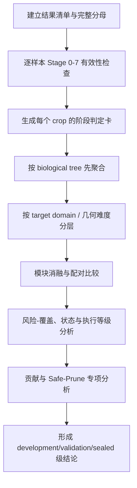

# ArcPith-GT v4 分阶段运行产物分析、结果评价与结论规范

**适用对象**：依据 `ArcPith_GTArc_SplitRole_Frozen_Final_Plan_v4.md` 实现并已经运行的 Phase A 几何后端。  
**分析目的**：不是确认脚本“有没有跑完”，而是逐阶段判断：

1. 产物是否数值、数据和语义有效；
2. 当前阶段是否完成了其唯一科学职责；
3. 该产物是否允许进入下一阶段；
4. 最终输出的髓心坐标、方向、范围、状态、执行等级和弧段贡献是否有充分证据支持；
5. 当前结果能够形成什么强度的研究结论，哪些结论仍不能宣称。

**当前边界**：本规范只评价人工连续年轮线驱动的 Phase A。自动年轮线前端不应与本阶段结果混在一起评价。若代码中的目录名、文件名与本文不同，应按字段语义映射，而不是机械按文件名对应。

---

# 0. 分析总原则

## 0.1 每个阶段都要回答三层问题

| 层级 | 核心问题 | 典型证据 | 允许形成的结论 |
|---|---|---|---|
| 数值有效性 | 产物是否完整、可复现、无坐标或求解错误 | 完整率、硬不变量、收敛、重复运行、有限值检查 | “程序和数值过程有效/无效” |
| 科学有效性 | 本阶段的算法是否完成其唯一职责 | 对照实验、参考搜索、GT、支持集、风险诊断 | “该模块能/不能解决相应科学问题” |
| 使用有效性 | 结果能否用于有限坐标、方向、范围或仅用于探索 | GeometryState、ExecutionDegree、风险—覆盖、校准级别 | “结果可用于何种程度” |

三层不能相互替代：

- 优化器收敛，不等于找到全局 basin；
- 找到低损失 basin，不等于有限距离可辨识；
- 支持集紧致，不等于公共径向中心就是生物学髓心；
- 某弧 residual 高，不等于该弧为负贡献；
- 删除弧后点误差下降，不等于删弧提高了可执行性；
- 同一树产生大量 crop，不等于有足够独立 biological trees 完成校准。

## 0.2 统一的阶段结论标签

每个阶段、每个 crop 和每个数据集汇总均使用以下标签之一：

```text
PASS
  当前阶段产物完整，核心门通过，可进入下游。

PASS_WITH_RISK
  可进入下游，但存在明确风险；风险必须传播到 ExecutionProfile。

EXPLORATORY
  结果可用于算法研究或趋势分析，但样本量、校准或参考基准不足，不能冻结。

FAIL
  当前阶段核心职责未完成；依赖该阶段的下游结论无效。

NOT_APPLICABLE
  该阶段对当前状态不适用，例如 REJECT 样本不做细粒度贡献或 Safe-Prune。
```

不能把 `EXPLORATORY` 写成“基本通过”，也不能把 `FAIL` 样本从总分母中删除。

## 0.3 三类结果必须分开保存和分析

```text
Geometry result:
  POINT / RANGE_UNCERTAIN / AXIS / MULTIMODAL / REJECT

Execution result:
  X0_INVALID / X1_GEOMETRY_WEAK / X2_DIRECTION_USABLE /
  X3_FINITE_RESEARCH / X4_FINITE_STABLE / X5_CERTIFIED

Target/model result:
  TARGET_ALIGNED / ECCENTRIC_GT / TARGET_UNKNOWN
  LOW_RISK / POINT_BLOCKING / HARD_REJECT / UNKNOWN
```

推荐在所有统计表中保留上述三个维度，禁止只导出一个“confidence”。

## 0.4 GT 的合法用途与禁止用途

GT 可以用于：

- 事后计算物理误差、方向误差和射影误差；
- 评价支持集是否覆盖真值；
- 评价弧段 `C_GT` 正负贡献；
- 构造 `F-Oracle` 理论上限；
- 在 development/calibration/validation 的预定职责内冻结参数或作 KEEP/OFF 决策。

GT 不可以用于：

- 在测试样本上选择冷启动、basin、支持阈值或删弧候选；
- 在多个 Safe-Prune 候选中挑选误差最低者；
- 删除失败样本或改变测试分母；
- 将当前样本的误差反向用于调样条、稳健核或搜索预算。

## 0.5 分析顺序必须固定



任何上游阶段 FAIL，必须在下游记录为“由上游失败导致不可解释”，而不是继续使用偶然生成的数值结果。

---

# 1. 结果目录、清单和最小数据结构

## 1.1 首先建立唯一结果索引

无论代码输出为 JSON、CSV、NPZ、PNG 还是日志，先生成统一的 `result_index`：

| 字段 | 含义 |
|---|---|
| `tree_id` | 独立 biological tree 标识 |
| `section_id` | 截面标识 |
| `crop_id` | 当前局部 FOV 标识 |
| `run_id` | 一次完整运行标识 |
| `config_hash` | 冻结参数和代码配置哈希 |
| `code_commit` | 代码版本 |
| `split` | development/calibration/validation/sealed_test |
| `target_domain` | TARGET_ALIGNED/ECCENTRIC_GT/TARGET_UNKNOWN |
| `stage0_status` … `stage7_status` | 各阶段结论 |
| `geometry_state` | 最终几何状态 |
| `execution_degree` | X0–X5 |
| `first_failure_stage` | 首个失败阶段 |
| `reason_codes` | 失败或限制原因 |
| `artifact_paths` | 各阶段产物路径 |

### 完整分母规则

设输入清单有 `N_manifest` 个 crop：


total denominator = `N_manifest`

必须分别报告：

```text
N_manifest
N_started
N_finished
N_stage0_pass
...
N_final_valid
N_POINT / N_RANGE / N_AXIS / N_MULTI / N_REJECT
N_missing_artifact
N_solver_failure
```

缺失产物、程序中断、NaN 和反序列化失败都进入分母，不能只分析成功样本。

## 1.2 每个 crop 建议汇总为一条主记录

```text
CropAnalysisRecord
├── provenance
├── target_domain / GT uncertainty
├── stage_verdicts[0:7]
├── measurement_summary
├── preflight_summary
├── seed_and_basin_summary
├── all_arc_estimate
├── profiles_and_state
├── model_risk_and_execution
├── contributions
├── safe_prune_comparison
├── runtime_and_memory
├── first_failure_stage
└── conclusion_text
```

## 1.3 结果完整性检查

| 检查 | 通过条件 | 失败处理 |
|---|---|---|
| 样本一一对应 | 每个 manifest crop 至少有状态记录 | `MISSING_RESULT` |
| 配置一致 | 同一正式实验的 `config_hash` 一致 | 分实验重算，禁止混合 |
| GT 隔离 | test 运行日志不存在 GT 参与选择的记录 | 该次 test 作废 |
| 数值有限 | 关键数值无 NaN/Inf，合法的 infinity 只以射影状态表达 | `NUMERICAL_INVALID` |
| 版本可追溯 | 代码、参数、数据版本齐全 | 不允许称可复现 |
| 产物可联结 | ring/block 贡献可追溯到原 fragment | `LINEAGE_BROKEN` |

---

# 2. 总体阶段—产物—结论地图

| 阶段 | 最小必查产物 | 核心评价问题 | 失败后影响 |
|---|---|---|---|
| Stage 0 坐标/目标合同 | manifest、transform、lineage、GT/domain、硬不变量报告 | 数据和目标定义是否真实有效 | 全部下游作废 |
| Stage 1 连续弧测量 | spline、tangent、uncertainty、validity、quadrature、overlay | 离散点是否被恢复为可信连续弧且未制造伪证据 | seed、目标、profile、贡献均不可解释 |
| Stage 2 预检/冷启动 | preflight descriptors、seed 表、seed cluster、粗 loss map | 候选库是否覆盖有限、图外、远场及第二 basin | 不能证明全局解 |
| Stage 3 All-Arc 全局反演 | 各 seed 优化、basin、J/M50/U20、预算 replay、Search Certificate | 是否找到同一固定目标的全部相关 basin | 不得输出 POINT/RANGE/AXIS |
| Stage 4 精化/可辨识性 | dense refit、profiles、supported sets、state | 方向和距离分别知道多少，有限点是否真正紧致 | 不能给正确几何状态 |
| Stage 5 风险/执行度 | target risk、结构残差、删除散布、replay、risk-coverage | 紧致解是否可能为模型伪中心，能用到什么程度 | POINT 需阻断或降执行等级 |
| Stage 6 弧段贡献 | exact delete-refit、C_GT/C_phi/C_r/C_mode/shift/conflict、heatmap | 每条弧具体帮助、伤害或排除何种不确定性 | 只能不给贡献结论，不应反改 All-Arc |
| Stage 7 Safe-Prune | 候选组、样本门、All/Safe/Oracle、rollback、部署统计 | 无 GT 条件删弧是否比 All-Arc 安全且更准 | 保持 `SAFE_PRUNE=OFF` |

---

# 3. Stage 0：坐标、目标与数据硬合同

## 3.1 应检查的运行产物

最低产物：

```text
input_manifest.csv/json
coordinate_transform.json
lineage_table.csv
parent_ring_order.csv
crop_polygon / source image metadata
pith_gt.json and gt_uncertainty, when available
target_domain.json
hard_invariant_report.json
source_crop_overlay.png
```

若代码未按这些名字输出，应定位同义字段。

## 3.2 单样本检查顺序

### A. 坐标往返

对原图点 `x_source`：

\[
e_{rt}=\|T^{-1}(T(x_{source}))-x_{source}\|.
\]

分别计算：

```text
max round-trip error
median round-trip error
pith-GT round-trip error
crop polygon round-trip error
```

正式结论应使用与数值精度匹配的预注册容差；若原方案要求“0 coordinate error”，实现中可将其操作化为机器精度或像素/毫米可忽略量，但必须固定，不得按样本放宽。

### B. 变换等变性

对平移、旋转和统一缩放 replay，映回原坐标后比较：

\[
E_{equiv}^{proj}=d_{\mathbb{RP}^2}(\hat h,\hat h_{replay}),
\]

有限解另报：

\[
E_{equiv}^{mm}=\|\hat p-\hat p_{replay}\|_{mm}.
\]

此项最好在固定 fixture 上自动执行，不需要对全部正式样本重复高成本求解。

### C. 射影不变量

必须验证：

```text
t -> -t 目标和结果不变
h -> -h 射影结论不变
finite/far chart overlap 映射一致
exact AXIS 不被写成最大半径有限点
图外 GT 不被裁剪到 crop 边界
```

### D. lineage 和 parent budget 前提

检查：

```text
parent_ring_id 是否唯一且稳定
fragment 是否全部归属于一个 parent ring
ring_order 是否来自完整拓扑而非当前候选
裁剪边界是否被误识别为年轮
重复点/插值点是否改变 parent-ring 计数
```

### E. 生物学目标与几何代理的关系

在有完整截面或最大 FOV 的样本上计算：

\[
B_{target}=\frac{\|p_{rc}^{full}-p^*\|}{D_{section}}.
\]

输出：

```text
B_target per section
TARGET_ALIGNED / ECCENTRIC_GT / TARGET_UNKNOWN
target-domain by tree/species/section/growth condition
GT uncertainty distribution
```

## 3.3 阶段指标

| 指标 | 层级 | 解释 |
|---|---|---|
| transform round-trip max/median | crop | 坐标实现是否正确 |
| invariance failure count | fixture/crop | 数学不变量是否破坏 |
| lineage conflict count | crop/tree | 证据语义是否可追溯 |
| clipped outside-GT count | crop | 是否人为改变图外真值 |
| duplicate/interpolation budget drift | fixture | 是否制造伪证据 |
| `B_target` median/P90/max | section/tree | 公共径向中心与生物学髓心差异 |
| target-domain rate | tree/domain | G0 的适用域边界 |

## 3.4 必画图

1. 原图、crop、连续弧、parent-ring ID、图内/图外 GT 的叠加图；
2. source↔crop 坐标往返误差分布；
3. `B_target` 按 tree/section 的箱线图或点图；
4. `TARGET_ALIGNED/ECCENTRIC_GT/TARGET_UNKNOWN` 的完整分母条形图；
5. 射影 finite→far→infinity fixture 的连续轨迹图。

## 3.5 结果判定

| 观察 | 判定 | 结论 |
|---|---|---|
| 任一坐标或 lineage 硬错误 | FAIL | 修复 Stage 0，所有下游结果作废 |
| 硬不变量通过，但目标域多数未知 | PASS_WITH_RISK | 可研究几何定位，不能宣称对生物学髓心已完成适用域认证 |
| `TARGET_ALIGNED` 内误差小、`ECCENTRIC_GT` 内显著变差 | 科学上合理 | 说明 G0 对径向汇聚中心有效，但受共同偏心模型限制 |
| `B_target` 在主数据域已接近应用容差或更大 | 目标模型风险高 | 不应只靠局部公共中心模型追求生物学髓心；需风险阻断或扩展观测 |

## 3.6 可直接使用的阶段结论模板

**通过时**：

> Stage 0 的坐标往返、射影等价、finite/far chart、图外 GT 保持及 parent-ring lineage 硬不变量均通过，说明后续误差可解释为测量、搜索或模型问题，而非坐标实现错误。目标域分析显示，G0 的主要适用范围为 `[TARGET_ALIGNED 具体范围]`；`ECCENTRIC_GT` 被保留在 full-domain 分母并单列分析。

**失败时**：

> Stage 0 在 `[具体不变量]` 上失败，因此当前坐标、支持集、贡献和 Safe-Prune 结果均不可解释。本轮分析应停止在 Stage 0，修复后重跑全部依赖阶段。

---

# 4. Stage 1：连续弧、切向和测量不确定度

## 4.1 应检查的运行产物

```text
spline_coefficients / sampled_spline
fragment_validity.csv
endpoint_guard.csv
tangent_field.npy/csv
position_covariance Sigma_x
tangent_uncertainty sigma_psi
smoothing_sweep.csv
annotation_bootstrap.csv
quadrature_nodes_and_weights
quadrature_convergence.csv
measurement_overlay.png
```

## 4.2 先做可视化，再看汇总数字

每个代表性 crop 至少检查：

1. 原始标注点与拟合 spline 是否一致；
2. 是否存在样条跨越真实缺口、自交、反向回折；
3. 端点切向是否出现明显摆动；
4. 低转角短弧是否被错误删除；
5. 高曲率或局部异常是否被过平滑；
6. tangent 的无向性是否正确；
7. 不确定度高值是否集中在端点、稀疏点和重复标注分歧区域，而非由当前髓心 residual 产生。

可视化应按 `valid / guarded / invalid` 着色，并标出 invalid reason。

## 4.3 样条和平滑评价

### A. 切向重复性

\[
D_t(\lambda)=Q_{0.90}\left[d_\pi(t_\lambda^{(b)},t_\lambda^{(b')})\right].
\]

按以下层级报告：

```text
fragment-level D_t
crop-level median / upper tail D_t
tree-level aggregate D_t
D_t by arc length / turn / point density / endpoint distance
```

### B. 总转角保持

\[
B_\Theta(\lambda)=
\frac{|\Theta_\lambda-\Theta_{ref}|}{\Theta_{ref}+\epsilon}.
\]

正确结果不是 `D_t` 越小越好，而是在切向稳定的同时不显著增加 `B_Theta`。若平滑使高转角弧的总转角系统下降，后续距离信息会被人为削弱。

### C. 下游髓心敏感性

对邻近平滑尺度 `0.5λ, λ, 2λ`，在固定算法下比较：

\[
\Delta p_\lambda=\|\hat p_{\lambda'}-\hat p_{\lambda}\|,
\qquad
\Delta h_\lambda=d_{RP^2}(\hat h_{\lambda'},\hat h_{\lambda}).
\]

该项只用于验证冻结尺度稳定，不得按单个 crop 的 GT 误差选择最优 `λ`。

## 4.4 测量不确定度评价

### A. 来源占比

分别报告：

```text
真实重复标注贡献
样条 bootstrap 贡献
合成扰动外推贡献
sigma floor 贡献
sigma clipping 比例
```

若多数 `sigma_e` 由人工上限/下限裁剪产生，说明不确定度模型未实际标定。

### B. 标准化一致性

在重复标注子集上，用独立重复测量差异检查 `Sigma_x` 和 `sigma_psi`：

- 经验分位数覆盖是否与设定尺度大致一致；
- 高不确定度是否对应高重复差异；
- 不同弧长、点密度和端点区是否存在系统低估。

不要求强行假设高斯分布；优先报告经验 coverage、median absolute standardized deviation 和分层校准曲线。

### C. 候选依赖只允许通过 Jacobian

检查日志中是否存在：

```text
根据当前 residual 重新放大/缩小 Sigma_x
根据当前候选给 ring 重新赋可靠权重
低 residual 自动减小 sigma
```

若存在，说明产生了自证循环，应判 Stage 1 FAIL 或实现偏离 v4。

## 4.5 连续弧有效性评价

| 指标 | 目的 |
|---|---|
| fragment valid rate | 测量层保留了多少真实证据 |
| invalid reason distribution | 点少、弧短、缺口、拓扑、切向不稳各占多少 |
| retained parent-ring rate | 是否因碎片化丢失过多 parent rings |
| endpoint guarded length ratio | 端点保护是否过度 |
| low-turn retained rate | 是否错误过滤方向证据 |
| arc length and turn after filtering | 后续可辨识性的真实基础 |

若 invalid rate 很高，不能直接放宽阈值；先按原因区分是标注质量、数据本身还是样条实现问题。

## 4.6 证据守恒和 quadrature 评价

必须构造三类 replay：

```text
顶点复制
插值加密
fragment 人工拆分后保持同一 parent ring
```

比较：

```text
J_abs
h_RP2 / finite pith
M50 / U20
profiles / state
parent-ring total weight
```

正确结果应在数值容差内一致。

quadrature 加密评价：

\[
E_{quad}=\frac{|A^{2K}-A^K|}{1+|A^{2K}|}.
\]

报告：

```text
convergence pass rate
nodes per fragment distribution
hard cases needing repeated doubling
quadrature time share
coarse-to-dense solution drift
```

## 4.7 阶段结果表

| 维度 | 主指标 | 通过含义 | 失败含义 |
|---|---|---|---|
| 曲线几何 | overlay、自交/回折/跨缺口率 | spline 忠实恢复连续弧 | 后续切向无物理意义 |
| 切向稳定 | `D_t` | 标注噪声得到控制 | seed 和 residual 不稳定 |
| 转角偏差 | `B_Theta` | 未抹掉距离信息 | 过平滑或参考错误 |
| 不确定度 | 重复标注经验校准 | 标准化 residual 有解释性 | pseudo-Huber 工作点漂移 |
| 证据守恒 | duplicate/split invariance | 点密度未被当作证据 | 统计语义错误 |
| 数值积分 | `E_quad` 和解漂移 | 结果不依赖采样节点 | 后续精度受离散化控制 |

## 4.8 阶段结论规则

- **PASS**：曲线拓扑正确；`D_t` 达到稳定要求；`B_Theta` 未显示系统转角损失；不确定度由真实重复标注支撑；证据守恒和 quadrature replay 通过。
- **PASS_WITH_RISK**：样条和证据守恒通过，但重复标注不足，`sigma` 主要为探索性估计。后续可运行，但 ExecutionDegree 不能达到正式校准等级。
- **FAIL**：存在跨缺口、自交、切向反向、candidate-dependent uncertainty、复制增权或 quadrature 不收敛。

## 4.9 可直接使用的阶段结论模板

> Stage 1 表明，冻结样条在 `[数据分层]` 上将切向重复性由 `[值]` 改善到 `[值]`，同时总转角偏差保持在 `[范围]`。复制、插值和 fragment split replay 未改变 parent-ring 预算和主要几何结论，说明连续积分只提高数值精度而未制造额外证据。当前限制为 `[重复标注覆盖不足/端点不稳定等]`，因此测量尺度的校准级别为 `[级别]`。

---

# 5. Stage 2：候选无关预检与六源冷启动

## 5.1 应检查的运行产物

```text
preflight_metrics.csv
Gram_eigenvalues_and_g_svd.csv
seed_table.csv
seed_source_summary.csv
seed_clusters.csv
coarse_loss_map_finite_chart
coarse_loss_map_far_chart
far_axis_and_ladder.json
circle_seed_bootstrap.csv
cold_start_ablation.csv
reference_basin_matching.csv
```

每个 seed 记录至少包含：

```text
seed_id / source_family
h_RP2 / finite p if applicable
validity / rejection reason
pre-refine J
post-refine J
matched_basin_id
is_unique_discovery
runtime
```

## 5.2 预检结果如何分析

预检不评价髓心“准不准”，只判断当前几何需要怎样的搜索预算。分析：

| 量 | 低/高值的科学含义 | 合法用途 |
|---|---|---|
| `R_eff` | 有效 parent rings 数量 | 搜索预算和结果分层 |
| total arc length | 覆盖量 | 搜索预算和结果分层 |
| `Theta_total` | 有限距离线索强弱 | far/finite seed 配比 |
| `B_spatial` | 弧段空间基线 | CS2/CS3 组合优先级 |
| `T_span` | 切向方向互补性 | far-chart 密度和困难度分层 |
| `g_svd` | SVD null direction 稳定性 | 搜索升级，不判 AXIS |
| truncation/one-sidedness | 局部观测偏置 | 困难度分层和修复建议 |

需要绘制 `g_svd`、`Theta_total`、`B_spatial` 与后续搜索预算、basin 数和状态的关系。该关系用于检验预检是否能预测“需要更多搜索”，而不是用它直接分类状态。

## 5.3 冷启动的核心评价：basin coverage

### A. 定义高预算 reference basin

在 development/audit 子集上，用更高预算确定性 RP² 搜索建立 `B_ref`。reference 仍使用同一 `J_abs`，不能用另一目标。

对候选 basin 与 reference basin 的匹配同时考虑：

\[
d_{RP^2}(h_b,h_{ref})\le\tau_h,
\]

有限点再满足：

\[
\|p_b-p_{ref}\|/D_{FOV}\le\tau_p.
\]

### B. 主要指标

| 指标 | 定义 | 解释 |
|---|---|---|
| basin recall | 找到的 reference basin 比例 | 冷启动覆盖能力 |
| global-best recall | 是否找到 reference 最优 basin | 是否可能得到正确主解 |
| relevant-mode recall | 是否找到所有 loss-equivalent 分离 mode | MULTIMODAL 不漏检能力 |
| source unique discovery | 某 family 独立发现的 basin 比例 | 该 seed family 的不可替代价值 |
| seeds per recovered basin | seed 数/有效 basin | 搜索效率和冗余 |
| pre-to-post objective gain | 局部精化前后差 | seed 是否处于有效吸引域 |
| far/infinity recall | 远场 fixture 的覆盖率 | 是否会被伪有限点替代 |
| corrupted-ring robustness | 含异常 ring 时 basin recall | CS3 等是否真正有价值 |

### C. 分 seed family 判断

**CS1 SVD**：

- 看全局最优 recall 和 `g_svd` 分层；
- `g_svd` 小时失效属于预期，但应被其他 family 补足；
- 不能因 SVD seed 误差大就删除 SVD，它可能在部分域提供最低成本稳定初值。

**CS2 连续法线带**：

- 报 `H_G` 条件数、合法组合率、seed 物理距离分布；
- 近奇异组合应转 far-axis，而不是产生极端有限点；
- 检查其对中等图外、不同空间基线弧的独立贡献。

**CS3 group consensus**：

- 报含异常 ring 时的独立 basin recall；
- `Q_G` 只评价 seed 筛选效率，不可作为最终置信；
- 若与 CS2 完全冗余且显著耗时，可在不损失 reference recall 的前提下缩减组合预算。

**CS4 整弧圆 seed**：

- 只在高转角稳定 fragment 上评价；
- 报 bootstrap 圆心离散与 basin 命中率；
- 若在低转角弧产生超远伪点，说明门控错误。

**CS5 far-axis**：

- 重点看 far/infinity fixture、方向误差和边界伪有限率；
- 梯级各距离层的作用只看 coverage，不将命中层解释为估计距离。

**CS6 确定性网格**：

- 评价启发式全部失败时的兜底 basin recall；
- 评价 seam、narrow basin 和第二 mode；
- 不能因其耗时而在没有等价兜底的情况下删除。

## 5.4 冷启动消融的正确比较方式

固定：

```text
同一 observations
同一 J_abs
同一局部优化器
同一 coarse quadrature
同一 basin merge
同一最大预算或明确报告预算差异
```

推荐版本：

```text
C0: FOV-center single start
C1: SVD only
C2: SVD + finite intersections/group seeds
C3: C2 + far-axis ladder
C4: 完整六源 seed bank
C5: C4 + high-budget deterministic reference
```

评价重点应为 basin recall 与 global-best recall，而不是仅比较最终平均误差。若单初值偶然在 GT 附近但漏掉第二 basin，也不能认为搜索充分。

## 5.5 必画图

1. finite chart 和 far chart 的 coarse loss map；
2. 不同 seed family 的初始点、局部优化轨迹和最终 basin；
3. seed family × fixture 的 basin recall 热图；
4. `g_svd` 或 `Theta_total` 与所需搜索预算的关系；
5. far ladder 上的目标曲线与 infinity 点；
6. 每个 basin 被哪些 seed family 发现的 UpSet/矩阵图。

## 5.6 阶段判定

| 结果 | 判定 |
|---|---|
| 完整六源相对 reference 的 global-best/relevant-mode recall 达到预注册要求 | PASS |
| 少数难例仍漏 basin，但可由搜索升级明确识别并在 Stage 3 拒识 | PASS_WITH_RISK |
| far/infinity 被最大半径点代替，或 narrow second basin 系统漏检 | FAIL |
| 只有 GT 正确率高，但缺少 reference basin 对照 | EXPLORATORY，不能宣称冷启动闭合 |
| 某 seed family 无独立增益且显著增加成本 | 可删减，但须重做完整 search adequacy 评价 |

## 5.7 阶段结论模板

> 六源冷启动在高预算同目标 reference 上获得 `[global-best recall]` 和 `[relevant-mode recall]`。其中 `[seed family]` 对 `[远场/异常 ring/第二 basin]` 具有独立发现作用，不能由其他初值替代；`[冗余 family]` 主要增加计算量。预检量 `[g_svd/Theta/B_spatial]` 能预测搜索升级需求，但未参与最终状态判断，符合职责分离要求。

---

# 6. Stage 3：All-Arc 全局公共中心反演与 Search Certificate

## 6.1 应检查的运行产物

```text
seed_optimization_log.csv
basin_table.csv
basin_merge_log.csv
ring_losses_at_each_basin.csv
J_M50_U20_summary.csv
budget_replay.csv
mesh_phase_replay.csv
chart_overlap_and_seam.csv
boundary_and_near_point_checks.csv
search_certificate.json
fit_overlay_all_arc.png
```

## 6.2 第一层：目标与优化器是否正常

检查每个 seed：

```text
initial J / final J
iteration count
final gradient norm
termination reason
near-point barrier activity
chart/parameterization
NaN/Inf/line-search failure
```

异常解释：

- 很多 seed 在同一位置异常终止：可能是目标/Jacobian 实现问题；
- 仅部分 seed 失败但其他 family 覆盖同一 basin：记录 solver failure，不必判整样本失败；
- 最优解长期停在非法域或边界：不是“困难有限点”，而是搜索/几何失败；
- 优化收敛但不同 seed 落入多个分离 basin：进入多模态和 search certificate 分析。

## 6.3 第二层：All-Arc 主目标与 ring-level 守卫

对每个 basin 报告：

\[
J_{abs},\quad M_{50},\quad U_{20},\quad \{A_r\}_{r=1}^R.
\]

另可报告描述性量：

\[
Q_{tail}=\frac{U_{20}}{M_{50}+\epsilon},
\]

但 `Q_tail` 只能帮助可视化，不能未经 calibration 变成新状态阈值。

### 结果解释

| 模式 | `J_abs` | `M50` | `U20` | 科学解释 |
|---|---:|---:|---:|---|
| 三者均低 | 低 | 低 | 低 | 多数和尾部 rings 均支持该公共中心 |
| J 低、M50 低、U20 高 | 低 | 低 | 高 | 主体一致但少数 rings 系统冲突；进入 model-risk/贡献 |
| J 和 M50 高 | 高 | 高 | 高或中 | 公共中心模型总体不适配或测量有问题 |
| 两 basin J 接近但 tail 结构不同 | 接近 | 不同 | 不同 | 不能仅按 tail 偷换候选；保留 mode，交给状态/风险解释 |

必须画每条 parent ring 的 `A_r` 条形图，并标出相应弧在图像中的位置。单看总体 loss 会掩盖少数有害或关键弧。

## 6.4 第三层：全局性和预算收敛

对预算 `B, 2B, 4B...` 报告：

\[
\Delta J_B=\frac{|J_{min}^{2B}-J_{min}^{B}|}{1+|J_{min}^{2B}|},
\]

\[
\Delta h_B=\max_{b\in\mathcal B_B}\min_{b'\in\mathcal B_{2B}}
 d_{RP^2}(h_b,h_{b'}).
\]

另报：

```text
basin count stability
component correspondence
new relevant low-loss cell count
mode rank stability
mesh phase agreement
chart rotation agreement
```

### Search Certificate 分项表

| 分项 | PASS 条件 | 失败结论 |
|---|---|---|
| best loss convergence | `ΔJ_B` 小于冻结容差 | 预算不足或目标计算不稳 |
| basin location convergence | `Δh_B` 和有限物理差稳定 | basin 未收敛 |
| relevant basin count | 增加预算不出现新 mode | 不能排除漏解 |
| stationarity | 所有保留 mode 局部稳定 | 数值优化未完成 |
| boundary | 无最大半径/搜索边界 pinned finite | 伪有限点风险 |
| near-point | 非法邻域被正确排除 | 目标存在伪零残差 |
| grid replay | phase/rotation 结论一致 | 网格别名效应 |
| seam | 射影位置、目标和 topology 一致 | 图表实现或搜索未闭合 |

任何关键项失败：

```text
geometry_state = REJECT
reason = SEARCH_INADEQUATE or NUMERICAL_INVALID
```

不能继续将宽 profile 解释成 RANGE/AXIS，因为其宽度可能只是搜索失败。

## 6.5 seam 分析

同时报告：

\[
E_{seam,h}=d_{RP^2}(h_F,h_P),
\]

\[
E_{seam,J}=\frac{|J_F-J_P|}{1+\min(J_F,J_P)}.
\]

以及 `component_count/topology` 是否一致。

分析顺序：

```text
扩大 overlap 或网格
-> 提高 quadrature/optimizer 精度
-> 重放 mesh phase/chart rotation
-> 仍不一致则 REJECT
```

seam 两侧出现两个数值副本不等于真实 MULTIMODAL。

## 6.6 GT 评价只能在搜索结论之后

当 Search Certificate 通过后，计算：

有限点物理误差：

\[
E_p=\|\hat p-p^*\|_{mm},
\qquad
E_{norm}=E_p/D_{FOV}.
\]

射影误差：

\[
E_{proj}=d_{RP^2}(\hat h,h^*).
\]

方向误差：

\[
E_\phi=d_\pi(\hat u,u^*).
\]

不能使用 GT 在两个 loss-equivalent basin 中选“更正确”的一个；这类样本应保留为 MULTIMODAL 或风险状态。

## 6.7 必画图

1. 所有 seed 到 basin 的轨迹；
2. RP² loss map 和保留 basin；
3. budget–best loss、budget–basin count 曲线；
4. finite/far chart seam 对比；
5. 每个 basin 的 ring loss profile；
6. 当前中心到连续弧的径向方向叠加图；
7. GT 只作为事后标记，不参与轨迹选择。

## 6.8 阶段结论分类

### PASS：全局反演闭合

- Search Certificate 全部关键项通过；
- relevant basins 对预算和 mesh replay 稳定；
- 无边界伪有限点；
- All-Arc 目标、M50/U20 可完整解释。

### PASS_WITH_RISK：几何搜索闭合但模型冲突

- 搜索闭合；
- `J/M50` 尚可但 `U20` 高，或 structured conflict 明显；
- 可进入 Stage 4/5，但不能直接升级为高等级 POINT。

### FAIL：搜索或数值未闭合

- 新 basin 随预算继续出现；
- seam 不一致；
- boundary-pinned finite；
- near-point 非法解；
- solver 大量失败且无替代 basin coverage。

## 6.9 阶段结论模板

> 在固定 All-Arc 目标下，预算从 `[B]` 增加到 `[2B/4B]` 后，最优目标变化为 `[ΔJ]`，相关 basin 数由 `[值]` 稳定为 `[值]`，射影位置变化为 `[Δh]`。双图表 seam 和 mesh replay 均 `[通过/失败]`，因此 Search Certificate 判为 `[PASS/FAIL]`。最优 basin 的 `M50=[ ]`、`U20=[ ]`，显示 `[整体一致/少数 ring 冲突]`；该冲突被传播到模型风险，而未用于事后换候选。

---

# 7. Stage 4：高分辨率精化、支持集和几何五态

## 7.1 应检查的运行产物

```text
coarse_vs_dense_refit.csv
dense_quadrature_convergence.csv
local_optimizer_diagnostics.csv
direction_profile.csv
range_vartheta_profile.csv
nested_supported_sets.json/npz
support_components.csv
state_decision_trace.json
profile_and_support_plots
```

## 7.2 高分辨率精化评价

对每个相关 basin 比较 coarse 与 dense：

```text
ΔJ_dense
Δh_proj
Δp_mm if finite
gradient norm / KKT residual
quadrature convergence
chart mapping difference
repeat-run difference
runtime multiplier
```

### 正确解释

- `Δp` 小且梯度/KKT 改善：coarse 已接近数值收敛，dense 作为认证有价值；
- `Δp` 中等且 GT error 稳定下降：dense 确实提高精度；
- `Δp` 大且随继续加密不稳定：当前结果为 `NUMERICAL_UNSTABLE`；
- 仅 `J` 略降但物理误差、重复性和 profile 均不改善：不应无限增加在线预算；
- dense 不能引入新权重、重新估计 sigma 或改变 robust kernel。

### 数据集级 KEEP 判据

比较 coarse/dense 时使用 tree-level paired endpoint：

```text
finite physical error
P90/P95/max or catastrophic rate
repeat-run drift
profile width
runtime
```

只有精度或数值稳定性有一致改善，才保留高预算；否则将 dense 限定为 audit。

## 7.3 profile 的正确读法

### A. 方向 profile

\[
L_\phi(\phi)=\min_\vartheta J_{abs}(\phi,\vartheta).
\]

分析：

```text
主方向
次方向 basin
mod-π 或 2π 周期处理是否正确
W_phi
方向支持是否随 delta 邻域稳定
mesh/profile refinement 后是否稳定
```

### B. 距离 profile

\[
L_\vartheta(\vartheta)=\min_\phi J_{abs}(\phi,\vartheta).
\]

分析：

```text
是否触及 vartheta=0
W_vartheta
有限 I_r
W_logr
finite-to-infinity ridge
下界和上界是否稳定
```

有限上界不存在时必须写 `∞`，不能截断成最大搜索半径。

### C. 嵌套支持集

对一组 `delta` 或校准的 `delta_alpha`，报告：

```text
component count
component persistence
GT containment, evaluation only
touches infinity
W_phi / W_vartheta / I_r / W_logr
topology under delta-neighborhood
replay stability
```

单个 `delta` 下得到漂亮紧致区域不构成可靠结果；应看邻近 `delta` 和搜索 replay 下的持续性。

## 7.4 校准状态必须单独报告

| 情形 | 可报告内容 | 禁止结论 |
|---|---|---|
| calibration trees 足够且 `delta_alpha` 冻结 | coverage、状态门、支持集统计 | test 上重选 delta |
| calibration trees 不足 | delta-family/nested profile、POINT_CANDIDATE | calibrated POINT 或 coverage 保证 |
| sealed test | 固定阈值下结果 | 用 test GT 调宽支持集 |

支持集 coverage：

\[
Coverage=\frac{1}{N}\sum_i \mathbf1[h_i^*\in\mathcal S_{\delta_\alpha,i}].
\]

应以 tree-level 分层和完整分母报告。

## 7.5 五态逐类评价

## 7.5.1 POINT / POINT_CANDIDATE

主指标：

```text
physical error mm
normalized error / D_FOV
projective error
median / IQR / P90 / P95 / max
catastrophic error rate
support containment
W_phi / W_vartheta / W_logr
false compact finite / False-POINT
```

判断：

- 点误差小但支持集未覆盖 GT：点估计偶然好，uncertainty 失准；
- 点误差大且支持集紧：危险伪 POINT，优先检查 target/model risk；
- 点误差大且支持集宽：本应为 RANGE 或未校准；
- `POINT_CANDIDATE` 只有通过 Stage 5 风险门后才成为 POINT。

## 7.5.2 RANGE_UNCERTAIN

主指标：

```text
GT 是否在 finite range interval 内
range interval width / W_logr
direction error and W_phi
interval lower/upper bound stability
false POINT conversion
```

正确结果允许点估计本身误差较大，只要方向稳定且真实距离被合理区间覆盖。不能用 RANGE 样本的单点误差评价整个方法。

## 7.5.3 AXIS

主指标：

\[
E_{axis}=d_\pi(\hat u,u^*).
\]

并报告：

```text
direction interval width
infinity touch
finite lower-bound violation
false finite conversion
far fixture consistency
```

AXIS 的正确结论是“当前 FOV 支持方向但不支持有限距离”，不是算法失败。

## 7.5.4 MULTIMODAL

主指标：

```text
component count
mode separation
GT-consistent component present
second-mode recall relative to reference
mode persistence across delta/budget/replay
```

真实数据中通常没有逐样本“真状态标签”。因此：

- synthetic/controlled fixture 可以有明确 MULTIMODAL ground truth；
- 真实数据优先评价 reference search 的 mode recall、GT 是否落在某个稳定 component 和 topology 稳定性；
- 不能用 GT 事后选择一个 component 并改报 POINT。

## 7.5.5 REJECT

报告：

```text
first failure stage
reason code
是否可修复
是否因数据、搜索、拓扑、模型或数值
对应几何难度和 target domain
```

REJECT 不是统一坏结果。必须分开：

```text
INVALID_DATA
INSUFFICIENT_GEOMETRY
SEARCH_INADEQUATE
TOPOLOGY_FRAGILE
DIRECTION_UNIDENTIFIABLE
NUMERICAL_INVALID
MODEL_HARD_REJECT
```

## 7.6 状态正确性的整体评价

### 对 synthetic/controlled fixtures

可建立状态混淆矩阵：

```text
true POINT/RANGE/AXIS/MULTI/REJECT
vs predicted state
```

重点错误：

```text
AXIS -> POINT
MULTIMODAL -> POINT
SEARCH FAIL -> RANGE/AXIS
ECCENTRIC model risk -> unmarked stable POINT
```

### 对真实 radial-paired crops

不宜用固定 `r/D` 直接定义真状态。应评价：

1. 随 `r/D` 增大或总转角下降，`W_vartheta/W_logr` 是否单调或总体增大；
2. 状态是否整体呈 `POINT -> RANGE -> AXIS`；
3. 方向误差是否比距离误差退化更慢；
4. False-POINT 是否受控；
5. 支持集 coverage 是否在不同距离分层中保持合理。

用有序趋势、转变区间和风险—覆盖评价，不强迫每个 crop 落入预设状态。

## 7.7 必画图

1. coarse/dense 点位与误差配对图；
2. `L_phi`、`L_vartheta` profile；
3. 嵌套支持集在 RP²/finite plane 的投影；
4. `W_phi/W_vartheta/W_logr` 对 `r/D_FOV`、总转角、空间基线的关系；
5. 状态 Sankey：near→mid→far paired crops；
6. POINT 物理误差与支持集宽度散点图；
7. GT containment 与 nominal coverage 图；
8. 典型 POINT/RANGE/AXIS/MULTI/REJECT 案例图。

## 7.8 阶段结论规则

- **PASS**：dense 数值稳定；支持集 topology 对邻近阈值和 replay 稳定；五态输出与 reference/fixture/退化趋势一致。
- **PASS_WITH_RISK**：profile 科学合理，但 `delta` 未独立校准，只能输出 `POINT_CANDIDATE/X3`。
- **FAIL**：support topology 对 mesh 或微小 `delta` 极度敏感；AXIS 被强制有限化；多 mode 被事后挑一个；dense 解不收敛。

## 7.9 阶段结论模板

> 高分辨率精化使有限解的数值漂移由 `[值]` 降至 `[值]`，物理误差 `[改善/无显著改善]`，因此该模块被定位为 `[在线精化/audit 数值认证]`。方向与距离 profile 显示 `[W_phi]` 和 `[W_vartheta/W_logr]`，支持集在邻近阈值及搜索 replay 下 `[稳定/不稳定]`。本样本/数据层级的几何状态为 `[状态]`，其依据是 `[component、infinity touch、range interval]`，而非固定 `r/D` 或单一 Hessian。

---

# 8. Stage 5：模型适用性、稳健性与执行等级

## 8.1 应检查的运行产物

```text
target_alignment_registry.csv
structured_residual_oof.csv
leave_one_ring_out_scatter.csv
annotation_spline_grid_replay.csv
common_bias_fixture_results.csv
model_risk_status.json
execution_profile.json
execution_degree.json
risk_coverage_curve.csv
reject_reason_summary.csv
```

## 8.2 target-alignment 分析

分两套结果：

```text
aligned-domain results
full-domain results including ECCENTRIC_GT and UNKNOWN
```

至少报告：

```text
TARGET_ALIGNED rate
ECCENTRIC_GT rate
TARGET_UNKNOWN rate
B_target by tree/section/condition
POINT error by target domain
False-POINT by target domain
model-risk capture by target domain
```

### 结论逻辑

- aligned 好、eccentric 差：说明 G0 对其假设域有效，不等于算法整体失败；
- 两域都好：可能说明局部证据或风险模块能够补偿，但需独立验证；
- aligned 也差：核心几何或测量/搜索仍有问题；
- eccentric 样本被大量 REJECT：可能是合理风险控制，也可能过度保守，应看风险—覆盖和 reason code。

## 8.3 结构化 residual 分析

使用 OOF：

\[
R^2_{struct}=1-
\frac{SSE_{OOF,model}}{SSE_{OOF,null}}.
\]

报告：

```text
OOF R2 by crop/tree/domain
in-sample vs OOF gap
harmonic coefficient stability
residual pattern by ring order / arc position / angle
relation to physical error and False-POINT
```

解释：

- OOF `R²_struct` 高且跨 ring 稳定：共同低频偏差证据；
- 训练内高、OOF 低：过拟合，不应 POINT_BLOCK；
- `R²` 低但误差大：风险可能来自 target mismatch、错误 association 或局部不可辨识，不能认为模型安全；
- 该诊断器不能输出替代中心。

## 8.4 parent-ring 删除散布

\[
S_{del}^{proj}=Q_{0.90,r}[d_{RP^2}(\hat h,\hat h_{-r})],
\]

有限解：

\[
S_{del}^{mm}=Q_{0.90,r}[\|\hat p-\hat p_{-r}\|].
\]

同时分析：

```text
state flip rate
new basin rate
largest deletion shift
which rings dominate instability
whether high shift ring is critical or harmful
```

高删除散布表示结果高度依赖少数 rings，但不能单独判其为坏弧。必须与 Stage 6 的 GT-help、direction/range role 和 conflict 联合解释。

## 8.5 measurement/search replay 稳定性

每种 replay 分别报告：

```text
center/projective dispersion
W_phi dispersion
W_vartheta/W_logr dispersion
state agreement rate
search certificate pass rate
risk-status agreement
```

建议把 replay 分为：

```text
measurement replay: annotation/spline/quadrature
search replay: seed family ablation/grid phase/chart rotation/budget
```

若搜索 replay 不稳定，应回到 Stage 3，而不是仅降低 `E_robust`。

## 8.6 common-bias fixture 分析

核心评价对象不是平均误差，而是“紧致、稳定、但 GT 严重错误”的灾难样本。

定义：

```text
catastrophic case:
  finite/high-confidence-like result
  AND physical error > pre-registered catastrophic threshold
```

主要指标：

| 指标 | 含义 |
|---|---|
| catastrophic capture | 高风险灾难被 POINT_BLOCKING/HARD_REJECT 捕获比例 |
| uncovered catastrophe | 灾难仍获得未标记 POINT 的比例 |
| false veto | 本来正确稳定的 POINT 被错误阻断比例 |
| incremental capture | 每个风险诊断相对已有诊断新增捕获量 |
| domain-specific capture | ECCENTRIC_GT、wrong association 等分层捕获能力 |

结果分析应比较：

```text
target alignment only
+ structured residual
+ deletion scatter
+ replay
full minimal risk set
```

若完整风险集仍有大量 uncovered catastrophe，不得签发 X4/X5。

## 8.7 模型风险状态判定

| 状态 | 产物表现 | 对 GeometryState 的影响 |
|---|---|---|
| LOW_RISK | target 适配、OOF residual 无显著系统结构、删除/replay 稳定 | POINT_CANDIDATE 可进入 POINT 门 |
| POINT_BLOCKING | 候选几何存在，但共同偏差或 target mismatch 风险 | 保留候选和 geometry state，禁止高等级 POINT |
| HARD_REJECT | association/模型/拓扑严重错误 | 最终 REJECT |
| UNKNOWN | 数据或功效不足 | 不能当 LOW_RISK；最高等级受限 |

禁止将 `POINT_BLOCKING` 改写成 RANGE 以绕开风险门。

## 8.8 ExecutionProfile 逐项分析

| 分量 | 核心产物 | 评价问题 |
|---|---|---|
| `E_data` | Stage 0/1 状态 | 数据和测量是否可追溯 |
| `E_search` | Search Certificate | basin 是否闭合 |
| `E_direction` | W_phi、mode、replay | 方向是否稳定 |
| `E_range` | W_vartheta、I_r、infinity touch | 有限距离是否稳定 |
| `E_model` | target/risk diagnostics | 公共中心是否可能为伪髓心 |
| `E_robust` | annotation/spline/deletion/grid replay | 小扰动是否改变结论 |
| `E_cal` | calibration/sealed 状态 | 统计门是否有独立数据支持 |

检查 ExecutionDegree 是否满足逻辑一致性：

```text
REJECT -> 通常 X0 或 X1，不得 X4/X5
AXIS -> 最高主要为 X2_DIRECTION_USABLE
RANGE -> 可有稳定方向/研究有限区间，但不能当精确 POINT
POINT_CANDIDATE + calibration不足 -> X3
POINT + 独立稳定验证 -> X4
只有 sealed/calibrated 门通过 -> X5
```

## 8.9 风险—覆盖分析

在一组由 ExecutionProfile 或冻结 operating point 定义的接纳规则上，计算：

```text
POINT coverage
usable coverage = POINT + RANGE + AXIS
False-POINT risk
catastrophic finite risk
REJECT rate and reason
AURC
```

必须画：

1. False-POINT risk–POINT coverage 曲线；
2. catastrophic risk–usable coverage 曲线；
3. 按 `r/D`、`R_eff`、总转角、target domain 的分层曲线；
4. reason-code 分布随阈值变化。

### 正确结论

- 风险降低但覆盖略降：可能是合理保守；
- 风险低是因为几乎全部 REJECT：不能称系统优秀；
- 覆盖高但 False-POINT 高：POINT 门过激；
- RANGE/AXIS 覆盖高、POINT 低：说明局部数据主要支持方向/范围，仍有科学价值。

## 8.10 阶段结论规则

- **PASS**：模型风险能捕获主要 common-bias catastrophe，false veto 可接受，执行等级与几何状态一致，风险—覆盖达到预注册 operating point。
- **PASS_WITH_RISK**：内部诊断合理，但独立树不足或 `TARGET_UNKNOWN` 多，最高 `X3/X4` 受限。
- **FAIL**：紧致伪 POINT 大量未被标记；搜索失败被误当作低稳健性；执行等级由低 loss 直接产生。

## 8.11 阶段结论模板

> Stage 5 的 target-domain 分析显示 `[aligned/eccentric/unknown 分布]`。最小风险集对 common-bias catastrophic cases 的捕获率为 `[ ]`，false veto 为 `[ ]`，仍未覆盖的灾难类型主要为 `[ ]`。风险—覆盖曲线在 False-POINT=`[ ]` 时获得 POINT coverage=`[ ]`、usable coverage=`[ ]`。因此当前结果的最高执行等级为 `[X3/X4/X5]`，限制来自 `[模型风险/校准功效/目标未知]`，而不是优化损失。

---

# 9. Stage 6：弧段正负贡献和功能角色

## 9.1 应检查的运行产物

```text
influence_screening.csv
exact_delete_refit_summary.csv
delete_refit_search_certificates
full_vs_delete_profiles
contribution_table_ring.csv
contribution_table_fragment.csv
contribution_table_block.csv
contribution_heatmaps
role_labels.csv
scale_phase_stability.csv
```

每个 exact group 至少记录：

```text
group_id / level / parent_ring_id / arc interval
removed parent budget
full and delete search status
full and delete geometry state
C_GT_proj / C_GT_mm
C_phi / C_r / C_mode
C_shift_proj / C_shift_mm
C_conflict / C50 / Ctail
role labels
screen-only or exact
unresolved reason
```

## 9.2 先验证 delete-refit 是否“正式有效”

一个贡献值只有在以下条件同时满足时才是正式贡献：

```text
删除的是完整连续组，不是零散点
其余 parent budget 语义保持
固定 global starts 重新运行
Search Certificate 重新通过
profiles 和 state 完整重建
没有重新调超参数
删除后的 incident edges 正确移除
```

否则标记：

```text
SCREEN_ONLY
UNRESOLVED_SEARCH
INVALID_DELETION
```

不得将其写成正/负贡献。

## 9.3 GT 正负贡献分析

射影贡献：

\[
C_{G,proj}^{GT}=d_{RP^2}(\hat h_{-G},h^*)-d_{RP^2}(\hat h,h^*).
\]

有限点物理贡献：

\[
C_{G,mm}^{GT}=\|\hat p_{-G}-p^*\|-\|\hat p-p^*\|.
\]

判定使用 practical-equivalence 容差 `epsilon_GT`，该容差至少覆盖：

```text
GT annotation uncertainty
full/delete numerical repeatability
quadrature/optimizer residual drift
```

分类：

```text
C_GT > +epsilon_GT -> BENEFICIAL_GT
C_GT < -epsilon_GT -> HARMFUL_GT
otherwise -> PRACTICALLY_EQUIVALENT / REDUNDANT candidate
```

### 状态变化优先于毫米数

若删除后发生：

```text
POINT -> RANGE
POINT -> AXIS
POINT -> MULTIMODAL
single -> multi
AXIS -> REJECT
```

必须首先报告状态贡献。即使删除后某个任意代表点的毫米误差变小，也不能说该删除“提高了可执行精度”。

## 9.4 方向、距离和 mode 贡献分析

方向：

\[
C_G^\phi=\log\frac{W_{\phi,-G}+\epsilon}{W_\phi+\epsilon}.
\]

距离：

\[
C_G^r=\log\frac{W_{\log r,-G}+\epsilon}{W_{\log r}+\epsilon}.
\]

mode：

```text
C_G^mode = 删除后新增的稳定 component 数
```

### 功能判定

| 变化 | 角色 |
|---|---|
| 删除后方向明显变宽或方向失稳 | DIRECTION_CRITICAL |
| 删除后 range 变宽或 POINT→RANGE/AXIS | RANGE_CRITICAL |
| 删除后出现第二稳定 basin | MODE_EXCLUSION |
| 中心移动大但 GT sign 不明确 | HIGH_LEVERAGE |
| 删除后其余证据明显更易拟合 | CONFLICTING，但不自动等于 HARMFUL |
| 所有量近零 | REDUNDANT |

同一弧可以多标签。例如：

```text
RANGE_CRITICAL + HIGH_LEVERAGE + HARMFUL_GT
```

其科学含义是：该弧提供稀缺距离信息，但其测量或局部形变同时将有限点推离生物学髓心。此类弧不能简单删掉，也不能简单保留；应进入标注复核和模型风险分析。

## 9.5 conflict 的正确解释

\[
C_G^{conflict}=J_{-G}(\hat h)-J_{-G}(\hat h_{-G}).
\]

并报告：

\[
C_G^{50},\quad C_G^{tail}.
\]

- conflict 大：保留 G 时，其余弧需要牺牲拟合；
- conflict 大且 `C_GT<0`：有较强负贡献证据；
- conflict 大但 `C_GT>0`：G 可能是纠正共同偏差或排除错误 mode 的关键弧；
- residual 大、conflict 大、删除后新 mode：典型 mode-exclusion，不可按残差删除。

建议绘制 `static residual` 与 `C_GT/C_phi/C_r/C_mode` 的散点图，用数据证明“高 residual ≠ 负贡献”。

## 9.6 贡献 ranking 如何评价

在有 GT 的 development/validation 数据上：

```text
positive/negative sign accuracy
HARMFUL_GT precision@k and recall@k
critical-arc protection recall
mode-exclusion recall
rank correlation with |C_GT|
top-k enrichment over random
```

对照 ranking：

```text
random
arc length
point count
static residual
robust weight
influence-only
本方案 exact contribution
```

若 exact contribution 不能优于静态 residual 或随机基线，应检查删除求解、GT 容差、block 尺度和样本量，而不是直接把贡献图用于论文结论。

## 9.7 block 尺度和 phase 稳定性

对两个 block 尺度和两个 phase，评价：

```text
GT sign consistency
role-label consistency
top-k harmful overlap/Jaccard
rank correlation
heatmap peak location drift
state-contribution consistency
```

结论规则：

- ring/fragment 稳定，block 不稳定：只发布 ring/fragment 贡献；
- block 在相邻尺度和 phase 稳定：允许发布细粒度热图；
- 只在一个 phase 出现“强负贡献”：标记 UNRESOLVED，不可用于 Safe-Prune；
- 重叠 block 热图只能可视化，不视为独立样本。

## 9.8 无 GT runtime 的合法结论

无 GT 时只能输出：

```text
BENEFICIAL_EVIDENCE_CANDIDATE
HARMFUL_SUSPECT
DIRECTION_CRITICAL
RANGE_CRITICAL
MODE_EXCLUSION
HIGH_LEVERAGE
REDUNDANT
UNRESOLVED
```

不能输出 `HARMFUL_GT` 或断言“该弧错误”。建议将 `HARMFUL_SUSPECT` 同时附上：

```text
测量异常证据
C50/Ctail
replay 一致性
是否受关键角色保护
exact delete-refit 状态
```

## 9.9 必画图

1. 原图连续弧上的多通道贡献热图；
2. 每条 parent ring 的 `C_GT/C_phi/C_r/C_mode/C_conflict` 雷达或矩阵图；
3. full 与 delete-refit 的 profile 对比；
4. full 与 delete-refit 的 basin map；
5. static residual 与 GT-help 的关系；
6. block scale/phase 稳定图；
7. positive、negative、critical、mode-exclusion 的典型案例。

## 9.10 阶段结论规则

- **PASS（ring/fragment 级）**：exact delete-refit 搜索闭合；GT sign 和关键角色在独立数据上可解释；尺度/phase 至少在该层级稳定。
- **PASS_WITH_RISK（仅解释）**：贡献能解释角色，但无 GT 的 harmful-suspect 识别精度不足；不进入 Safe-Prune。
- **EXPLORATORY（block 级）**：细粒度热图对 phase 敏感，只作为案例展示。
- **FAIL**：使用静态 residual 直接定义正负，或删除后未重做全局搜索/profile。

## 9.11 阶段结论模板

> Exact delete-refit 表明，不同弧段的作用不能由静态 residual 统一解释。`[比例]` 的高 residual 弧实际属于 direction/range/mode-exclusion 关键证据；GT 负贡献弧的 top-k 识别精度为 `[ ]`。贡献标签在 `[ring/fragment/block]` 层级及不同 scale/phase 下 `[稳定/不稳定]`，因此本研究最终发布的贡献分辨率为 `[层级]`。无 GT 运行时仅将候选标为 `HARMFUL_SUSPECT`，不将其解释为已证实错误弧。

---

# 10. Stage 7：Safe-Prune 条件精化

## 10.1 应检查的运行产物

```text
harmful_suspect_candidates.csv
protected_arc_flags.csv
candidate_lexicographic_selection.json
sample_level_gate_table.csv
all_arc_vs_safe.csv
all_arc_vs_oracle.csv
rollback_log.csv
dataset_level_safe_prune_metrics.csv
power_and_n_freeze_report.md/json
```

## 10.2 首先确认当前是否允许评价“部署”

\[
n_{freeze}=\max(30,n_{power}).
\]

若独立 validation trees 少于该数：

```text
SAFE_PRUNE = OFF
F-Safe 仅为 exploratory shadow
final coordinate = F-All
```

即使当前 crop 数很多，也不能以同树重复 crop 替代独立树。

## 10.3 候选生成是否符合 v1 限制

检查：

```text
最多一个 contiguous block 或一个明确错误 ring
未递归删除
未遍历多个结果后按 GT/loss 挑最好
总 parent budget <= b_max
候选由冻结词典序唯一确定
受保护 critical/mode-exclusion 弧未进入候选
```

若违反任何一项，Safe 结果只能视为 Oracle-like 探索，不能称可部署。

## 10.4 样本级安全门逐项分析

| 门 | 需要的产物 | 失败解释 |
|---|---|---|
| Search Certificate | delete-refit certificate | 删除后搜索未闭合 |
| Remaining geometry | R_eff、T_span、B_spatial、length | 删除导致证据不足 |
| Critical protection | contribution role | 误删方向/距离/mode 关键弧 |
| Basin safety | basin table | 新增未解释 basin |
| State safety | state trace | RANGE/AXIS 被伪升级为 POINT |
| Remaining-fit Pareto | J/M50/U20 on same remaining data | 改善不一致或只改善单项 |
| Replay stability | annotation/grid replay | 删弧结果对扰动脆弱 |
| Model risk | risk status | 删除掩盖或加剧共同偏差 |
| Support plausibility | profile/support | 支持集异常缩窄 |

输出每个候选的 gate vector：

```text
PASS PASS PASS FAIL ... -> rollback
```

只要一项 FAIL，最终坐标必须回退 All-Arc。

## 10.5 三层对照的分析顺序

```text
F-All    默认稳健基线
F-Oracle GT 最佳单删理论上限
F-Safe   无 GT 冻结策略
```

先问 Oracle：负贡献删弧是否存在潜在收益？  
再问 Safe：无 GT 特征能否接近该收益？  
最后问风险：Safe 是否在 tail、False-POINT 和 coverage 上安全？

## 10.6 单样本结果的正确解释

| All vs Safe | GT error | support/state | 结论 |
|---|---|---|---|
| Safe 误差下降，state 不变，support 不异常缩窄 | 改善 | 稳定 | 样本级正向证据，但仍需数据集门 |
| Safe 误差下降，POINT→RANGE/AXIS | 改善 | 可辨识性下降 | 不可称“精度提升”；通常回退或输出较弱状态 |
| Safe loss 下降，GT error 上升 | 恶化 | 任意 | 识别器失败 |
| Safe median 好但产生第二 basin | 不确定 | multi | mode-exclusion 被误删，回退 |
| Safe 与 All 几乎相同 | 等价 | 等价 | robust All-Arc 已足够，Safe 无实际价值 |
| Safe 只有 development 好 | validation 不稳 | 任意 | 过拟合，OFF |

## 10.7 数据集级评价

所有比较先在每棵树内聚合，再以树为独立单位。必须报告：

```text
paired median physical error change
paired P90/P95/max change
catastrophic error rate change
False-POINT change and one-sided upper bound
POINT/RANGE/AXIS/REJECT coverage change
critical-arc false removal rate
rollback rate
Oracle gain
Safe gain
Oracle-Safe gap
aligned-domain and full-domain results
runtime overhead
```

### 不劣与改善逻辑

Safe-Prune 只有同时满足：

1. 主精度终点至少一项明确改善；
2. P90/P95/max/catastrophic 不恶化；
3. False-POINT 不恶化；
4. usable coverage 未通过大量 REJECT 人为换取；
5. critical false removal 在上限内；
6. 独立树数量和功效达到冻结要求；
7. sealed test 前策略完全冻结。

不能只凭平均误差或所有 crop 混合后的显著性判断。

## 10.8 Oracle–Safe 结论矩阵

| Oracle | Safe | 风险指标 | 最终结论 |
|---|---|---|---|
| 明显改善 | 接近 Oracle | 不恶化 | 具部署潜力，可进入 sealed 门 |
| 明显改善 | 无改善/不稳 | 任意 | 负贡献存在，但无 GT 识别器不成熟；Safe OFF |
| 无明显改善 | 无改善 | 稳定 | All-Arc 已充分；Safe 无必要 |
| Safe median 改善 | tail/False-POINT 恶化 | 恶化 | 禁止部署 |
| Safe 只在 aligned 改善 | full-domain 恶化 | 分域冲突 | 限域或 OFF，不能给全域结论 |
| development 改善 | validation/sealed 无改善 | 过拟合 | OFF |

## 10.9 阶段结论模板

**当前独立树不足时**：

> F-Oracle 显示单次删除具有 `[有/无]` 理论收益，但独立 validation trees 未达到 `n_freeze=max(30,n_power)`，因此 Safe-Prune 保持 `OFF`。当前最终坐标固定为 All-Arc，贡献模块仅用于解释和标注复核，不能将 exploratory Safe 结果写成方法提升。

**满足部署门时**：

> 在独立 tree-level validation 上，F-Safe 相对 F-All 的主精度终点改善为 `[ ]`，P90/P95/max、catastrophic rate 和 False-POINT 均 `[非劣/改善]`，usable coverage 为 `[ ]`，critical-arc false removal 为 `[ ]`。F-Safe 与 F-Oracle 的差距为 `[ ]`，且样本级门触发的 rollback 率为 `[ ]`。因此 Safe-Prune `[进入 sealed test/保持 OFF]`。

---

# 11. 端到端结果如何汇总

## 11.1 先按 biological tree 聚合

禁止直接把全部 crop 当独立样本。推荐：

1. 每个 crop 计算原始指标；
2. 每棵树内按预注册规则聚合，例如 median、P90、worst 或状态比例；
3. 方法比较先形成每棵树的 paired difference；
4. 再做 tree-level bootstrap、permutation 或配对非参数检验；
5. 同时报告效果量和区间，不只报告 p 值。

## 11.2 主分层变量

所有主指标至少按以下维度分层：

```text
target_domain
r / D_FOV
R_eff
Theta_total
T_span
B_spatial
arc length
one-sidedness / truncation
annotation stability
geometry_state
execution_degree
tree / section
```

这样才能区分“算法失效”与“局部数据本来不可辨识”。

## 11.3 端到端核心表

### 表 A：数据和目标域

| split | trees | sections | crops | aligned | eccentric | unknown | GT uncertainty |
|---|---:|---:|---:|---:|---:|---:|---:|

### 表 B：各阶段通过率和首失败原因

| stage | PASS | PASS_WITH_RISK | EXPLORATORY | FAIL | main reason |
|---|---:|---:|---:|---:|---|

### 表 C：GeometryState 和 ExecutionDegree 联合分布

| GeometryState | X0 | X1 | X2 | X3 | X4 | X5 |
|---|---:|---:|---:|---:|---:|---:|

### 表 D：POINT 精度

| domain/stratum | N trees | N crops | median mm | P90 | P95 | max | catastrophic | False-POINT | containment |
|---|---:|---:|---:|---:|---:|---:|---:|---:|---:|

### 表 E：RANGE/AXIS/MULTI 质量

| state | containment/GT component | width/error | false conversion | topology stability |
|---|---:|---:|---:|---:|

### 表 F：搜索消融

| cold-start version | best recall | mode recall | boundary false finite | seam fail | runtime |
|---|---:|---:|---:|---:|---:|

### 表 G：贡献质量

| level | harmful precision@k | harmful recall | critical recall | mode recall | scale stability |
|---|---:|---:|---:|---:|---:|

### 表 H：Safe-Prune

| version | median | P90 | max | catastrophic | False-POINT | usable coverage | rollback |
|---|---:|---:|---:|---:|---:|---:|---:|

### 表 I：工程性能

| mode | P50 runtime | P90 runtime | peak memory | solver failure | contribution share |
|---|---:|---:|---:|---:|---:|

## 11.4 端到端主图

1. 完整算法阶段通过率与失败流图；
2. `r/D_FOV`—`W_phi/W_vartheta/W_logr`—状态退化图；
3. POINT 误差与支持集宽度/ExecutionDegree 图；
4. 风险—覆盖曲线；
5. All-Arc、Safe、Oracle 的 tree-level paired 图；
6. 冷启动 family 的 basin recall 图；
7. target-domain 分层的误差与 False-POINT；
8. 典型五态案例；
9. 弧段贡献多通道图；
10. runtime 随 `R/N_q/K_ex` 的扩展曲线。

---

# 12. 核心实验 E0–E9 的结果评价与结论

## 12.1 E0：目标定义与公共中心适用域

**必须回答**：G0 的公共径向中心在什么条件下可作为生物学髓心代理？

**结果评价**：

```text
B_target distribution
TARGET_ALIGNED/ECCENTRIC_GT rate
pith error difference between domains
structured residual and center drift
```

**结论分支**：

- `B_target` 在主域远小于应用容差：公共中心假设得到支持；
- eccentric 占比高且误差显著：方法必须限域或风险阻断；
- target unknown 多：结论限定为局部径向汇聚中心研究，不可完全外推到生物学髓心。

## 12.2 E1：连续弧测量与 sigma

**必须回答**：连续弧恢复是否比点子集/三点圆更稳定，同时保留真实转角？

**结果评价**：`D_t`、`B_Theta`、重复标注校准、pith shift、quadrature convergence、复制/切分不变量。

**结论分支**：

- 切向方差下降且 turn bias 可控：KEEP；
- 只变平滑但距离信息被抹掉：不 KEEP；
- sigma 缺乏真实重复标注：方法可运行但校准为 exploratory。

## 12.3 E2：冷启动与 Search Certificate

**必须回答**：六源候选是否覆盖有限、图外、无穷远和第二 basin？

**结果评价**：reference basin recall、best recall、unique discovery、seam、boundary false finite、runtime。

**结论分支**：

- 完整六源接近 reference：搜索结构成立；
- 某 family 对远场或多模态不可替代：保留；
- 仍漏相关 basin：不能冻结 POINT 输出。

## 12.4 E3：All-Arc 与 tail guard

**必须回答**：连续弧 parent-balanced 稳健目标能否降低定位误差，同时不掩盖少数系统冲突？

**结果评价**：median/P90/P95/max、catastrophic、M50/U20、false compact finite。

**结论分支**：

- median 与 tail 同时改善：核心估计有效；
- median 改善、tail 恶化：不称全面提升；需 model-risk；
- pseudo-Huber 在 clean case 明显伤害：核参数或 sigma 有问题。

## 12.5 E4：方向—距离退化与五态

**必须回答**：随着局部证据变弱，系统是否诚实地从有限点退化到范围和方向？

**结果评价**：`W_phi/W_vartheta/W_logr`、GT containment、状态趋势、False-POINT、false finite。

**结论分支**：

- 呈 POINT→RANGE→AXIS，方向比距离更稳定：符合病态反演规律；
- far crop 仍大量 POINT：状态门过激或远场处理错误；
- near crop 大量 AXIS：测量/搜索或阈值过保守。

## 12.6 E5：高分辨率精化

**必须回答**：dense refit 是否真正降低数值/物理误差？

**结果评价**：paired error、repeatability、KKT、profile、runtime。

**结论分支**：

- 稳定改善：在线 KEEP；
- 仅少量难例改善：AUDIT only；
- 无改善且耗时大：降低预算。

## 12.7 E6：贡献与 Safe-Prune

**必须回答**：正负和功能角色能否被 exact delete-refit 识别，无 GT 策略能否安全利用？

**结果评价**：GT sign、critical role、mode recall、Safe/Oracle gap、tail、False-POINT、rollback。

**结论分支**：详见 Stage 6/7；必须分别形成“贡献解释结论”和“Safe 是否部署结论”。

## 12.8 E7：共同偏差生态效度

**必须回答**：内部稳定但生物学错误的伪 POINT 能否被识别？

**结果评价**：catastrophic capture、uncovered catastrophe、false veto、domain coverage。

**结论分支**：

- 高捕获、低误杀：可进入 X4/X5 风险门；
- 仍有未标记灾难：最高等级受限；
- 强行修正中心而无独立收益：偏离 v4，应撤回主线。

## 12.9 E8：计算预算

**必须回答**：分层贡献策略是否显著降耗且不漏关键弧？

**结果评价**：P50/P90 runtime、内存、exact 次数、critical miss、harmful miss、贡献开销占比。

**结论分支**：

- 降耗且关键召回非劣：KEEP；
- 漏关键弧：提高 exact budget 或降低解释分辨率；
- REJECT 样本仍做大量 block deletion：实现预算路由错误。

## 12.10 E9：sealed-tree 终测

**必须回答**：冻结系统在未参与任何选择的树上是否保持精度、状态诚实性和风险控制？

**结果评价**：完整分母、全部阶段失败、所有状态、aligned/full-domain、risk-coverage、runtime。

**结论规则**：

- test GT 只做一次事后评价；
- 不修阈值、不改删弧策略、不删除失败样本；
- 若 sealed 不满足门，结论是“当前冻结版本未通过”，而不是回到 test 调参后再次称 sealed。

---

# 13. 单个 crop 的标准分析卡

每个代表性或失败 crop 建议生成以下 Markdown/HTML 卡片。

## 13.1 基本信息

```text
Tree / section / crop
split / config hash / code version
physical scale / r-D stratum
target domain / GT uncertainty
R_eff / total length / total turn / T_span / B_spatial
```

## 13.2 阶段判定表

| Stage | Status | 核心证据 | 主要风险 | 是否允许下游 |
|---|---|---|---|---|
| 0 | | | | |
| 1 | | | | |
| 2 | | | | |
| 3 | | | | |
| 4 | | | | |
| 5 | | | | |
| 6 | | | | |
| 7 | | | | |

## 13.3 几何结果

```text
GeometryState
h_RP2
pith coordinate if finite
direction and interval
range interval
competing modes
W_phi / W_vartheta / W_logr
Search Certificate
```

## 13.4 误差与风险

```text
E_mm / E_norm / E_proj / E_phi
GT containment
J / M50 / U20
target risk / structured residual / deletion scatter
replay stability
ExecutionProfile / ExecutionDegree
```

## 13.5 弧段贡献

表格按 parent ring 排序：

| ring/block | C_GT | C_phi | C_r | C_mode | shift | conflict | role | exact? |
|---|---:|---:|---:|---:|---:|---:|---|---|

## 13.6 最终文字结论

固定回答：

1. 当前数据支持有限点、范围、方向还是多模态？
2. 搜索是否闭合？
3. 有限点的物理误差与支持集是否一致？
4. 是否存在共同模型偏差或 target mismatch？
5. 哪些弧提供方向、距离、mode 排除或造成负贡献？
6. Safe-Prune 是否允许改变坐标？
7. 该结果最高可用于 X0–X5 的哪个等级？

---

# 14. 常见结果模式与最终结论

| 结果模式 | 正确分析 | 禁止结论 |
|---|---|---|
| J 低、Search pass、support 紧、GT error 小、risk low | 稳定有限点候选；按校准级别给 X3/X4/X5 | “loss 低所以正确” |
| J 低、support 紧、GT error 大、B_target/struct risk 高 | 紧致伪中心或 target mismatch；POINT_BLOCKING | 偷换为 RANGE 或忽略 ECCENTRIC_GT |
| direction 紧、range 触 infinity | AXIS，方向可用 | 输出最大半径有限点 |
| direction 稳定、有限 range 很宽 | RANGE_UNCERTAIN | 只报一个点坐标和点误差 |
| 两个稳定 basin | MULTIMODAL | 用 GT 或同一证据挑一个 |
| seam 不一致 | SEARCH_INADEQUATE | 解释为生物多模态 |
| U20 高、M50 低 | 少数 ring 冲突 | 直接删高 residual 弧 |
| 删除后误差下降但 POINT→AXIS | 偏差降但可辨识性损失；回退或弱状态 | 宣称精度提升 |
| harmful suspect 在 phase 间翻转 | 细粒度贡献不稳，降级到 ring/fragment | 发布精细负贡献热图 |
| Safe median 改善、False-POINT 增加 | 禁止部署 | 只报告平均改善 |
| REJECT 高、风险低 | 分析原因与 coverage，可能过保守 | 简单放松门限 |
| REJECT 低、False-POINT 高 | 状态过激，收紧 POINT | 宣称覆盖率高 |

---

# 15. 论文或报告中的结论强度

## 15.1 可以形成强结论的条件

只有在独立树、固定参数和相应阶段门通过时，才可写：

> ArcPith-GT 在 `[声明适用域]` 中能够从局部连续年轮弧稳定恢复有限髓心，并在距离证据不足时输出 RANGE/AXIS，而非产生搜索边界伪点。其搜索、支持集、模型风险和贡献结论均在独立树上得到验证。

## 15.2 只能形成中等强度结论的条件

当几何主线有效但校准/风险功效不足：

> 结果证明了人工连续年轮线条件下的几何可行性和方向—距离退化规律，但 POINT 阈值、模型风险边界或 Safe-Prune 尚未达到正式冻结所需的独立树数量，当前有限点结果属于 X3/X4 研究级证据。

## 15.3 只能形成探索性结论的条件

当样本少或仅同树多 crop：

> 当前实验支持 `[某模块]` 的趋势，但由于 biological tree 数量不足，结果不能用于校准 coverage、冻结 Safe-Prune 或签发 X5。所有阈值和贡献识别性能均视为 exploratory。

## 15.4 负结果也应明确写出

例如：

> F-Oracle 显示部分弧确有 GT 负贡献，但无 GT `HARMFUL_SUSPECT` 规则无法在独立树上稳定识别这些弧，且 Safe-Prune 增加了 tail risk。因此最终系统保留 All-Arc 坐标，将贡献模块限定为解释和标注复核工具。

该结论比只报告 development 上的删弧增益更科学，也更符合 v4 的可证伪设计。

---

# 16. 对现有运行结果的推荐实际分析顺序

## Step 1：建立完整分母和版本清单

先汇总所有输入 crop、运行状态、配置和缺失产物。任何后续图表均从同一 `result_index` 派生。

## Step 2：只检查 Stage 0–1

在不看最终误差的情况下确认坐标、lineage、spline、tangent、sigma、证据守恒和 quadrature。若失败，停止相应样本下游分析。

## Step 3：建立 reference-search 子集

选择覆盖 inside/near/far/infinity、低/高转角、单侧/分布式和异常 ring 的 development/audit 子集，用高预算同目标搜索建立 basin reference。

## Step 4：分析冷启动和 Search Certificate

先证明搜索闭合，再分析最终点误差。将所有 `SEARCH_INADEQUATE` 样本从 POINT 精度表转入失败表，但保留在总分母。

## Step 5：分析 dense refit 和 profiles

按 POINT/RANGE/AXIS/MULTI 分开评价，不将所有样本压成单点误差。

## Step 6：分析 target/model risk

重点找“支持集紧但 GT 错”的样本，评价 POINT_BLOCKING 能否捕获，而不是只看平均误差。

## Step 7：分析贡献

先做 ring 级 exact delete-refit，再根据稳定性决定是否下沉到 fragment/block。贡献不稳定时降低空间分辨率，不降低科学标准。

## Step 8：最后评价 Safe-Prune

先看 Oracle 收益，再看无 GT 识别，最后看 tail/False-POINT/coverage。未达到独立树门时保持 OFF。

## Step 9：tree-level 汇总和 sealed 结论

所有主结论以 biological tree 为单位，报告 aligned-domain 和 full-domain，并完整报告 REJECT 与失败原因。

---

# 17. 最终验收清单

```text
[ ] 结果完整分母与缺失/失败样本已报告
[ ] Stage 0 坐标、射影、lineage 硬不变量全部通过
[ ] Stage 1 连续弧拓扑、切向、sigma、证据守恒与 quadrature 通过
[ ] 冷启动相对同目标高预算 reference 的 basin recall 已评价
[ ] Search Certificate 分项而非单一布尔值已报告
[ ] J_abs、M50、U20 和 parent-ring loss 已联合分析
[ ] dense refit 的物理收益和数值收益已分开
[ ] W_phi、W_vartheta、I_r/W_logr 已分开报告
[ ] POINT/RANGE/AXIS/MULTIMODAL/REJECT 使用各自指标
[ ] calibration不足时仅报告 POINT_CANDIDATE/X3
[ ] TARGET_ALIGNED 与 ECCENTRIC_GT 均在完整分母中
[ ] common-bias 的 uncovered catastrophe 已报告
[ ] ExecutionDegree 未由低 loss 直接决定
[ ] exact contribution 重新运行了全局搜索和 profile
[ ] 高 residual 未直接等同于负贡献
[ ] block contribution 的 scale/phase 稳定性已检查
[ ] 无 GT 只输出 HARMFUL_SUSPECT，不输出 HARMFUL_GT
[ ] Safe-Prune 未达到 n_freeze 时保持 OFF
[ ] Safe 的 tail、False-POINT、coverage 和 rollback 已报告
[ ] 所有汇总先按 biological tree 聚合
[ ] 代码、参数、数据 manifest 和版本可追溯
```

---

# 18. 总结

ArcPith-GT v4 的结果分析不能简化为“预测点与 GT 的欧氏距离”。完整评价链应为：

\[
\boxed{
\text{数据/目标有效}
\rightarrow
\text{连续弧测量可信}
\rightarrow
\text{冷启动覆盖相关 basin}
\rightarrow
\text{All-Arc 全局搜索闭合}
\rightarrow
\text{方向与距离可辨识}
\rightarrow
\text{模型风险受控}
\rightarrow
\text{执行等级明确}
\rightarrow
\text{弧段正负与功能贡献可解释}
\rightarrow
\text{Safe-Prune 经独立验证或回退 All-Arc}
}
\]

最终结论必须同时回答：

1. **精度**：对真正可辨识的有限点，物理误差达到什么水平；
2. **诚实性**：不可辨识时是否正确输出 RANGE、AXIS、MULTIMODAL 或 REJECT；
3. **全局性**：搜索是否证明没有遗漏相关 basin；
4. **适用域**：公共径向中心何时能代表生物学髓心；
5. **风险**：紧致伪 POINT 是否被识别和阻断；
6. **贡献**：哪些弧提供方向、距离、mode 排除，哪些弧经 GT 证实为正或负贡献；
7. **可执行度**：结果属于 X0–X5 中哪一级；
8. **可部署精化**：Safe-Prune 是否通过独立树、tail、False-POINT 和风险—覆盖门，否则是否严格回退 All-Arc。

只有这八个问题形成闭环，运行产物才能支持“局部、截断、非理想同心年轮弧反演图外生物学髓心”的完整科学结论。
