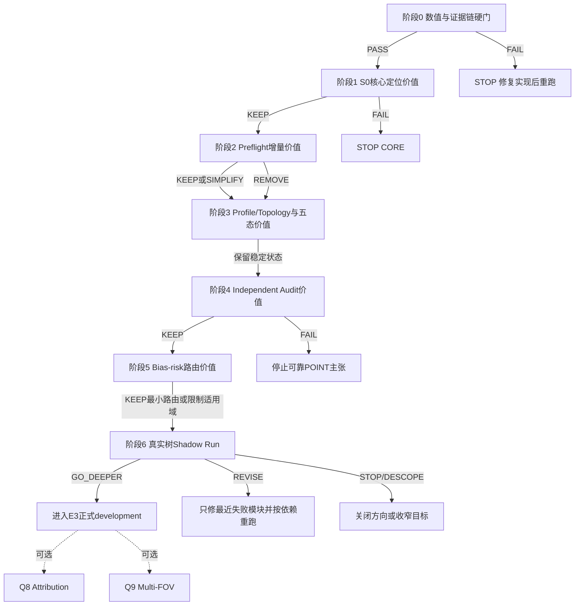

# ArcPith v5-slim 分离式快速价值验证方案 v2
## 面向树髓定位的逐模块筛选、参数检查、证据分析与去留决策（含逐阶段可视化验证图）

> **对应设计**：[ARCPITH_integrated_expert_review_final_design-v5-slim.md](./ARCPITH_integrated_expert_review_final_design-v5-slim.md)。
>
> **文档定位**：本方案把原快速验证稿中相互缠绕的内容拆成串行的模块价值筛选。每个阶段只回答一个主要问题；前一阶段保留下来的最小实现被冻结后，才进入下一阶段。
>
> **结论边界**：快速验证用于判断控制要素、参数结构和证据机制是否合理、是否有独立价值、是否值得进入正式实验；不产生最终准确率、正式显著性、正式 type-I/power、`CALIBRATED` 或生产可用结论。

---

# 0. 一页执行结论

ArcPith 的快速验证不应把 S0、Preflight、五态、independent audit、family-bias 和真实数据一次揉成一个大实验。更可执行的方式是：

1. 先排除实现错误和证据泄漏；
2. 单独验证 S0 是否有核心定位价值；
3. 单独验证 Preflight 是否能更安全或更省计算；
4. 单独验证 profile/topology 是否需要五态表达；
5. 单独验证 independent audit 是否能反证错误候选；
6. 单独验证 bias-risk route 是否能覆盖 audit 的共同盲区；
7. 最后才把已保留的最小链条放到少量真实树上做 shadow run；
8. Multi-FOV 与 attribution 只在 Core 值得继续后按需验证。



## 0.1 逐阶段“验证—分析—指标—结论”可视化图

下图每一行只验证一个模块。阅读顺序固定为：**怎么验证 → 结果怎么分析 → 看哪些指标 → 如何判断是否有价值**。阶段 2、3、5 的复杂模块没有增量价值时可以删除或简化；阶段 0、1、4 的必要条件失败时必须停止相应主张。

```mermaid
flowchart TB
    subgraph S0[阶段0：数值正确性与证据链硬门]
        direction LR
        V0["怎么验证<br/>重复运行与lineage负控<br/>h/t符号尺度和frame往返<br/>finite-axis seam与near barrier<br/>E_audit泄漏负控<br/>minimal search对照B3"]
        A0["怎么分析<br/>逐fixture核对硬断言<br/>比较等价变换前后差异<br/>追踪首个不一致环节<br/>不得用平均值抵消单例失败"]
        M0["关键指标<br/>max loss/residual/gradient diff<br/>round-trip与state diff<br/>leakage count与replay diff<br/>basin miss与search inadequacy"]
        D0{"是否可继续<br/>全部硬断言在数值容差内<br/>泄漏=0且故意破坏可被捕获"}
        V0 --> A0 --> M0 --> D0
    end
    X0["STOP<br/>修复实现、证据链或搜索<br/>完整重跑阶段0"]
    D0 -->|PASS| V1
    D0 -->|FAIL| X0

    subgraph S1[阶段1：Shared S0与Equal-parent核心价值]
        direction LR
        V1["怎么验证<br/>同一crop配对运行B0/B1/B2/B3<br/>交叉distance、arc、rings、noise<br/>复制/插值/fragment消融<br/>iid与相关噪声压力测试"]
        A1["怎么分析<br/>按easy与partial-arc分层<br/>比较B2-B0和B2-B1配对效应<br/>区分objective增益与search miss<br/>检查最坏错误和方向稳定性"]
        M1["关键指标<br/>easy recovery<br/>paired delta d_RP2<br/>finite/axis误差<br/>duplication/fragmentation shift<br/>B2-B3 basin gap"]
        D1{"是否有核心价值<br/>easy不退化<br/>partial arcs稳定改善<br/>纯重采样不制造信息"}
        V1 --> A1 --> M1 --> D1
    end
    X1["STOP CORE<br/>S0无稳定独立增量<br/>不再投入可靠性模块"]
    D1 -->|KEEP| V2
    D1 -->|FAIL| X1

    subgraph S2[阶段2：Preflight与Correlation Control增量价值]
        direction LR
        V2["怎么验证<br/>同一冻结S0运行P0/P1/P2/P3<br/>F_geom optimum与envelope比较<br/>改变density/duplicate/correlation<br/>unknown class保守回退测试"]
        A2["怎么分析<br/>做P1-P0、P2-P1、P3-P2嵌套比较<br/>先安全、再拒识代价、后计算收益<br/>检查指标是否预测下游真实失稳"]
        M2["关键指标<br/>unsafe pass<br/>unnecessary reject<br/>expensive runs avoided与runtime saved<br/>route stability under resampling<br/>F_geom与实际dispersion排序"]
        D2{"是否有增量价值<br/>复杂规则比便宜规则更安全<br/>或稳定节省明显计算<br/>且不增加危险放行"}
        V2 --> A2 --> M2 --> D2
    end
    R2["SIMPLIFY / REMOVE / RESTRICT<br/>保留最便宜有效规则<br/>复杂指标无增量则删除<br/>危险stratum禁止POINT"]
    D2 -->|KEEP或SIMPLIFY| V3
    D2 -->|无增量但有安全fallback| R2
    R2 --> V3

    subgraph S3[阶段3：Profile、Topology与五态表达价值]
        direction LR
        V3["怎么验证<br/>POINT/AXIS/RANGE/MULTI/REJECT fixtures<br/>fast two-level对照dense B3<br/>delta-grid与grid/refinement小扰动<br/>窄深第二mode和seam专测"]
        A3["怎么分析<br/>构造fast-dense状态混淆<br/>逐个审查未触发升级的危险漏检<br/>追踪component边界与refinement flip<br/>区分不稳定状态和S0本身失败"]
        M3["关键指标<br/>state agreement<br/>unsafe FINITE_COMPACT miss<br/>component recall/precision<br/>boundary distance与refinement flip<br/>escalation sensitivity与runtime ratio"]
        D3{"五态是否有价值<br/>easy状态稳定恢复<br/>关键第二mode不被静默漏掉<br/>危险case能升级或保守拒识"}
        V3 --> A3 --> M3 --> D3
    end
    R3["REVISE / SUSPEND STATE<br/>调整refinement trigger<br/>暂停无稳定定义的状态<br/>不得靠调delta掩盖mode"]
    D3 -->|保留稳定状态| V4
    D3 -->|危险漏检或状态不稳| R3

    subgraph S4[阶段4：Independent Audit增量反证价值]
        direction LR
        V4["怎么验证<br/>固定E_fit并改变E_audit检查firewall<br/>H0 null红旗筛查<br/>0到large-effect sentinel曲线<br/>A0/A1/A2与buffer/FOV route比较<br/>non-point representative cover"]
        A4["怎么分析<br/>先确认无泄漏<br/>比较null与alternative响应分离<br/>计算relative对absolute的新增捕获<br/>审查independence-power权衡<br/>underpowered与supported严格分开"]
        M4["关键指标<br/>firewall violations<br/>null rejection与large-effect rejection<br/>sentinel incremental detection<br/>powered/underpowered proportion<br/>fit-audit correlation与uncovered boundary"]
        D4{"是否有可靠性价值<br/>泄漏=0<br/>large effect明显区别于null<br/>存在可用且有功效的audit route"}
        V4 --> A4 --> M4 --> D4
    end
    R4["SIMPLIFY AUDIT<br/>删除无增量sentinel<br/>保留有响应的absolute/relative最小结构"]
    X4["STOP RELIABLE POINT<br/>audit无信号或firewall失败<br/>仅保留探索性几何"]
    D4 -->|KEEP最小audit结构| V5
    D4 -->|仅部分sentinel有增量| R4
    R4 --> V5
    D4 -->|audit无信号或泄漏| X4

    subgraph S5[阶段5：Common Family Bias与Risk Route价值]
        direction LR
        V5["怎么验证<br/>ellipse/center-drift/deformation压力面<br/>mixed-center与OOD负控制<br/>audit-only、加scatter、加S1逐层比较<br/>验证risk只能升不能降"]
        A5["怎么分析<br/>定位audit-supported但oracle-error大的盲区<br/>逐层计算新增灾难捕获<br/>同时检查正常weak/far样本误veto<br/>比较捕获成本与未覆盖风险"]
        M5["关键指标<br/>catastrophic capture<br/>false veto与incremental capture<br/>cost per added capture<br/>NOT_RUN/UNDERPOWERED<br/>uncovered catastrophe types"]
        D5{"是否有风险控制价值<br/>最小路由能增量捕获共同偏差<br/>误veto和成本可接受<br/>不可识别stratum可明确限制"}
        V5 --> A5 --> M5 --> D5
    end
    R5["KEEP MINIMAL ROUTE / RESTRICT DOMAIN<br/>删除无增量diagnostic<br/>高风险stratum设POINT_BLOCKING或HARD_REJECT"]
    X5["STOP<br/>负控制仍大量产生灾难POINT<br/>不能进入权威真实shadow"]
    D5 -->|有可执行风险边界| R5
    D5 -->|无风险边界| X5
    R5 --> V6

    subgraph S6[阶段6：Full-section与Real-tree Shadow Run]
        direction LR
        V6["怎么验证<br/>冻结阶段0到5最小配置<br/>盲跑全部预注册tree/crop队列<br/>完成后才连接独立reference<br/>保存early reject和全provenance"]
        A6["怎么分析<br/>按tree而非crop汇总<br/>定位first failing stage<br/>比较synthetic已知与真实新增失效<br/>审查单tree支配和domain异常"]
        M6["关键指标<br/>completion与state distribution<br/>catastrophic POINT<br/>audit feasible/powered proportion<br/>failure localization rate<br/>P50/P90 runtime与peak memory"]
        D6{"是否值得深入实验<br/>数据链可重放且easy有信号<br/>灾难受控或明确排除<br/>失败可定位且E3数据可获得"}
        V6 --> A6 --> M6 --> D6
    end
    G6["GO_DEEPER<br/>冻结快速验证版<br/>进入E3正式development"]
    RR6["REVISE_AND_REPEAT<br/>只修最早失败模块<br/>按依赖矩阵重跑"]
    XS6["STOP_OR_DESCOPED<br/>关闭方向或收窄目标域"]
    D6 -->|全部满足| G6
    D6 -->|局部可修复| RR6
    D6 -->|核心或可行性失败| XS6
```



## 0.2 各阶段“有价值”结论所依赖的主指标

| 阶段 | 首要价值信号 | 必须同时满足的安全条件 | 有价值结论 |
|---|---|---|---|
| 0 数值/证据链 | 等价变换与重放结果一致，搜索恢复参考 basin | invariant 全通过、泄漏为 0、故意破坏可检出 | 只能得出 `PASS`；否则 `STOP` |
| 1 S0 | partial/open arcs 上 B2 相对 B0/B1 的 paired `d_RP2`、状态误差或稳定性改善 | easy 不退化；复制、插值和 fragment split 不移动结论 | `KEEP S0`；无独立增量则 `STOP CORE` |
| 2 Preflight | 相对便宜规则新增减少 unsafe pass 或避免无用昂贵运行 | 不得用计算节省补偿危险放行；unknown 必须保守回退 | 保留最便宜有效版本；复杂项无增量即 `SIMPLIFY/REMOVE` |
| 3 五态/Topology | fast/dense state agreement、component recall、关键 mode 捕获 | 不得出现未触发升级的危险 `FINITE_COMPACT` 漏检 | 保留稳定状态；不稳定状态暂停或对应 strata 拒识 |
| 4 Audit | large-effect rejection 与 null 明显分离；relative/absolute 有可解释新增捕获 | firewall violation=0；underpowered 不得记为 supported | `KEEP` 最小 audit；失败则停止 reliable POINT |
| 5 Bias route | audit-only 之外的 catastrophic POINT 增量捕获 | false veto、成本可接受；diagnostic 只能升风险 | 保留最小 route 或限制 domain；无风险边界则 `STOP` |
| 6 真实 Shadow | 冻结链条完成、easy strata 有方向性信号、失败可定位 | 全队列分母保留；灾难受控；按 biological tree 分析 | `GO_DEEPER / REVISE_AND_REPEAT / STOP_OR_DESCOPED` |

图中的指标均为快速价值筛选指标，不是通用固定阈值。除阶段 0 的确定性硬断言外，具体候选区间必须在 experiment registry 中预注册，并在 E3 以 biological tree 为单位完成正式 calibration。

每个模块最终只允许四种去留判断：

| 判断 | 含义 | 后续动作 |
|---|---|---|
| `KEEP` | 对目标错误或目标能力存在稳定、非平凡的增量价值 | 冻结最小有效版本，进入下一阶段 |
| `SIMPLIFY` | 有价值，但更便宜的控制量已达到相同作用 | 保留便宜版本，删除冗余实现 |
| `REMOVE` | 相对已冻结基线没有增量价值，或代价明显大于收益 | 删除该模块；非核心模块删除后可继续 |
| `STOP` | 实现硬门、S0 核心或可靠 POINT 的必要条件失败 | 停止相应主张，修复或重定义目标 |

快速验证的最终产物不是“系统已被证明可靠”，而是：

- 一条经过逐模块筛选的最小有效管线；
- 每个保留模块的作用、参数候选范围和失败边界；
- 被删除或降级的高成本低价值内容；
- 值得进入 E3 正式 development 的明确实验问题；
- 真实树上需要增加数据的 strata 与失败类型。

---

# 1. 树髓定位目标与验证边界

## 1.1 树髓定位任务

输入是木材横切面局部视野中的开放年轮弧、切向、尺度、有效性与 lineage。系统目标不是始终给出一个坐标，而是根据证据输出互斥状态：

| 状态 | 在树髓定位中的含义 |
|---|---|
| `POINT` | 证据支持唯一且有限的髓心位置 |
| `AXIS` | 只能稳定确定髓心所在的远场方向，不能稳定确定距离 |
| `RANGE_UNCERTAIN` | 支持有限区域或距离范围，但不足以压缩成唯一点 |
| `MULTIMODAL` | 存在多个稳定且相互分离的候选区域/模式 |
| `REJECT` | 数据、几何、搜索、审计、偏差或域条件不足以形成权威输出 |

在阶段 3 结束时得到的是 `E_fit` 上的 provisional topology；最终状态仍需经过阶段 4 的 independent audit 与阶段 5 的 bias/domain route。不得把 provisional `FINITE_COMPACT` 直接称为最终 `POINT`。

## 1.2 快速验证覆盖的证据层级

| 层级 | 数据 | 本方案用途 | 可支持的结论 |
|---|---|---|---|
| E0 | 解析构造、确定性 fixture、数值负控 | 阶段 0 | 实现、符号、尺度、chart、barrier、防火墙是否正确 |
| E1 | 可控 synthetic、paired perturbation | 阶段 1–5 | 理论机制是否存在方向性信号和独立增量价值 |
| E2 | 少量 full-section/真实 biological trees | 阶段 6 | 数据链是否可行，主要风险能否定位 |
| E3 | tree-level development calibration | 本方案之后 | 正式阈值、type-I、power、risk map 与 Gate G/R |
| E4 | 全新 sealed trees | 本方案之后 | Gate S 与同 scope 的 `CALIBRATED` |

## 1.3 绝对不可破坏的约束

1. biological tree 是最高统计独立单位；synthetic seed 不是 tree。
2. parent ring 是主要证据预算单位；采样点数量不能冒充独立信息。
3. 样本内证据必须遵守 `E_fit | frozen buffer | E_audit`。
4. `E_audit` 不参与搜索、候选选择、profile、topology、representative 或 threshold 调整。
5. finite POINT 与 infinity AXIS 在 `RP²` 中连续表达。
6. 纯复制、插值和 fragment split 不得提高信息量、state 或 audit power。
7. audit underpowered 不等于通过；holdout 通过也不等于真实髓心正确。
8. common family bias 不能只靠同 family 的 ring holdout 排除。
9. cheap diagnostic 只能提高风险，不能把样本升级为可信 POINT。
10. 快速实验看过结果后修改参数，必须增加版本并重跑受影响阶段。

---

# 2. 统一准备：数据、对照、参数与输出

## 2.1 数据层级与最低 lineage

```text
biological tree
└── source section
    └── FOV / crop
        └── parent ring
            └── ordered fragment
                └── micro-arc quadrature observation
```

每条 observation 至少保存：

```text
tree_id / section_id / fov_id / crop_id
parent_ring_id / fragment_id / observation_id
ring_order
frame / units / normalization_id
input_hash / observation_hash / lineage_hash
```

缺少 parent-ring association 时，只允许运行 observation 与探索性 geometry；关闭 equal-parent、buffered ring audit 和完整可靠性结论。

## 2.2 Observation 固定输入

每个 observation `(r,i)` 至少包含：

| 字段 | 作用 |
|---|---|
| `x_ri ∈ R²` | 原始 frame 中的位置 |
| `t_ri ∈ R²` | 单位无方向切向；必须满足 `t→-t` 不变 |
| `w_ri` | 弧长 quadrature × validity |
| `σ_ri` 或 fixed scale | 冻结尺度；不能在样本 S0 拟合中看结果重估 |
| lineage | parent ring、fragment、observation 的唯一追溯 |
| flags | defect、occlusion、domain、invalid |

阶段 1 以后使用同一 observation 版本；若 tangent、association、scale 或 validity 算法改变，阶段 0–1 至少全部重跑。

## 2.3 最小数据集合

| 数据集 | 最少覆盖 | 用途 |
|---|---|---|
| `D0_analytic` | origin、finite near/mid/far、exact AXIS、seam、near-observation | 数值硬门 |
| `D1_concentric` | distance、方向、弧覆盖、ring 数、噪声、相关性 | S0、Preflight、五态 |
| `D2_ambiguous` | range、two-mode、finite/infinity ridge、insufficient | topology 与拒识 |
| `D3_bias` | ellipse、center drift、低频形变、mixed centers、共同 tangent bias | bias blindness 与风险路由 |
| `D4_full_section` | 独立 reference pith 的完整截面及预注册 crops | 真实可行性与 synthetic 对照 |
| `D5_negative` | invalid lineage、错误 normalization、defect、OOD、无唯一 finite pith | False-POINT 红旗检查 |

快速阶段不规定虚假的 tree 最低数。若真实 tree 很少，阶段 6 只能称 smoke/shadow test，不能估计总体准确率。

## 2.4 基线与模块对照

| ID | 系统 | 被验证的作用 |
|---|---|---|
| `B0` | one-ring pseudocenters + projective medoid | shared S0 是否必要 |
| `B1` | pooled micro-arcs S0，无 equal-parent budget | equal-parent 是否必要 |
| `B2` | equal-parent shared S0 | ArcPith 核心候选 |
| `B3` | dense/offline high-budget search/profile | 快速实现参考解，不是生产基线 |
| `P0` | ring count only | 最便宜 Preflight |
| `P1` | ring count + total arc span/coverage | 简单几何 Preflight |
| `P2` | P1 + turn/angular coverage + `F_geom` | 几何信息候选 |
| `P3` | P2 + pooled correlation class + `N_seg-equiv` | 相关性修正候选 |
| `A0` | absolute audit only | 最小独立审计 |
| `A1` | applicable relative sentinels only | relative 审计增量 |
| `A2` | absolute OR relative joint rule | 完整 audit 候选 |
| `R0` | audit-only，无 bias route | family-bias 风险控制的基线 |

所有 paired comparison 必须使用完全相同的 crop、observation、split、seed 与冻结上游结果。

## 2.5 参数分层与冻结顺序

| 类别 | 参数示例 | 快速阶段如何处理 |
|---|---|---|
| `N` 数值 | float/KKT/round-trip 容差 | 阶段 0 冻结；不按科学结果调整 |
| `G` 几何 | `ε, λ_near, r_hard, r_excl, τ_low, τ_high` | 阶段 0 找连续稳定区间 |
| `S` 搜索/S0 | starts、inverse-range ladder、reseed、robust loss、equal-parent | 阶段 1 冻结最小实现 |
| `P` Preflight | pilot envelope、`F_geom` summaries、coverage bins、correlation class | 阶段 2 保留有增量的最小集合 |
| `T` Topology | grid、refinement、`δ` 候选网格、adjacency、seam merge | 阶段 3 冻结候选规则 |
| `A` Audit | buffer、absolute/relative score、sentinel、`K_max`、`ε_rep` | 阶段 4 只筛结构与候选范围 |
| `B` Bias | deformation strata、scatter、S1 diagnostic、risk levels | 阶段 5 筛选增量变量 |
| `M/D` 扩展 | fixed `H` perturbation、deletion groups | Core 通过后单独验证 |

冻结顺序：

```text
阶段0 → freeze N/G 与证据 schema
阶段1 → freeze S0 objective、budget 和最小 search
阶段2 → freeze Preflight/correlation candidate design
阶段3 → freeze profile/topology candidate design
阶段4 → freeze audit structure；不冻结最终统计阈值
阶段5 → freeze candidate domain/risk variables
阶段6 → 决定是否进入 E3
```

---

# 3. 统一分析方法与“有价值”定义

## 3.1 统一几何与状态指标

Projective 距离：

\[
d_{\mathbb{RP}^2}(h_1,h_2)
=
\arccos\left(
\left|\bar h_1^\top\bar h_2\right|
\right).
\]

按输出语义分别报告：

| 输出/模块 | 必报指标 |
|---|---|
| finite candidate / POINT | normalized coordinate error、physical coordinate error、`d_RP2` |
| AXIS | modulo-π direction error |
| RANGE | oracle containment、region width、方向/距离可用性 |
| MULTIMODAL | component count、mode recall、minimum separation |
| Search | best-basin recovery、miss、gradient/KKT、跨 start/reseed 稳定性 |
| Topology | fast/dense state agreement、component recall、boundary distance、refinement flip |
| Preflight | unsafe pass、unnecessary reject、saved expensive runs、route stability |
| Audit | firewall failure、null rejection、effect-response、powered/underpowered 比例 |
| Bias route | catastrophic capture、false veto、incremental capture、未覆盖灾难类型 |
| 工程 | P50/P90 分阶段时间、peak memory、failure/retry、可重放率 |

## 3.2 统一配对分析

每个模块使用以下顺序分析：

1. **先看硬错误**：invariant、泄漏、危险 POINT、错误 state、不可重放；硬错误不能被平均指标抵消。
2. **再看 paired raw effect**：同一 fixture 上比较模块开/关或简/繁版本。
3. **按预设因素分层**：distance、coverage、ring count、noise、correlation、bias、domain。
4. **检查方向稳定性**：报告 paired win/tie/loss、median difference、MAD 和 worst case。
5. **检查机制特异性**：模块应优先响应其设计要处理的失效，而不是所有情况都改变结果。
6. **检查代价**：新增运行时、内存、不可用率、实现复杂度和新增参数数目。
7. **最后做去留判断**：不使用小样本 `p<0.05` 作为 GO 条件。

Synthetic 重复只用于稳定方向和发现边界；真实 pilot 按 tree 汇总，不能用 crop 数放大独立样本量。

## 3.3 模块价值的最低条件

模块被判为 `KEEP` 至少需要：

1. 对其目标错误存在可复现的增量捕获或目标能力改善；
2. easy/正确 case 不发生不可接受退化；
3. 改善不是由候选数量、采样复制、证据泄漏或额外信息预算造成；
4. 效果在预期 strata 中方向稳定，且 worst case 可解释；
5. 不能被明显更便宜的已知变量等价替代；
6. 新增参数和运行成本与增量收益相称。

若第 1 条成立但第 5 条不成立，判 `SIMPLIFY`；第 1 条不成立则 `REMOVE`；必要核心硬门失败则 `STOP`。

---

# 4. 阶段 0：数值正确性与证据链硬门

## 4.1 在树髓定位中的作用

树髓可能位于 FOV 内、FOV 外，甚至只能表达为 infinity direction。若齐次尺度、符号、chart seam、near-point barrier、frame transform 或 evidence split 实现错误，系统会人为制造错误有限髓心、伪多模态或伪 AXIS。阶段 0 的作用是保证后续看到的“效果”不是实现伪影。

## 4.2 本阶段唯一问题

> 同一几何与同一冻结证据，在合法等价变换、重复运行和 chart 切换下，是否给出相同的 loss、解、profile feature、route 与 reason code；任何 audit-only 信息是否都无法影响上游选择？

## 4.3 固定内容与操控因素

固定：observation、lineage、objective、seed、reference fixtures。

只操控：

- homogeneous scale/sign；
- tangent sign；
- coordinate/frame round-trip；
- signed inverse range 与 seam 位置；
- candidate 到 observation 的相对距离；
- start family 与 search budget；
- `E_audit` 内容和 threshold version（用于泄漏负控）。

## 4.4 相关参数

| 参数 | 作用 | 快速扫描/检查 | 通过后处理 |
|---|---|---|---|
| numeric tolerance | 比较 loss、gradient、round-trip | 由 analytic scale 与浮点精度确定，不看科学结果 | 冻结为 `N` |
| `ε` | residual denominator 稳定 | 检查过小/过大邻域的 loss 和梯度 | 选连续稳定区间 |
| `λ_near` | near-point barrier 强度 | 检查能否阻止 observation 上人工零解，同时不过度推开合法解 | 冻结候选值 |
| `r_hard` | 方向未定义硬邻域 | 扫描 `d_min/r_hard` | 必须 `0<r_hard<r_excl` |
| `r_excl` | 平滑排斥范围 | 扫描 `d_min/r_excl` | 在边界保持至少 C1 |
| `τ_low, τ_high` | affine/far chart 平滑 gate | 穿越两个阈值检查值与梯度 | 必须 `0<τ_low<τ_high` |
| starts | SVD、balanced RANSAC、far-axis、inverse-range ladder、deterministic starts | 逐 family 删除 | 只保留能恢复独特 basin 的 family |
| KKT/gradient tolerance | search adequacy | 与 B3 参考解比较 | 冻结为 `N` |

Homogeneous scale 的确定性检查可用：

```text
λ ∈ {-10, -2, -0.5, 0.5, 2, 10}
```

Near-point 位置可按相对尺度检查：

```text
d_min ∈ {0, 0.5 r_hard, r_hard,
         0.5(r_hard+r_excl), r_excl, 2 r_excl}
```

这些是数值测试点，不是生产门槛。

## 4.5 实验 0A：数据合同、lineage 与重放

1. 选至少 3 个 synthetic fixtures 和 2 个真实 crop。
2. 生成完整 tree→ring→fragment→observation lineage。
3. 执行 normalization 与 inverse round-trip。
4. 保存 input/config/code/threshold/seed hashes。
5. 同一配置连续运行三次。
6. 修改无语义 metadata，确认结果不变。
7. 修改 observation 或 threshold version，确认版本/hash 改变。
8. 构造重复 ID、错误 frame、缺 ring association、非法权重等负控。
9. 确认负控进入明确 `REJECT/INVALID`，不 silent repair。

分析指标：replay diff、lineage 唯一性、invalid-route 命中率、early-return schema 完整性。

## 4.6 实验 0B：尺度、符号与 frame 不变量

1. 固定 observations，计算原始 loss、residual、gradient、profile features。
2. 对每个 `λh`、`-h`、随机 `t→-t` 重算。
3. 在合法 frame transform 中计算并映回原 frame。
4. 比较 `d_RP2`、loss、gradient、basin、state feature 和 reason code。

硬判据：每个 fixture 的差异都在阶段 0 冻结的 numeric tolerance 内；不得以平均通过率掩盖单例失败。

## 4.7 实验 0C：finite→infinity、seam 与 origin

1. 固定多个方向 `φ`，扫描 signed inverse range `κ_s<0 → 0 → κ_s>0`。
2. 在 affine/far overlap 同时计算两个 chart。
3. 在 `φ≈0/π` seam 邻域重复。
4. 加入 exact AXIS fixture，不能用“极大有限圆”冒充 infinity。
5. 比较 overlap solution、loss、gradient、basin 和 mode/component 数。

有价值结果不是“状态始终不变”，而是随几何信息连续地发生合理 POINT/RANGE/AXIS 转换，同时没有 loss jump、符号复制模式或 seam 断裂。

## 4.8 实验 0D：near-point barrier 与搜索充分性

1. 对 `d_min` 相对 `r_hard/r_excl` 扫描 barrier value 与 finite-difference gradient。
2. 穿越 `τ_low/τ_high` 检查值和一阶差分连续性。
3. 确认 `d≤r_hard` 进入 geometry invalid；AXIS 不计算 finite proximity。
4. 用 B3 high-budget search 得到参考 basin。
5. 运行 minimal starts 并逐 family 删除。
6. 比较 basin recovery、miss、`d_RP2`、state 和 runtime。

## 4.9 阶段 0 结果分析与决策

| 结果 | 判断 | 动作 |
|---|---|---|
| invariant、seam、barrier 或 firewall 任一失败 | `STOP` | 修复后完整重跑阶段 0 |
| minimal search 不能恢复 easy/reference basin | `STOP/REVISE` | 修正 search，不进入 S0 价值判断 |
| 某 start family 无独特 basin 增量 | `REMOVE` | 从主线删除该 start |
| 所有硬断言通过，故意破坏能被测试捕获 | `PASS` | 冻结 `N/G`、schema、防火墙测试，进入阶段 1 |

本阶段不回答 S0 是否优于 pseudocenter，也不回答 audit 是否有统计价值。

---

# 5. 阶段 1：Shared S0 与 Equal-parent 的核心定位价值

## 5.1 在树髓定位中的作用

局部单条开放年轮弧通常只能给出不稳定的伪中心。Shared S0 的理论价值是利用多条 parent rings 的共同投影几何，在 `RP²` 中把有限髓心、远场方向和证据不足连续表达。Equal-parent 的作用是防止长弧、密集采样或重复 points 通过数量优势支配共同解。

若这一阶段失败，后续 Preflight、五态和 audit 即使复杂，也只是在包装一个没有核心增量的定位器，因此必须停止 Core。

### 被验证的 S0 计算对象

规范坐标与单位齐次参数为：

\[
\tilde x=\frac{x-c_{\rm FOV}}{s_{\rm FOV}},
\qquad
h=[a_x,a_y,h_0]^\top,
\qquad
\bar h=\frac{h}{\|h\|_2}.
\]

对 observation `(r,i)`：

\[
v_{ri}(\bar h)=\bar a-\bar h_0\tilde x_{ri},
\qquad
e_{ri}(\bar h)=
\frac{t_{ri}^{\top}v_{ri}(\bar h)}
{\sqrt{\|v_{ri}(\bar h)\|^2+\epsilon^2}}.
\]

每个 eligible parent ring 先按弧长 quadrature 聚合，再对 rings 等预算：

\[
L_r(\bar h)=
\frac{\sum_i w_{ri}[\rho(e_{ri}/\sigma_{ri})+B_{ri}]}
{\sum_i w_{ri}},
\qquad
L_{S0}^{(P)}(\bar h)=
\frac{1}{|P_{\rm elig}|}\sum_{r\in P_{\rm elig}}L_r(\bar h).
\]

阶段 1 验证的是这个 equal-parent objective 是否有价值，不允许在比较 B0/B1/B2 时改变 observation、robust loss、eligible rings 或搜索预算。

## 5.2 本阶段唯一问题

> 在相同观测和相同搜索预算下，equal-parent shared S0 是否比 one-ring pseudocenter 与 pooled micro-arcs 更稳定、更接近 oracle，并对纯复制/插值/fragment split 保持不变？

## 5.3 固定内容与操控因素

冻结阶段 0 的 `N/G`、starts、observation、seed 和 B3 reference。

主要操控：

- 定位器：`B0 / B1 / B2`；
- pith distance：origin / near / mid / far / infinity；
- arc span：narrow / medium / wide；
- ring count：very-low / low / medium；
- angular diversity：one-sided / distributed；
- tangent/position noise：none / low / medium / high；
- sampling density、fragmentation、duplicate factor；
- within-arc/cross-ring correlation。

`very-low/low/medium` 必须在 manifest 映射到当前项目的实际 ring 数与 coverage 分位，不在本文虚构通用阈值。

## 5.4 相关参数

| 参数 | 作用 | 本阶段检查 |
|---|---|---|
| robust loss `ρ` 与 scale | 控制 tangent/outlier 对 S0 的作用 | 正确 case 不偏移，噪声升高时退化平滑 |
| per-ring quadrature `w_ri` | 近似真实弧积分 | 采样加密不改变单环贡献 |
| equal-parent normalization | 各 eligible ring 等预算 | 长弧/密集 ring 不支配 |
| eligibility rule | 定义进入 S0 的 parent rings | 只读拟合前 lineage/quality |
| start set / inverse-range ladder | 覆盖 finite/far basin | 已在阶段 0 冻结，不按本阶段结果增加 starts |
| pooled correlation/block aggregation | 抑制同一连续弧的伪信息 | 先验证方向，不做最终校准 |

## 5.5 实验 1A：核心定位器配对比较

1. 在 `D1_concentric` 中覆盖 distance × arc span × ring count × noise × diversity。
2. 对同一生成 crop 运行 B0、B1、B2、B3。
3. 保存 best loss、basin、`d_RP2`、finite/axis error、跨 seed 稳定性和 runtime。
4. 按 distance、coverage 与 ring count 分层画 B2−B0、B2−B1 paired effect。
5. 单独检查 easy anchors、partial arcs、far/near-infinity 与 one-sided coverage。

必须回答：

- B2 在 easy case 是否至少不劣；
- B2 的收益是否出现在实际关心的 partial/open arcs，而非只出现在人工极端点；
- B2 与 B3 的差异是 objective 问题还是 search miss；
- 错误是否被 profile/Preflight 暴露，而不是形成紧致错误候选。

## 5.6 实验 1B：Equal-parent 预算消融

从同一 crop 派生以下不改变真实几何的信息操作：

- 某一 ring 采样密度 ×2/×4；
- 同一 observations 复制 ×2/×4；
- 一个 fragment 拆成 2/4/8 fragments；
- 对一条 noisy ring 过度采样；
- 仅增加插值点；
- 对照组增加真实独立弧覆盖。

比较 B1 与 B2 的：

- `d_RP2` before/after；
- each-ring loss share；
- objective minimum shift；
- profile sharpness/state feature shift；
- runtime/memory。

期望：纯密度、复制、插值和 fragment split 不显著移动 B2；只有真实新增弧覆盖可以改善几何。

## 5.7 实验 1C：相关噪声与最小有用域

1. 固定 marginal variance，配对生成 iid 与相关噪声。
2. 扫描 `ell_arc/ρ_arc`、`ell_ring/ρ_ring` 和 common observation bias。
3. 比较 nominal sharpness、实际 error、profile width 与重采样敏感性。
4. 建立仅用于下一阶段分层的初始 map：

```text
EASY_RECOVERABLE
WEAK_BUT_STRUCTURED
SYSTEMATICALLY_UNIDENTIFIABLE
MODEL_MISMATCH
```

该 map 不是 production domain registry。

## 5.8 阶段 1 结果分析与决策

核心指标：

- easy recovery；
- partial-arc paired `Δd_RP2`；
- finite/axis state-specific error；
- B2 vs B3 search gap；
- duplication/fragmentation shift；
- paired win/tie/loss 与 effect sign stability；
- worst-case catastrophic candidate。

| 结果 | 判断 | 动作 |
|---|---|---|
| B2 在 easy anchors 也不稳定 | `STOP CORE` | 修正 S0 或终止方向 |
| B2 相比 B0/B1 无稳定增量，且无更好拒识语义 | `STOP CORE` | 不投入后续可靠性模块 |
| B2 有价值但 length/capped-quality 无增量 | `KEEP + REMOVE` | 保留 equal-parent S0，删除额外权重 |
| B2 对复制/fragmentation 敏感 | `REVISE` | 修正预算后重跑阶段 1 |
| partial arcs 有稳定收益、easy 不退化、重采样不变量成立 | `KEEP` | 冻结最小 S0，进入阶段 2 |

---

# 6. 阶段 2：Preflight 与 Correlation Control 的增量价值

## 6.1 在树髓定位中的作用

Preflight 不定位髓心。它在昂贵搜索或最终 POINT 路径之前判断：当前局部弧是否具有足够 parent-ring、角度、覆盖、局部几何约束和可用 independent audit。其价值是阻止明显不可辨识的 crop 被强迫成有限髓心，同时避免在注定失败的样本上浪费计算。

复杂 `F_geom` 或 correlation mapping 只有优于简单 coverage rule 时才值得进入主线。

### 两阶段接口

`Preflight-0` 只读 candidate-free 的 lineage、eligible rings、有效弧长、tangent turn/coverage、相关类别、`N_seg-equiv` 与 audit feasibility，并生成/冻结 `E_fit | buffer | E_audit`。

`Preflight-1` 只用 `E_fit` 生成 pilot envelope 并计算 `F_geom`。两阶段共同输出：

```text
POINT_CANDIDATE / AXIS_ONLY / INSUFFICIENT / INVALID
BUFFERED_AUDIT_FEASIBLE / FOV_AUDIT_FEASIBLE / NO_POWERED_AUDIT_AVAILABLE
```

快速实现必须遵守：`INVALID/INSUFFICIENT → REJECT`；`AXIS_ONLY` 禁止 POINT；`NO_POWERED_AUDIT_AVAILABLE` 禁止最终 POINT。阶段 2 只比较哪套 predictor 值得保留，不放松这些硬映射。

## 6.2 本阶段唯一问题

> 在冻结 S0 上游不变的前提下，P2/P3 是否比 P0/P1 更少危险放行、减少无用计算或提供更稳定的路由？

## 6.3 相关参数和候选特征

| 参数/特征 | 含义 | 检查方式 |
|---|---|---|
| eligible ring count | 最低结构量 | 与 coverage-only 基线配对 |
| total valid arc / tangent turn / angular coverage | 方向与弧覆盖 | 看是否已解释复杂指标的收益 |
| pilot envelope | E_fit-only low-loss candidates | 比较 optimum-only 与 envelope-worst |
| `λ_min(F_geom)` | 最弱局部几何方向 | 与实际 solution dispersion 排序比较 |
| `cond(F_geom)` | 局部病态程度 | 检查是否预测 instability |
| weakest eigenvector | 最弱方向 | 与实际 error direction 比较 |
| pooled `c_corr` | 相关类别 | unknown 必须回退保守类 |
| `N_seg-equiv` | block-equivalent 支持量 | 复制/插值不得提高 |
| audit feasibility | buffered ring/FOV 是否有可用证据 | 只读 candidate-free 信息 |

## 6.4 实验 2A：Preflight 层级消融

1. 使用阶段 1 的全部 feasibility strata。
2. 对相同 crop 分别运行 P0、P1、P2、P3。
3. 再运行冻结 B2 与 downstream dense reference。
4. 由 synthetic oracle/B3 定义快速阶段的 unsafe case。
5. 记录每条规则的 route、实际 error/profile、昂贵步骤是否被跳过。

主要比较：

```text
P1 - P0：简单 coverage 的价值
P2 - P1：F_geom 的增量价值
P3 - P2：correlation/Nseg 的增量价值
```

## 6.5 实验 2B：F_geom 预测性

1. 在冻结 E_fit pilot envelope 上计算 weakest eigenvalue、condition number、weakest direction。
2. 对 observations 做小扰动 synthetic repeats/block bootstrap。
3. 计算实际 solution dispersion、profile width、state instability。
4. 比较 optimum-only summary 与 envelope-worst summary。
5. 检查 pure resampling 后 `F_geom` 是否虚假变强。

`F_geom` 有价值的模式是：弱 `F_geom` 对应更大实际不稳定；最弱方向与错误方向一致；envelope-worst 减少 unsafe pass；纯重采样不提高其结论。

## 6.6 实验 2C：Correlation control 与两阶段防火墙

1. 保持几何相同，只改变 density、duplicate、fragmentation、gaps、`ell_arc`、`ell_ring`。
2. 比较 P2 与 P3 route 及 downstream error。
3. 强制 unknown correlation class，确认只能回退到保守类。
4. 固定 E_fit，生成多个 E_audit variants。
5. 在打开 E_audit 前比较 split、pilots、`F_geom`、search、profile hashes。
6. 在测试分支故意让 E_audit 进入 pilot selection，确认 leakage test 能报警。

## 6.7 结果分析

每条规则分别报告，不折成一个模糊总分：

- `unsafe_pass_rate`；
- `unnecessary_reject_rate`；
- `expensive_runs_avoided`；
- `runtime_saved`；
- `route_stability_under_resampling`；
- `downstream_error_by_route`；
- `unknown_class_behavior`；
- 新增参数数目与运行时。

增量价值的比较顺序是安全 → 可解释性 → 计算收益。计算变快不能补偿 unsafe pass 增加。

## 6.8 阶段 2 决策

| 结果 | 判断 | 动作 |
|---|---|---|
| P3 明显减少强相关 case 的 unsafe pass | `KEEP P3` | correlation class/`N_seg` 进入 E3 候选 |
| P3 与 P2 等价 | `SIMPLIFY` | `N_seg` 仅报告，不参与 route |
| P2 与 P1 等价 | `SIMPLIFY/REMOVE` | `F_geom` 降为 diagnostic 或删除 route 作用 |
| P0/P1 已足够且更稳定 | `KEEP SIMPLE` | 采用简单 Preflight |
| 所有规则对某 stratum 高频 unsafe pass | `REVISE/RESTRICT` | 该 stratum 禁止 POINT，不靠复杂指标硬救 |
| firewall failure | `STOP` | 修复证据分区并重跑阶段 0–2 |

本阶段只筛 predictor 和结构，不冻结最终门槛。

---

# 7. 阶段 3：Profile、Topology 与五态表达的价值

## 7.1 在树髓定位中的作用

局部开放年轮弧可能只支持方向、范围或多个候选。Profile/topology 的作用是保存这种几何不确定性，防止优化器的单个最优点被误写成唯一髓心。五态的价值不在于增加标签，而在于让有限点、远场方向、有限范围、多模态和不可用证据具有不同、不可混淆的输出语义。

### 被验证的 supported set

Profile 只能读取 `E_fit` data loss：

\[
L_{\rm prof}(q)=
\inf_{\theta:[h(\theta)]=q}
L_{S0,E_{\rm fit}}^{\rm data}(\theta),
\qquad q\in\mathbb{RP}^2,
\]

\[
\mathcal S_{\delta(d_{\rm geom})}
=
\{q:L_{\rm prof}(q)\le L_{\min}+\delta(d_{\rm geom})\}.
\]

其中不含 `E_audit`、prior、S1 penalty、model-selection penalty 或 registration correction。快速阶段只验证 `delta_grid` 是否存在稳定候选区间；最终 `δ(d_geom)` 必须留给 E3 的 tree-level calibration。

## 7.2 本阶段唯一问题

> E_fit-only profile 的 supported set 是否能在合理 grid/`δ` 小扰动下稳定恢复预期 topology，并在快速网格漏检关键模式前触发 refinement 或保守拒识？

## 7.3 Fixture library

| Fixture | 构造 | 预期 provisional topology |
|---|---|---|
| `F-POINT` | unique finite S0、充分覆盖 | single compact finite (`FINITE_COMPACT`) |
| `F-AXIS` | exact/near infinity | stable direction + infinity ridge (`AXIS`) |
| `F-RANGE` | 方向明确、距离弱 | bounded wide finite component (`RANGE_UNCERTAIN`) |
| `F-MULTI` | 两个相近或等价 basin | ≥2 persistent components (`MULTIMODAL`) |
| `F-REJECT` | insufficient、finite/infinity unresolved、invalid | unstable/unclosed (`REJECT`) |

每类覆盖 near origin、mid、near infinity、seam、low/high noise 与 coarse-grid adversarial position。Oracle 由生成参数、构造性 ambiguity 和 B3 dense profile 联合确定，不能只读 fixture 名称。

## 7.4 相关参数

| 参数 | 作用 | 快速验证重点 |
|---|---|---|
| `coarse_grid_resolution` | 初始 profile 离散化 | easy case 速度与 critical mode recall |
| `refinement_factor/levels` | 对危险区域加密 | 是否只在需要时升级 |
| `delta_grid` | supported-set 宽度候选 | state 是否对小扰动稳定；不选最终 `δ` |
| `component_adjacency` | 网格连通 | seam 两侧不误拆，独立 mode 不误合 |
| `minimum_component_separation` | 科学相关多模态 | narrow-deep mode 不被吞掉 |
| `near-origin rule` | origin 附近不要求方向 | 防止因 `φ` 不定义而错拒 |
| `infinity overlap/seam rule` | affine/far 连接 | finite→axis 连续 |
| `boundary_cover_tolerance` | 后续 audit representatives 覆盖 | 不完整时必须 underpowered |
| escalation trigger | state flip、near infinity、mode、边界 | 危险 case 必须升级 |

## 7.5 实验 3A：fast vs dense topology

1. 对每个 fixture 运行 B3 dense profile。
2. 运行候选 two-level fast profile。
3. 在小范围 `delta_grid` 上记录 component count、state、boundary 和 width。
4. 检查 refinement 前后 state flip。
5. 检查 seam component 合并与 near-origin 规则。
6. 记录 escalation trigger 是否被触发。
7. escalation 后再次与 B3 比较。

## 7.6 实验 3B：危险漏检专测

必须单列：

- narrow-deep second basin；
- 同方向不同 distance 的 modes；
- 跨 seam mode；
- finite core + infinity tail；
- tiny spurious noise islands；
- near-origin direction instability。

关键红旗：B3 存在科学相关第二 component，而 fast path 输出 `FINITE_COMPACT` 且未触发 escalation。

## 7.7 实验 3C：状态硬路由

为以下规则建立 deterministic tests：

```text
INVALID / INSUFFICIENT → REJECT
AXIS_ONLY ≠ POINT
FINITE_COMPACT + no powered audit ≠ POINT
near-origin RANGE: direction may be null
MULTIMODAL: cannot select one mode using the same audit
OOD production route → REJECT
```

阶段 3 只验证 provisional route 的语义；涉及 audit 和 bias 的最终结果在阶段 4–5 验证。

## 7.8 结果分析与决策

指标：fast/dense state agreement、unsafe compact-finite miss、component recall/precision、boundary distance、refinement flip、escalation sensitivity、not-computed/unstable proportion、fast/dense runtime ratio。

| 结果 | 判断 | 动作 |
|---|---|---|
| easy fixtures 无法恢复 | `REVISE` | 修正 profile/search 后重跑阶段 3 |
| critical second mode 漏检且不升级 | `STOP FAST POINT` | 增加 trigger 或该 stratum 直接 REJECT |
| two-level 与 dense 在 easy case 一致，critical case 能升级 | `KEEP` | 保留分层 topology |
| full refinement 几乎每样本必需 | `SIMPLIFY TARGET/ACCEPT COST` | 不能再宣称快速 topology |
| 某一状态无稳定 fixture 定义 | `SUSPEND STATE` | 暂停该权威状态，不否定已验证的 S0 |

---

# 8. 阶段 4：Independent Audit 的增量反证价值

## 8.1 在树髓定位中的作用

S0 与 profile 使用 `E_fit` 找到并描述候选；independent audit 使用未参与拟合的 `E_audit` 尝试反证已锁定候选。它降低的是选择后过拟合和局部偶然一致风险，不是真值 oracle，也不能排除所有 rings 共享的 family bias。

没有有功效、无泄漏的 independent audit，有限候选最多是探索性结果，不能形成可靠 POINT 主张。

## 8.2 本阶段唯一问题

> 在 hypothesis、state、representatives 和 sentinels 全部锁定后，E_audit 是否能在 null 下不过度拒绝，在 minimum-relevant/large errors 下产生有方向性的拒绝，并比 fit-only 或 absolute-only 提供独立价值？

## 8.3 Audit 结构与参数

合法证据路径：

```text
A. E_fit | frozen buffer | E_audit
B. 完整 held-out FOV audit
```

| 参数 | 作用 | 快速阶段处理 |
|---|---|---|
| audit route | buffered ring 或 held-out FOV | 看独立性—功效权衡 |
| buffer candidate | 0 / narrow / medium / conservative | 只给候选范围，不定最终值 |
| `τ_abs(d0)` structure | absolute misfit gate | 验证有响应，最终 cutoff 留给 E3 |
| applicable sentinel types | translation、direction、range、infinity、pseudocenter/distinct basin | 按 state 只生成适用项 |
| `Δ_min,t` | minimum-relevant error | 用 `0, 0.5, 1, 2, large × Δ_min` 画响应曲线 |
| `K_max, ε_rep` | non-point boundary representatives | cover 不足必须 underpowered |
| `d0` strata | corr、audit budget、geometry、coverage/noise、state、domain | 快速阶段只筛低维结构 |
| joint rule | absolute OR relative | 以后必须整体校准；此处只筛信号 |

统一 audit score 为：

\[
S_{\rm audit}(h)=
\frac{1}{|E_{\rm audit,elig}|}
\sum_{r\in E_{\rm audit,elig}}L_r(\bar h).
\]

对锁定 hypothesis `M` 与打开 audit 前生成的 applicable alternative `M'`，比较 `S_audit(M)-S_audit(M')`。Score、margin、scale、representatives 和聚合规则在打开 `E_audit` 前全部锁定。

每次 audit 只能输出：

| 输出 | 语义 |
|---|---|
| `HOLDOUT_FAILED` | 冻结的 state/hypothesis 被 independent evidence 反证 |
| `AUDIT_SUPPORTED` | 未被反证，并且 absolute 及全部 applicable error 的目标功效条件满足 |
| `HOLDOUT_UNDERPOWERED` | 未拒绝但证据量、representative cover 或错误类型功效不足 |

`HOLDOUT_UNDERPOWERED` 不是通过；relative sentinel set 为空时仍必须运行 absolute gate。

快速阶段可以验证这个三分接口和响应方向，但 E3 正式 calibration 完成前，三分结果都只能作为研究验证记录；即使测试标签为 `AUDIT_SUPPORTED`，也不能据此把真实样本标为 `CALIBRATED`。

## 8.4 实验 4A：Audit firewall

1. 固定同一 E_fit，生成多个 E_audit variants。
2. 比较打开 E_audit 前的 fit、profile、components、representatives、sentinels 与 hashes。
3. 修改 audit threshold version，E_fit result 不得变化。
4. 让 audit fail，确认不重拟合、不换 candidate。
5. 尝试复用同一 audit 做 candidate switching，系统必须拒绝。

任何 firewall failure 都是 `STOP`，不能用最终误差较低补偿。

## 8.5 实验 4B：Null 红旗筛查

按少量 coarse strata 组合：

```text
audit budget: low / medium
noise: low / high
correlation: weak / strong
provisional topology: FINITE_COMPACT / AXIS / RANGE / MULTI
route: buffered ring / held-out FOV
```

在 H0 fixtures 上重复 audit。首轮可用约 100–200 replicates/粗 stratum 观察红旗，但不得称正式 type-I 估计。

红旗：

- empirical rejection 明显超过目标 `α` 的两倍；
- rejection 随 duplicate/resampling 增加；
- representative 数增加造成未校正 rejection 激增；
- unknown stratum 使用更宽松规则；
- relative set 为空或 cover 不足却被标记 powered。

## 8.6 实验 4C：Sentinel 响应曲线与增量

1. 对每个 applicable error 生成 `0/0.5/1/2/large × Δ_min`。
2. 运行 A0 absolute-only、A1 relative-only、A2 joint rule。
3. 记录 rejection vs effect、monotonicity、unavailable/not-applicable、运行时。
4. 比较 A1−A0 和 A2−A0 的新增捕获。
5. 对 pseudocenter sentinel 单独说明：若不能检出 common-bias case，不得宣称覆盖该风险。

期望：large effect rejection 明显高于 null；曲线总体随 effect 增大；absolute 和至少部分 applicable relative sentinel 有各自独特检出区。

## 8.7 实验 4D：Buffer、相关性与 non-point coverage

1. 扫描 buffer candidate 与 cross-ring correlation。
2. 计算 fit/audit residual correlation、null rejection 与 usable audit budget。
3. 绘制 independence–power tradeoff。
4. buffered route 功效崩溃时比较 held-out FOV。
5. 对 AXIS/RANGE/MULTI 建 mode + extrema + farthest-point boundary cover。
6. 逐步增加 `K_max`；cover 不足时必须输出 `HOLDOUT_UNDERPOWERED`。
7. 验证 component AND、MULTIMODAL component OR 的预注册聚合，不得用 audit 选择单一 mode。

## 8.8 结果分析与决策

指标：firewall violations、null rejection curve、large-effect rejection、sentinel incremental detection、absolute/relative 独特捕获、powered proportion、buffer correlation、non-point uncovered boundary、每类 audit runtime。

| 结果 | 判断 | 动作 |
|---|---|---|
| firewall failure | `STOP RELIABILITY` | 修复证据链，重跑阶段 0/2/4 |
| null 明显反保守 | `REVISE` | 修正整体 calibration structure，不进入 alternative 结论 |
| large errors 与 null 无分离 | `STOP RELIABLE POINT` | audit 无实用反证能力 |
| relative sentinel 无增量但 absolute 有价值 | `SIMPLIFY` | 删除/重定义无价值 sentinel；保留 absolute |
| buffered route 功效崩溃 | `RESTRICT/USE FOV` | 降低 POINT coverage 或改 held-out FOV |
| audit 有方向性增量、无泄漏且 underpowered 明确路由 | `KEEP` | 冻结结构，进入阶段 5 |

快速阶段不选择最终 `α/β`、cutoff 或正式 `Δ_min`。

---

# 9. 阶段 5：Common Family Bias 与 Risk Route 的价值

## 9.1 在树髓定位中的作用

多个年轮可能共同偏离同心圆模型，例如椭圆、中心漂移、低频形变或共同 tangent 偏差。这时 S0 与 ring holdout 可能同时支持同一个错误 pseudocenter。Bias-risk route 的作用不是输出另一个髓心，而是识别 audit 的共同盲区，阻止危险 finite candidate 被签发为 POINT，或明确收窄适用域。

## 9.2 本阶段唯一问题

> 在 audit 已冻结的前提下，cheap scatter、residual diagnostic、可选 S1 或 domain/risk strata 是否能增量捕获“audit supported 但 oracle error 大”的 catastrophic cases，并控制正常弱几何样本的误 veto？

## 9.3 Bias 压力因素与参数

| 因素/参数 | 快速水平或状态 | 作用 |
|---|---|---|
| eccentricity | none / low / medium / high | 椭圆/各向异性偏差 |
| center drift `γ_r` | none / low / medium / high | 不同 rings 的中心系统漂移 |
| low-frequency deformation | none / one mode / mixed | 非同心低频形状偏差 |
| mixed centers | absent / partial / strong | 多源或错误关联负控 |
| common observation bias | none / low / high | 全部 rings 共享观测误差 |
| arc coverage | narrow / medium / wide | 盲区对覆盖的依赖 |
| distance | near / mid / far | pseudocenter 与 axis 语义差异 |
| scatter definition | finite projective location / far modulo-π direction | 必须按 state 定义 |
| S1 inner-fold rule | train/validation grouped folds | 只作 blindness diagnostic |
| risk levels | `LOW_CANDIDATE / POINT_BLOCKING / HARD_REJECT / UNKNOWN` | per-sample 只能升风险 |

## 9.4 实验 5A：Blindness surface

1. 在 `D3_bias` 中交叉 deformation × coverage × distance × noise/common bias。
2. 运行冻结 S0、profile 和 audit。
3. 标记 `audit supported + oracle error large` 的 blind catastrophic cases。
4. 运行 cheap scatter/residual features。
5. 在预注册高风险 strata 运行 S1 inner-fold diagnostic。
6. 输出 blindness surface：S0 error、audit outcome、profile compactness、diagnostics、oracle support。

这一实验直接回答 holdout 的边界；如果 common bias 很少但一旦出现 audit 全盲，仍有保留 risk route 的高价值。

## 9.5 实验 5B：Cheap scatter/residual 的增量

必须分状态：

- finite/search-adequate：标准化 projective location scatter；
- far/axis：modulo-π direction scatter；
- short arc、弱曲率、单环不可辨识：`NOT_APPLICABLE`；
- residual heterogeneity 单独记录，不把高 residual 直接解释成非圆性。

对照：correct concentric weak geometry、shared-deformation pseudocenter、单 ring corruption、all-ring common corruption、far-axis。

保留为 runtime candidate 需要同时满足：

1. 对 blind cases 有非零增量捕获；
2. 不对正确 weak/far case 产生不可接受误 veto；
3. 不能被更便宜的 Preflight/domain variable 替代；
4. 只读 E_fit；
5. small scatter 不被解释成 family safe。

## 9.6 实验 5C：S1 diagnostic 的增量

每个 inner fold：

1. inner-train 拟合 S0；
2. 只由 inner-train 构造 radius proxy/`γ_r`；
3. inner-train 拟合 S1 diagnostic；
4. inner-validation 比较同 observable/scale data loss；
5. 不读取 E_audit；
6. non-finite/undefined/信息不足输出 `NOT_RUN/UNDERPOWERED`。

比较：

```text
R0 audit-only
R0 + cheap scatter
R0 + S1 diagnostic
R0 + both
oracle family-bias label
```

S1 只有提供 scatter/Preflight 之外的稳定 blind-case 捕获，且误 veto 与成本可接受时，才作为 runtime candidate；否则降为 development-only。任何情况下都不得输出 `p_S1` 或把 S1 candidate 称为树髓。

## 9.7 实验 5D：Risk route 与负控制

建立 deterministic route cases：

```text
LOW_CANDIDATE
POINT_BLOCKING
HARD_REJECT
UNKNOWN
OUT_OF_DOMAIN
```

验证：

- diagnostic 只能升风险；
- `NOT_RUN/UNDERPOWERED` 不能降为 LOW；
- `POINT_BLOCKING` 不能把 `FINITE_COMPACT` 降格成 RANGE 来绕过 POINT 门；
- OOD calibrated path 必须 REJECT；
- 非点语义只有单独验证时才保留；
- 查看 sealed 结果后不得重分 strata。

负控制至少包括 mixed centers、invalid association、wrong normalization、common tangent rotation、defect-dominated arcs、domain-shift noise/scale、oracle 不支持唯一 finite point。

## 9.8 结果分析与决策

核心 paired 指标：

\[
\Delta_{\rm capture}
=
N(\text{catastrophic POINT}_{\rm audit-only})
-N(\text{catastrophic POINT}_{\rm audit+bias}).
\]

同时报告 false veto、incremental capture、每新增捕获的计算成本、未覆盖 catastrophe 类型、`NOT_RUN/UNDERPOWERED` 比例和 domain coverage。

| 结果 | 判断 | 动作 |
|---|---|---|
| cheap feature 有独立捕获且误 veto 可控 | `KEEP` | 进入 E3 candidate risk variables |
| cheap feature 可被 coverage/domain 替代 | `SIMPLIFY` | 删除复杂 diagnostic |
| S1 无增量、常 underpowered 或成本过高 | `REMOVE RUNTIME` | 仅保留 development diagnostic |
| 某 deformation stratum 无可用识别方法 | `RESTRICT DOMAIN` | `POINT_BLOCKING/HARD_REJECT` |
| negative controls 仍大量产生 POINT | `STOP` | 不进入权威真实 shadow |
| 存在可执行风险边界 | `KEEP MINIMAL ROUTE` | 冻结最小 route，进入阶段 6 |

## 9.9 阶段 5 后的最终五态映射

分离验证并不改变最终状态机。阶段 0–5 保留的最小模块按以下固定顺序合并：

| 顺序 | 条件 | 最终状态 |
|---:|---|---|
| 1 | invalid/insufficient、search inadequate | `REJECT` |
| 2 | OOD/unknown calibrated path、`HOLDOUT_FAILED`、`HARD_REJECT`、topology unstable | `REJECT` |
| 3 | provisional `MULTIMODAL`，audit 未反证，bias route 允许 mode topology | `MULTIMODAL` |
| 4 | `POINT_CANDIDATE + FINITE_COMPACT + IN_DOMAIN + bias允许POINT + AUDIT_SUPPORTED` | `POINT` |
| 5 | provisional `AXIS`，audit 未反证，bias route 允许方向语义 | `AXIS` |
| 6 | provisional `RANGE_UNCERTAIN`，audit 未反证，bias route 允许 bounded-region 语义 | `RANGE_UNCERTAIN` |
| 7 | 其余无法闭合的候选 | `REJECT` |

窄的 finite candidate 若 audit underpowered 必须 `REJECT`，不得改写成 RANGE；`POINT_BLOCKING` 也不得把 finite candidate 降格成非点状态来绕过 POINT 门。

在快速验证与 development 阶段，冻结的 `LOW_CANDIDATE` route 可以产生 POINT 以便接受检验，但其 calibration level 必须是 `RESEARCH_UNCALIBRATED`；只有同一 scope 通过 Gate S 并晋升为 `LOW_VALIDATED` 后，后续结果才可使用 calibrated POINT 语义。

---

# 10. 阶段 6：小规模 Full-section / Real-tree Shadow Run

## 10.1 在树髓定位中的作用

前五阶段主要在解析和 synthetic 中逐个验证机制。阶段 6 将已经保留下来的最小链条放到少量真实 biological trees 上，验证真实图像、ring association、crop construction、reference、audit budget、偏差路由和工程资源能否闭合。

它不是最终准确率实验；主要目标是判断是否值得收集更多 tree 并进入 E3。

## 10.2 本阶段唯一问题

> 冻结后的最小管线能否在完整预注册真实队列上重放，主要失败是否可定位并与前述机制对应，是否存在足够多可审计样本支持下一阶段研究？

## 10.3 Pilot tree 与 crop 选择

按 biological tree 选择少量差异明确的对象，优先覆盖：

- geometry easy / hard；
- reference pith 在 FOV 内、邻近、FOV 外；
- narrow / wide arcs；
- low / high ring count；
- good / poor surface quality；
- concentric与疑似 eccentric/deformed section；
-主设备域与至少一个 shifted domain；
- 有独立 full-section/reference pith procedure。

每棵 tree 的 crops 在看 ArcPith 输出前生成并预注册 distance、orientation、coverage 和 source→crop transform。不得因为某 crop 失败而重新裁更容易的 crop；invalid crop 仍留在 full-queue denominator。

## 10.4 冻结内容

在连接 reference error 前冻结：

```text
stage-0 geometry/search implementation
stage-1 S0/equal-parent objective
stage-2 minimal Preflight
stage-3 profile/topology rules
stage-4 audit structure
stage-5 minimal risk/domain route
code/config/threshold-candidate hashes
failure taxonomy
```

本阶段不得调参；只改变 tree/section/crop。

## 10.5 执行步骤

1. Blind 运行全部预注册 crops。
2. 保存 early REJECT 与各阶段 `NOT_RUN` 状态。
3. 保存 observation、split、search、profile、audit、bias provenance。
4. 完成全队列后才连接独立 reference。
5. 按 tree→section→crop 查看 state、error、audit 和 bias route。
6. 记录 P50/P90 分阶段时间、peak memory、failure/retry。
7. 不在本轮调 threshold 后重报同一结果；修改需新 rapid version。

阶段 6 中出现的 POINT 仅是被冻结候选路线的 shadow output，统一标记 `RESEARCH_UNCALIBRATED`。

## 10.6 必报结果

### Full queue

- state distribution；
- Preflight routes；
- search inadequate；
- audit feasible/supported/failed/underpowered；
- bias/OOD routes；
- invalid/lineage failures；
- runtime/memory；
- not-computed fields。

### Reference linked

- POINT physical/normalized error；
- AXIS modulo-π angle error；
- RANGE reference containment/width；
- MULTIMODAL 是否包含 reference-consistent mode；
- catastrophic POINT cases；
- state/error vs distance、coverage、ring count；
- synthetic 已预测与新出现的 failure modes。

### Tree level

- 每棵 tree 的 crop state map；
- 同 tree 内 failure consistency；
- 是否由单棵 tree 支配 crop-level 摘要；
- section/domain anomalies；
- 可用于 powered audit 的 tree/crop 比例。

## 10.7 Failure review

每个失败只指定一个首要 bucket：

```text
OBSERVATION / LINEAGE / GEOMETRY / SEARCH
PREFLIGHT / PROFILE_TOPOLOGY
AUDIT_POWER / AUDIT_BLINDNESS
FAMILY_BIAS / DOMAIN_SHIFT
REFERENCE_UNCERTAINTY / IMPLEMENTATION / UNKNOWN
```

记录：`tree_id/crop_id`、first failing stage、expected vs observed、是否可重放、synthetic counterpart、fix locality、受影响实验、是否需要新数据、severity。

## 10.8 阶段 6 决策

### `GO_DEEPER`

必须同时满足：

1. 数据、reference 和整条管线可重放；
2. 阶段 0–5 没有未关闭硬 red flag；
3. 真实 easy strata 有正确方向性信号；
4. catastrophic POINT 被 route 捕获，或已明确排除对应 stratum；
5. powered audit 不是在全部目标 crops 上系统不可用；
6. 主要失败能定位到具体模块；
7. E3 所需 tree strata 可以实际收集。

### `REVISE_AND_REPEAT`

适用于失败集中在一个可局部修复模块、核心信号仍存在且重跑范围可明确限定的情况。

### `STOP_OR_DESCOPED`

适用于 shared S0 在真实 easy case 也无恢复能力、family bias 无法限定域、independent audit 在目标数据上几乎总无功效且无 FOV route、reference 无法独立定义，或系统只在无实际意义的极易 case 工作。

---

# 11. Core 通过后的两个可选验证

## 11.1 Q8：Coarse exact deletion attribution

### 在树髓定位中的作用

回答“冻结管线的结果对删除某个 parent ring、固定 arc block 或 whole FOV 有多敏感”，用于解释证据贡献和检查重复性；不回答生物因果，也不改进核心定位。

### 运行前提

- 阶段 6 为 `GO_DEEPER`；
- core configuration 已冻结；
- 删除组在批量运行前锁定；
- 能完整重跑 Preflight/search/profile/audit/bias/state。

### 指标与价值判断

- `d_RP2`/state before→after；
- basin change、component change、audit capability change；
- tree/FOV repeatability；
- 非平凡效应比例；
- 单组 exact rerun 成本。

只有重复性和解释增量足够且成本可承受时 `KEEP`；否则延期或只保留粗 ring deletion。不得用 attribution 结果重新选择 core threshold。

## 11.2 Q9：Fixed-H Multi-FOV

### 在树髓定位中的作用

回答多个独立视野是否提供单 FOV 没有的覆盖互补或风险发现。它是扩展能力，不用于挽救单 FOV 核心失败。

### 最小比较

```text
single-FOV
source-space medoid comparator
equal-FOV fixed-H shared-S0 joint
leave-FOV-out
```

只允许外部冻结的 registration `H`。比较 overlap、registration perturbation、coverage complementarity、single/joint error、False-POINT red flags、leave-FOV-out 稳定性与额外成本。

有明确互补收益且 registration sensitivity 可控才 `KEEP`；失败回退 single-FOV，不影响 Core。

---

# 12. 推荐执行批次与停止规则

| 批次 | 内容 | 主要数据 | 预期输出 | 未通过时是否继续 |
|---|---|---|---|---|
| `R0` | 阶段 0 | E0 analytic + 少量 real crop | 数值/lineage/firewall PASS | 否 |
| `R1` | 阶段 1 | concentric/correlated synthetic | S0 KEEP 或 STOP CORE | 仅 KEEP 后继续 |
| `R2` | 阶段 2 | 阶段 1 feasibility strata | Preflight KEEP/SIMPLIFY/REMOVE | 简化后可继续 |
| `R3` | 阶段 3 | five-topology fixtures | 稳定 states 与 escalation rule | 修正后继续 |
| `R4` | 阶段 4 | null/alternative/audit splits | Audit KEEP 或 STOP POINT | 仅 KEEP 后继续可靠 POINT |
| `R5` | 阶段 5 | deformed/negative synthetic | 最小 bias route 或 domain restriction | 有边界才继续 |
| `R6` | 阶段 6 | full-section/real-tree | GO/REVISE/STOP | 决定 E3 |
| `RX` | Q8/Q9 optional | Core 通过后的专用数据 | 扩展 KEEP/DROP | 不阻塞 Core |

每批次内部允许先跑小规模 deterministic seeds 暴露红旗；只有看不到硬失败时才增加 seeds/strata。不得在前一批次未裁决时并行扩大后续实验矩阵。

---

# 13. 修改后的依赖重跑矩阵

| 修改项 | 最早必须重跑 | 后续必须重跑 |
|---|---|---|
| observation/tangent/association/scale | 阶段 0 | 1–6 |
| projective residual/barrier/chart | 阶段 0 | 1–6 |
| starts/search adequacy | 阶段 0D | 1–6 |
| S0 objective/equal-parent/eligibility | 阶段 1 | 2–6 |
| Preflight/split/correlation mapping | 阶段 2 | 3–6；涉及 split 时重跑 4 |
| profile `δ`/grid/component rule | 阶段 3 | 4–6 |
| audit score/buffer/sentinel/aggregation | 阶段 4 | 5–6 |
| bias diagnostic/domain route | 阶段 5 | 6 |
| 仅工程加速且逐值等价 | 对应数值交叉复验 | 若等价通过，不重做科学筛选 |

若修改会改变前一阶段 estimand，而不仅是实现 bug，则必须增加 protocol/config version，不能把旧结果与新结果拼接成一条证据链。

---

# 14. 单个实验的标准记录与结果表

## 14.1 Experiment registry 最低字段

```yaml
experiment_id:
protocol_version:
stage:
scientific_question:
role_in_pith_localization:
baseline_id:
candidate_id:
single_manipulated_factor:
fixed_upstream_versions:
dataset_manifest:
tree_ids_if_real:
fixture_ids_if_synthetic:
parameter_candidates:
primary_metrics:
hard_red_flags:
keep_rule:
simplify_rule:
remove_or_stop_rule:
seed_policy:
code_config_hashes:
status:
decision:
decision_reason:
affected_downstream_stages:
```

## 14.2 Case-level 输出

```yaml
case_id:
tree_id: null_if_synthetic
fixture_id:
control_levels:
baseline_result:
candidate_result:
state_or_topology:
d_rp2:
state_specific_error:
preflight_route:
search_status:
audit_outcome:
bias_domain_route:
runtime_by_stage:
hard_failure:
first_failure_stage:
reason_codes:
```

不适用字段写 `null/NOT_APPLICABLE`，未运行字段写 `NOT_RUN`；不得用 0 代替缺失、拒识或不适用。

## 14.3 Module value card

每阶段结束只填写一张卡：

| 字段 | 内容 |
|---|---|
| 模块 | S0 / Preflight / Topology / Audit / Bias / Shadow |
| 目标错误或能力 | 模块应解决什么树髓定位问题 |
| 最小对照 | off/simple vs candidate |
| 独立增量 | 新增捕获、误差改善或计算节省 |
| 代价 | runtime、memory、参数、不可用率、工程复杂度 |
| Worst case | 最严重未解决问题 |
| Confound check | 是否由更多候选、更多数据、泄漏、重采样造成 |
| 决策 | KEEP / SIMPLIFY / REMOVE / STOP |
| 冻结项 | 进入下一阶段的最小配置 |
| 正式实验需求 | E3 需要的 trees、strata、power/calibration 问题 |

---

# 15. 快速验证结果的最终分析方式

## 15.1 不做一个“总分”

安全、准确、覆盖、可解释性和成本不可被压成一个未经校准的单一分数。最终审查使用分层合取：

1. 硬正确性与防火墙必须通过；
2. S0 必须有独立核心价值；
3. 每个非核心模块只保留其最小增量版本；
4. reliable POINT 必须有可用 independent audit；
5. common-bias 必须有可执行风险边界；
6. 真实 shadow 必须证明数据链可行且失败可定位。

## 15.2 可进入 E3 的最低条件

```text
stage_0 == PASS
AND stage_1 == KEEP
AND stage_2 in {KEEP, SIMPLIFY, REMOVE_WITH_SAFE_FALLBACK}
AND stage_3 has stable retained topology/states
AND stage_4 == KEEP for reliable POINT
AND stage_5 has minimal risk route or explicit domain restriction
AND stage_6 == GO_DEEPER
```

若阶段 4 失败，可以保留 S0/profile 作为探索性几何研究，但必须删除“可靠 POINT”主张。若阶段 5 只能对部分 deformation/domain 建立风险边界，则只对明确支持的域进入 E3，不能用平均结果覆盖盲区。

## 15.3 正式 E3 需要继续完成的内容

快速验证通过后，E3 才负责：

- tree-level development sample size；
- 正式 `δ(d_geom)` 选择；
- audit overall type-I 与 state-level power；
- minimum-relevant effects；
- False-POINT upper bound；
- audit-powered proportion；
- domain/risk threshold registry；
- tree-level confidence intervals；
- Gate G/R；
- 冻结后新 tree 的 Gate S。

---

# 16. 本方案的再审计清单

## 16.1 正确性

- [ ] finite/axis 使用同一 `RP²` 语义，未把 infinity 硬切断。
- [ ] `h↔-h`、`t↔-t`、frame round-trip 有确定性测试。
- [ ] near-point barrier 无人工零 residual，AXIS 不计算 finite proximity。
- [ ] equal-parent 以 parent ring 为预算单位。
- [ ] pure duplication/interpolation/fragment split 不提高信息或 power。
- [ ] `E_audit` 不进入候选、profile、topology 或 risk feature 选择。
- [ ] provisional `FINITE_COMPACT` 未被提前称为最终 POINT。

## 16.2 模块独立性

- [ ] 每阶段只有一个主要操控因素。
- [ ] 上游配置在下游实验中冻结。
- [ ] complex candidate 始终与 cheap baseline 比较。
- [ ] 无增量模块可以删除而不阻塞后续安全验证。
- [ ] S0、audit 两个核心失败分别触发明确 STOP。

## 16.3 参数纪律

- [ ] 文中符号水平已映射到项目 manifest，而非临时拍数值。
- [ ] 快速参数范围未冒充 final threshold。
- [ ] 看结果后的修改有新 version 和依赖重跑记录。
- [ ] statistical/state-changing threshold 与纯数值 tolerance 分开登记。

## 16.4 结果分析

- [ ] 先报告 hard red flags 和 worst cases，再报告平均改善。
- [ ] paired comparison 使用完全相同的 crop/seed/split。
- [ ] synthetic seed 未被当作 biological tree。
- [ ] 真实 pilot 按 tree 汇总，完整 full-queue denominator 保留。
- [ ] underpowered、not applicable、not run 未填成通过或数值 0。
- [ ] 未用小样本 `p<0.05` 替代机制和安全判断。

## 16.5 目标一致性

- [ ] 系统仍允许 AXIS/RANGE/MULTIMODAL/REJECT，而非强迫有限髓心。
- [ ] holdout 只作为 out-of-fit 反证，不冒充真值。
- [ ] family-bias 由 synthetic/full-section/risk route 处理。
- [ ] S1 不输出替代髓心。
- [ ] Multi-FOV 与 attribution 不阻塞 Core。

---

# 17. 最终执行判定

本方案建议以以下顺序启动：

```text
先完成 R0
→ 只有 R0 PASS 才运行 R1
→ 只有 S0 KEEP 才逐个运行 R2、R3、R4、R5
→ 每阶段删除无增量复杂度并冻结剩余最小版本
→ 用最小版本运行 R6 real-tree shadow
→ 只有 GO_DEEPER 才设计 E3 正式 development
→ Q8/Q9 按研究问题独立启动
```

最终原则：

> **先验证“有没有独立价值”，再验证“是否足够可靠”，最后才验证“在真实树上是否值得扩大实验”。不让尚未证明有用的复杂模块共同进入大实验，也不让便宜但无证据的 proxy 替代必要的安全门。**
